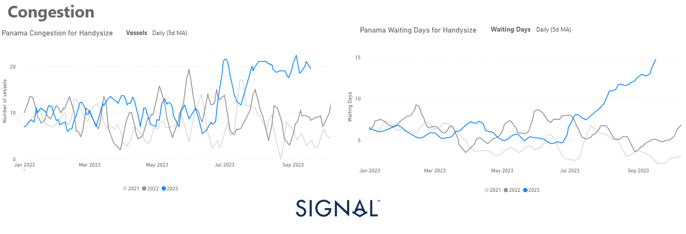
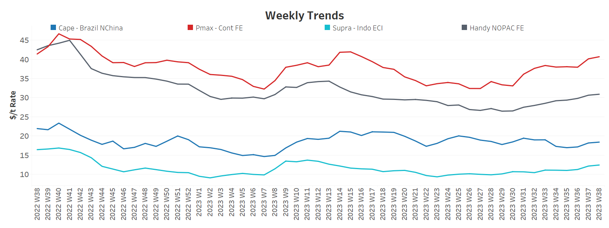
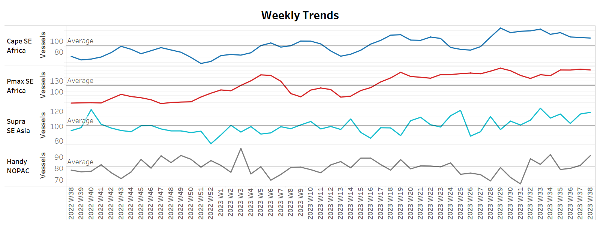
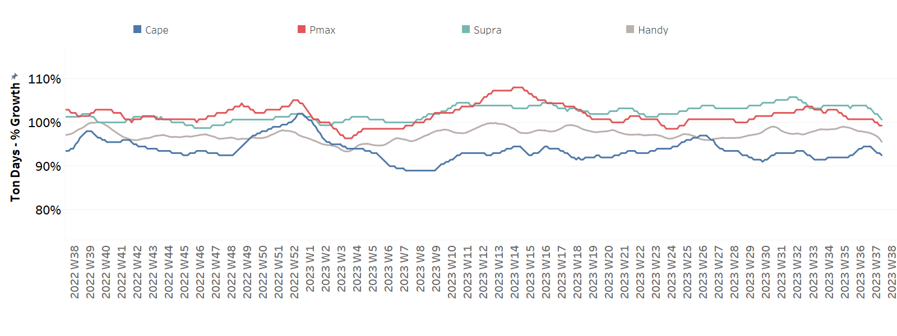
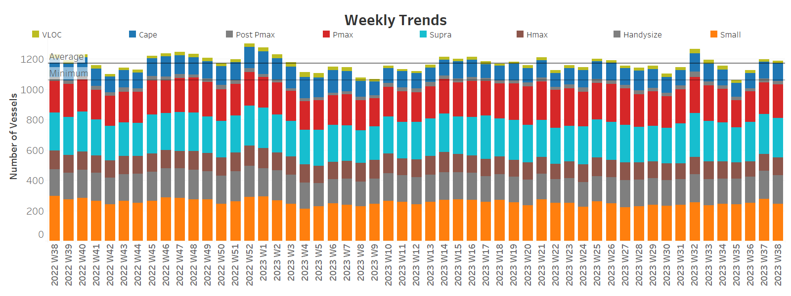

# Signal Dry Bulk Weekly Report

**Date:** September 20, 2023  
**Publisher:** Breakwave Advisors | **Category:** Market Insights  
**Original URL:** [https://www.breakwaveadvisors.com/insights/2023/9/20/signal-dry-bulk-weekly-report](https://www.breakwaveadvisors.com/insights/2023/9/20/signal-dry-bulk-weekly-report)  

---

## Chart of the Week: Panamax Canal Congestion, Handysize

**Brazilian iron ore export volumes increased in August, leading to a boost in Capesize tonne days**

> **Figure 1: Market Chart 1**  
> **Interactive Data & Source:** [Signal Ocean Platform](https://go.signalocean.com/e/983831/congestion-report-dry-download/2pd9h1/346894656?h=8acfMf1qc-u79gjN59v5dhODYRSXC2mM55w_pFT8OPs) | [Local Asset](file:///C:/Users/Dell/Github/Shipping/corpus/03-breakwave/insights/2023/assets/2023-09-20_signal-dry-bulk-weekly-report_img_unnamed-2023-09-20t122056953_2914ef495a43.png)

In the third week of September, freight rates in the various ship categories increased significantly, indicating a robust upward trend. At the same time, there is a noticeable optimism in Chinese economic activity, supported by a number of strategic stimulus measures by policy makers. In recent weeks, policymakers in China have introduced a comprehensive package of measures to boost economic growth and support the real estate market and the national currency.
Most notably, the People's Bank of China took decisive action on Thursday, cutting the reserve requirement ratio for banks by 0.25 percentage points to 7.4 percent. This effectively injected liquidity into the financial system, further underscoring the determination to maintain economic momentum.

The recent upswing has been greatly aided by increased congestion in the Panama Canal since late August. Levels have remained high for all vessel size categories, but the increase in the Handysize segment (pictured above) is surprising, where the daily (5-D moving average) has exceeded any high since the summer season, while last week appears to have reached the upper limit of the increase.

For more information on this week's trends, see the analysis sections below:

Freight Market, Supply, Demand and Port Congestion

## Section 1/ Freight​​​

‘The Big Picture’ - Capesize and Panamax Bulkers and Smaller Ship Sizes

Market Rates ($/t) Firmer

> **Figure 2: Market Chart 2**  
> **Interactive Data & Source:** [Signal Ocean Platform](https://www.thesignalgroup.com/signal-ocean-platform) | [Local Asset](file:///C:/Users/Dell/Github/Shipping/corpus/03-breakwave/insights/2023/assets/2023-09-20_signal-dry-bulk-weekly-report_img_unnamed-2023-09-20t122205675_aa1f1d52f40c.png)

In the third week of September, rates recovered and sentiment remained positive across all ship size categories, with the recovery particularly pronounced in the Panamax and Handysize segments.

- Capesize vessel freight rates from Brazil to North China exceeded $18/tonne, representing a 5% w-o-w increase.
- Panamax vessel freight rates from the Continent to the Far East reached $41 per tonne, continuing the positive sentiment from a week ago, with a tendency for further positive development.
- Supramax vessel freight rates on the Indo-ECI route rose to $12.4/tonne, a 8% weekly increase. Monthly rates are up 9% compared to a similar week in September.
- Handysize freight rates for the NOPAC Far East route rose to $30/tonne, surpassing week 22 high, and up 7.5% from a month ago.

## Section 2/ Supply ​​​

> **Figure 3: Supply Trend Lines for Key Load Areasballasters (# Vessels) Mixed**  
> **Interactive Data & Source:** [Signal Ocean Platform](https://www.thesignalgroup.com/signal-ocean-platform) | [Local Asset](file:///C:/Users/Dell/Github/Shipping/corpus/03-breakwave/insights/2023/assets/2023-09-20_signal-dry-bulk-weekly-report_img_unnamed-2023-09-20t122606985_f73bfe0774af.png)

The number of ballast ships remained at a higher level in the smaller ship categories, while a downward trend was observed in the Capesize and Panamax segments.

- **Capesize SE Africa:**The number of ballasters dropped to 106, which is ten less than three weeks ago and 14% less than the peak recorded almost ten weeks ago.
- **Panamax SE Africa**: The number of ballasters was 160, and it seems that already in the second week of September one of the highest values was reached.
- **Supramax SE Asia**: The number of ballast ships has risen to 115, fifteen more than the previous week, with a steady increase over the last two weeks.
- **Handysize NOPAC**: The number of ballast ships has increased to 90, ten more than the previous week, with an upward trend above the annual average since the end of August.

## Section 3/ Demand

> **Figure 4: Summary of Dry Bulk Demand, per Ship Sizetonne Days Decreasing**  
> **Interactive Data & Source:** [Signal Ocean Platform](https://www.thesignalgroup.com/signal-ocean-platform) | [Local Asset](file:///C:/Users/Dell/Github/Shipping/corpus/03-breakwave/insights/2023/assets/2023-09-20_signal-dry-bulk-weekly-report_img_unnamed-2023-09-20t122758378_3636da5fc678.png)

The prevailing sentiment is downward, although there were signs of a possible recovery in the Capesize segment.

- **Capesize:**Demand growth in tonnes per day again fell to lower levels than the previous two weeks, but remained stronger than the lows recorded five weeks ago.
- **Panamax**: Growth rates have consistently stayed subdued, with the most recent peak occurring during week 33.
- **Supramax:**The third week of September saw an even sharper decline than the previous week, and there were no signs of an imminent recovery.
- **Handysize**: Similar downward momentum with falling demand growth rates compared to the level of three weeks ago.

## Section 4/ Port Congestion ​​​​​

> **Figure 5: Dry Bulk Ships Congested at Chinese Portsno of Vessels Increasing**  
> **Interactive Data & Source:** [Signal Ocean Platform](https://www.thesignalgroup.com/signal-ocean-platform) | [Local Asset](file:///C:/Users/Dell/Github/Shipping/corpus/03-breakwave/insights/2023/assets/2023-09-20_signal-dry-bulk-weekly-report_img_unnamed-2023-09-20t123024179_ba22fade2abb.png)

The increase seems to continue in the larger ship categories, while there is evidence of a decline in the Supramax segment.

- **Capesize**: The number of congested ships was 116, 16 more than two weeks ago.
- **Panamax:**The number is now 222, which is 14 more than week 36, and 40 vessels more than three weeks ago.
- **Supramax**: The number of ship congestion remained at the previous week's level of 260, 30 ships above the low of three weeks ago.
- **Handysize:**The number of congested ships stood 188 from a low of 167 in week 34.

Data Source:[Signal Ocean Platform](https://www.thesignalgroup.com/signal-ocean-platform)
