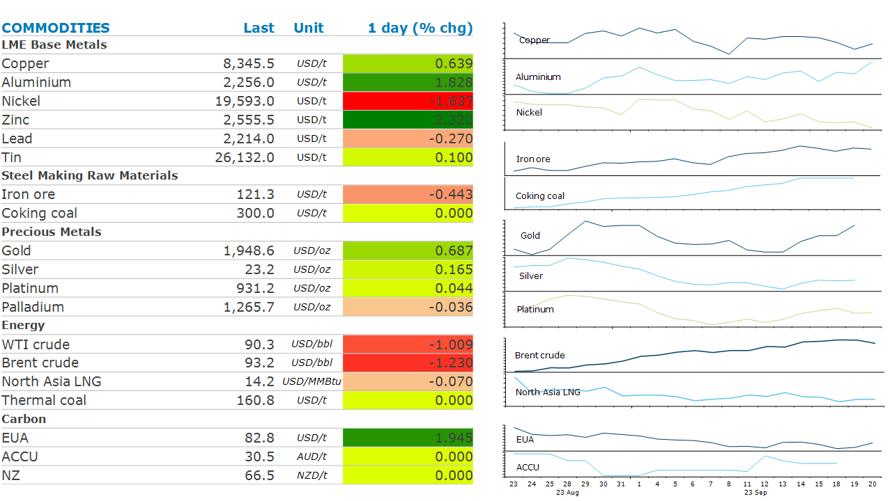

# Commodities Wrap

**Date:** September 21, 2023  
**Publisher:** Breakwave Advisors | **Category:** Market Insights  
**Original URL:** [https://www.breakwaveadvisors.com/insights/2023/9/21/commodities-wrap](https://www.breakwaveadvisors.com/insights/2023/9/21/commodities-wrap)  

---

***By***[***Daniel Hynes***](https://www.linkedin.com/in/dahynes/)

Commodities edged higher as the US Federal Reserve paused its rate hike cycle, as expected. Higher than expected inventories halted oil’s recent rally, while more support measures in China lifted metals***.***

> **Figure 1: 1695247237124**  
> **Interactive Data & Source:** [Linkedin](https://www.linkedin.com/newsletters/commodities-wrap-6692196755876012032/?fbclid=IwAR3kiXJqZdxmp9ZcRwBNI7FsBySI-XSC0pfPur1qzjt7OZp7PTE59Tsl1QI) | [Local Asset](file:///C:/Users/Dell/Github/Shipping/corpus/03-breakwave/insights/2023/assets/2023-09-21_commodities-wrap_img_1695247237124_0d750e992eda.png)

**Gold**was up strongly ahead of the FOMC’s decision, as a weaker USD boosted investor appetite. However, it pared those gains after the Fed left rates unchanged but signalled they will stay higher for longer than expected. The hawkish bent failed to dent enthusiasm for the precious metal. It also held up against surging bond yields, with the Treasury 2y rate climbing to its highest level since 2006.

**Base metals**were mixed ahead of the FOMC’s decision.**Copper**managed to end the session higher amid more property support in China. Wuhan, the capital city of Hubei, removed home purchase restrictions in downtown areas as part of a package to bolster the local property market. Similar moves were also made in Xi’an and Wuxi. This comes after China’s home prices dropped at a faster pace in August. New home prices in 70 cities fell 0.29% m/m. Other official data showed property investment and residential sales also remained weak. The moves helped push**iron ore**futures in Shanghai higher. Steel mills are also reported to be restocking ahead of next month’s National Day holiday week. This could be tempered by shrinking margins, which could spur some output cuts.

The recent rally in**crude oil**prices was halted by a smaller than expected fall in US inventories. EIA data showed US stockpiles fell 2.14mbbl last week, well short of the 5.25mbbl drop reported by the American Petroleum Institute. The disappointing inventory drawdown gave impetus for traders to lock in profits following the 10% gain since the start of the month. This was bolstered by a risk-off tone across markets after the Fed signalled rates will likely stay higher for longer. Nevertheless, ongoing declines in US inventories are raising concerns. A few more drawdowns could revive talks of tanks reaching their operational minimum. This comes as OPEC production cuts start to bite. With the production cuts by Saudi Arabia and the broader OPEC+ alliance expected to remain for the rest of the year, inventories will likely touch record lows.

**European gas**sedged higher as traders continue to monitor disrupted flows from Norway. The country’s grid operator said the ramp-up of the giant Troll gas field will take longer than expected. The continued delays have seeded doubt in traders’ minds as to the latest ramp up schedule. They are also mindful of ongoing industrial action in Australia.**North Asian LNG**spot prices were relatively unchanged as buyers remained on the sidelines. A report from the Australian Competition & Consumer Commission provided some comfort to the market. It estimates Australia’s LNG exports from its east coast facilities will rise by 9% y/y in Q1 2024.

Data source:[Commodities Wrap](https://www.linkedin.com/newsletters/commodities-wrap-6692196755876012032/?fbclid=IwAR3kiXJqZdxmp9ZcRwBNI7FsBySI-XSC0pfPur1qzjt7OZp7PTE59Tsl1QI)
