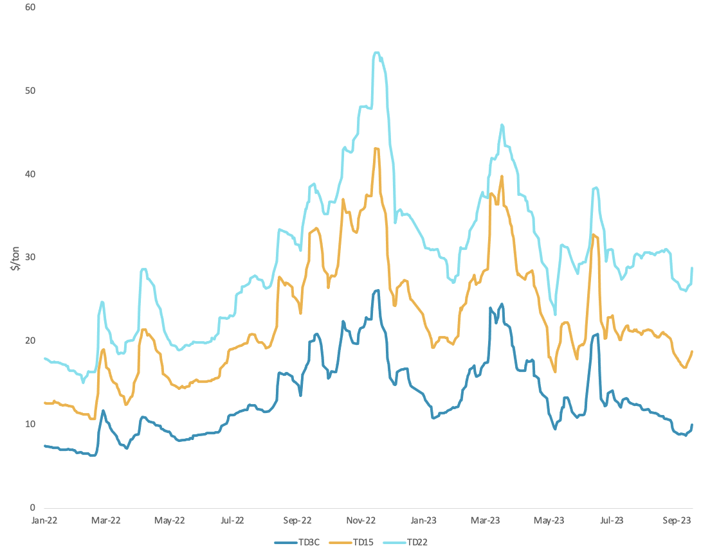
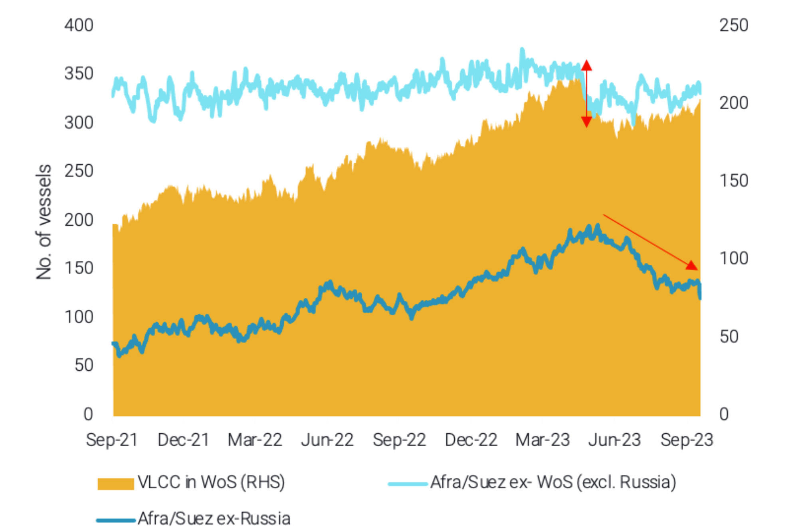

# VLCC fate in the hands of OPEC and China

**Date:** September 21, 2023  
**Publisher:** Breakwave Advisors | **Category:** Market Insights  
**Original URL:** [https://www.breakwaveadvisors.com/insights/2023/9/21/vortexa-freight-weekly](https://www.breakwaveadvisors.com/insights/2023/9/21/vortexa-freight-weekly)  

---

*By*[*Mary Melton*](https://www.linkedin.com/search/results/all/?fetchDeterministicClustersOnly=true&heroEntityKey=urn%3Ali%3Afsd_profile%3AACoAABXVyecBtg-pRnIrZe0BoWk0ygPiUfbvhsw&keywords=mary%20melton&origin=RICH_QUERY_SUGGESTION&position=0&searchId=45223ed9-69f8-45dc-970f-b31841d4e33a&sid=Lzs)

### Analysis / East of Suez / Dirty

## VLCC Fate in the Hands of OPEC and China

> **Figure 1: VLCC Freight Rates Towards China ($/Ton)**  
> *VLCC freight rates towards China ($/ton)*  
> **Interactive Data & Source:** [Vortexa](https://www.vortexa.com//oil-gas-data-traders-analysts-data-scientists?gclid=Cj0KCQjw8_qRBhCXARIsAE2AtRZKOvMnbilZ_6_91d7huSFFy71pWLrnPwGwOHVzXsmsG-1a1mZnQw8aAt89EALw_wcB&hsa_acc=1782073842&hsa_ad=548425387665&hsa_cam=14746637662&hsa_grp=125038601902&hsa_kw=&hsa_mt=&hsa_net=adwords&hsa_src=g&hsa_tgt=dsa-1431852288425&hsa_ver=3&utm_campaign=%5BCD%5D%20-%20DSA%20-%20EMEA&utm_medium=cpc&utm_medium=ppc&utm_source=google&utm_source=adwords&utm_term=) | [Local Asset](file:///C:/Users/Dell/Github/Shipping/corpus/03-breakwave/insights/2023/assets/2023-09-21_vortexa-freight-weekly_img_unnamed-2023-09-21t122038370_6b59c183ebcb.png)

- As the crude market struggles to supply stable levels of crude demand amid OPEC+ voluntary cuts as well as seasonal declines in Russian crude exports, crude prices have continued to trend higher.The supply-side restrictions have kept crude tanker rates low, particularly for VLCCs heading to China, however, these have bottomed out this week.
- There has been slight demand side support, partly driven by a small pick up in VLCC tonne-days towards Asia out of Saudi Arabia, as m-o-m preliminary exports have shown a sharp increase. However, with Saudi volumes towards China remaining flat due to inventory draws supporting high refinery runs rather than crude imports, demand upside for VLCCs is likely to remain capped in the short term.
- If rising crude prices prompt a revision of the current voluntary cuts, this could support VLCCs heading towards the end of the year.

### Analysis / West of Suez / Dirty

## Vlccs Migration and Russia Reduced Exports Push Crude Tanker Rates to 2023-Lows

> **Figure 2: Aframax/suezmax Utilisation From Selected West of Suez Origins**  
> *Aframax/Suezmax utilisation from selected West of Suez origins (LHS) vs. VLCCs located in West of Suez (RHS)*  
> **Interactive Data & Source:** [Vortexa](https://www.vortexa.com//oil-gas-data-traders-analysts-data-scientists?gclid=Cj0KCQjw8_qRBhCXARIsAE2AtRZKOvMnbilZ_6_91d7huSFFy71pWLrnPwGwOHVzXsmsG-1a1mZnQw8aAt89EALw_wcB&hsa_acc=1782073842&hsa_ad=548425387665&hsa_cam=14746637662&hsa_grp=125038601902&hsa_kw=&hsa_mt=&hsa_net=adwords&hsa_src=g&hsa_tgt=dsa-1431852288425&hsa_ver=3&utm_campaign=%5BCD%5D%20-%20DSA%20-%20EMEA&utm_medium=cpc&utm_medium=ppc&utm_source=google&utm_source=adwords&utm_term=) | [Local Asset](file:///C:/Users/Dell/Github/Shipping/corpus/03-breakwave/insights/2023/assets/2023-09-21_vortexa-freight-weekly_img_unnamed-2023-09-21t122355877_5a85c70529bc.png)

- Freight rates for trademark routes across the main crude tankers classes (TD3C, TD20, TD25) have been on a downward trajectory reaching 2023-lows. The main factor leading to this development was the concurrent decline of exports out of Saudi Arabia and Russia.
- While the former triggered a rebound on VLCC migration to the West of Suez, the latter led to a sharp reduction of Aframax and Suezmax demand that were previously employed to long-haul voyages from the Baltic/Black Sea towards Asia.
- While West of Suez (excl. Russia volumes) utilisation of Suezmax and Aframax remains robust due to the heathy European demand, it is insufficient to wholly absorb the lost demand from Russia and Saudi Arabia. However, a prospective increase of Saudi crude exports amid high crude prices and a seasonal rebound of Russian volumes could alleviate vessel supply and support rates throughout Q4.

Data Source:[Vortexa](https://www.vortexa.com//oil-gas-data-traders-analysts-data-scientists?gclid=Cj0KCQjw8_qRBhCXARIsAE2AtRZKOvMnbilZ_6_91d7huSFFy71pWLrnPwGwOHVzXsmsG-1a1mZnQw8aAt89EALw_wcB&hsa_acc=1782073842&hsa_ad=548425387665&hsa_cam=14746637662&hsa_grp=125038601902&hsa_kw=&hsa_mt=&hsa_net=adwords&hsa_src=g&hsa_tgt=dsa-1431852288425&hsa_ver=3&utm_campaign=%5BCD%5D%20-%20DSA%20-%20EMEA&utm_medium=cpc&utm_medium=ppc&utm_source=google&utm_source=adwords&utm_term=)
