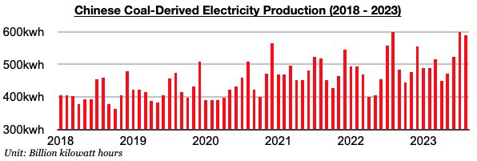
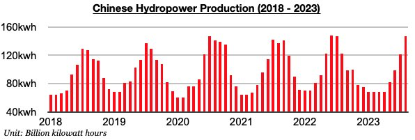

# China's Coal-Derived Electricity Output Remain Strong; Hydropower Output Has Returned to Finding Growth

**Date:** September 22, 2023  
**Publisher:** Breakwave Advisors | **Category:** Market Insights  
**Original URL:** [https://www.breakwaveadvisors.com/insights/2023/9/21/chinas-coal-derived-electricity-output-remain-strong-hydropower-output-has-returned-to-finding-growth](https://www.breakwaveadvisors.com/insights/2023/9/21/chinas-coal-derived-electricity-output-remain-strong-hydropower-output-has-returned-to-finding-growth)  

---

*By*[*Jeffrey Landsberg*](https://www.linkedin.com/in/jeffrey-landsberg-70ab957/)

China produced 382.2 million tons of coal in August. This has marked a month-on-month increase of 4.7 million tons (1%) and is up year-on-year by 11.8 million tons (3%). As we have been stressing in our Weekly Dry Bulk Reports and Weekly China Reports, China's central government last year shifted to no longer focusing on improving mine safety and instead focusing on ensuring strong coal production. China’s coal production has remained strong this year, even as a large number of coal mine accidents and deaths have continued to occur.

Coal-derived electricity generation continues to make up the bulk of the nation’s electricity production and totaled 589.1 billion kilowatt hours. This has marked a month-on-month drop of 10.6 billion kilowatt hours (-2%) and is down up year-on-year by 9.8 billion kilowatt hours (-2%). Coal-derived electricity generation remains very strong but coal output growth has finally come in higher than coal-derived electricity generation growth again. Previously, coal-derived electricity generation growth had exceeded coal production growth for five straight months.

> **Figure 1: Chart 1 (82)**  
> [Local Asset](file:///C:/Users/Dell/Github/Shipping/corpus/03-breakwave/insights/2023/assets/2023-09-22_chinas-coal-derived-electricity-output-remain-strong-hydropower-output-has-retur_img_chart1288229_5b9250e68d61.jpg)

Hydropower production totaled 146.6 billion kilowatt hours last month. This has marked a month-on-month increase of 25.5 billion kilowatt hours (21%) and is up year-on-year by 24 billion kilowatt hours (20%). Previously, hydropower output had contracted on a year-on-year basis during eleven of the prior twelve months. The return of growth in hydropower output has been a factor behind coal-derived electricity generation contracting last month.

> **Figure 2: Chart 2 (70)**  
> [Local Asset](file:///C:/Users/Dell/Github/Shipping/corpus/03-breakwave/insights/2023/assets/2023-09-22_chinas-coal-derived-electricity-output-remain-strong-hydropower-output-has-retur_img_chart2287029_7b24f78162c7.jpg)
