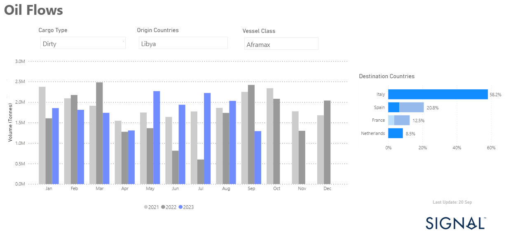
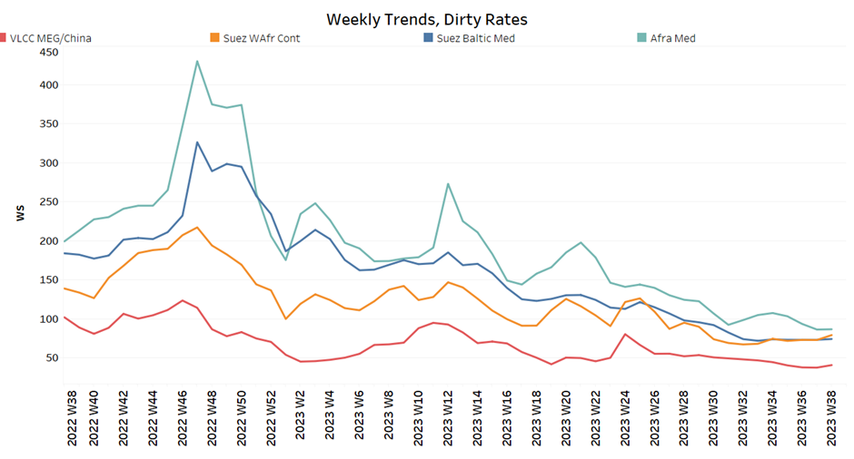
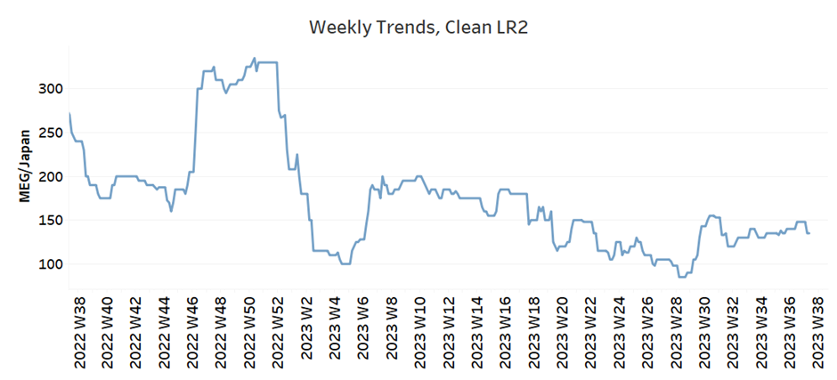
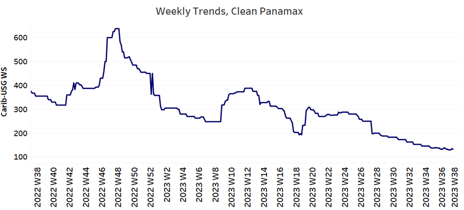
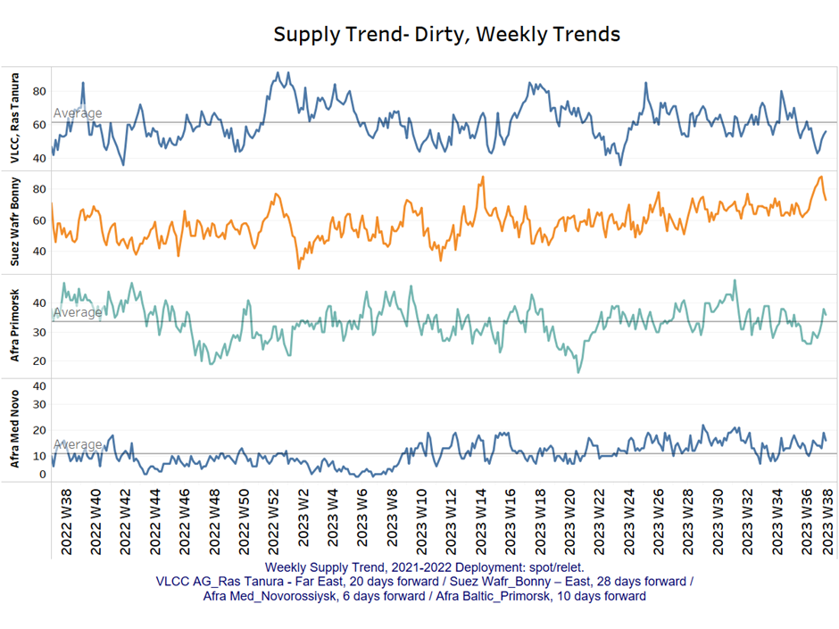
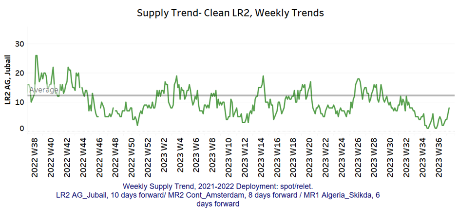
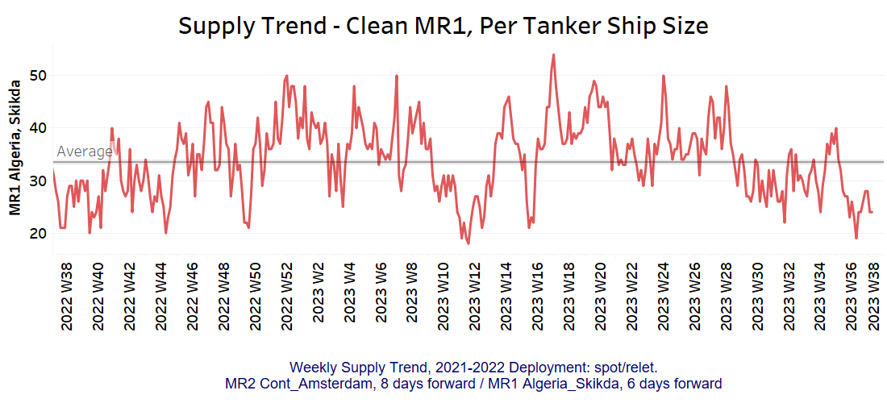
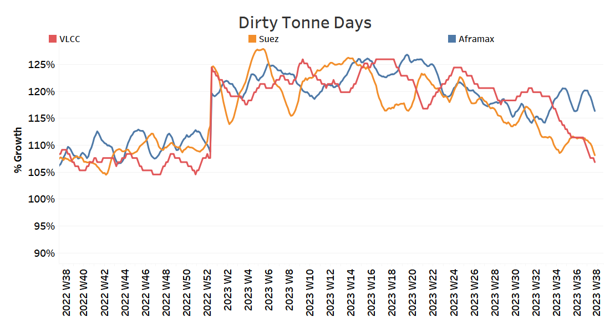
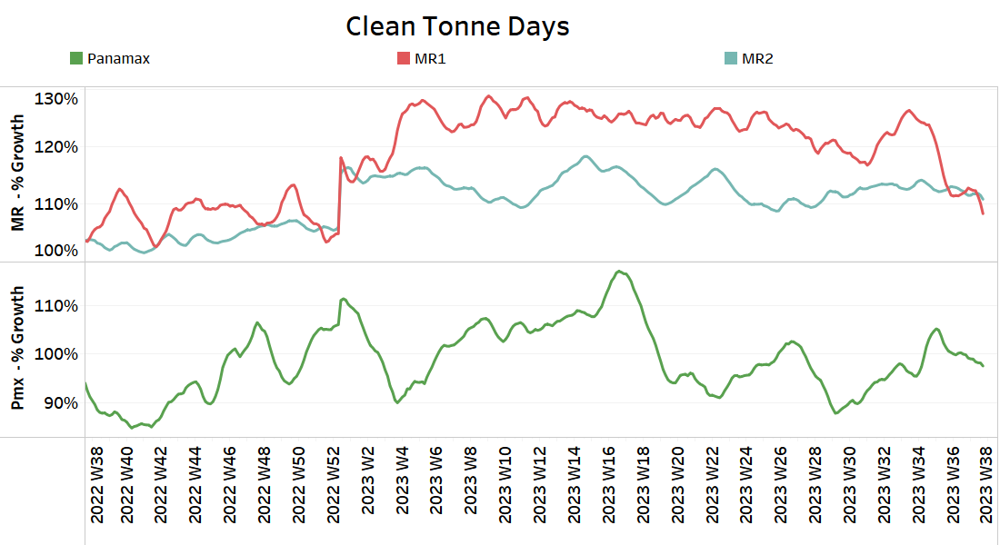

# Signal Tanker Weekly Report

**Date:** September 22, 2023  
**Publisher:** Breakwave Advisors | **Category:** Market Insights  
**Original URL:** [https://www.breakwaveadvisors.com/insights/2023/9/21/signal-tanker-weekly-report](https://www.breakwaveadvisors.com/insights/2023/9/21/signal-tanker-weekly-report)  

---

## Chart of the Week: Dirty Oil Flows Libya to European Destinations

**Higher growth rates of dirty Libyan exports to Italy, Spain, France & the Netherlands in 2Q - 3Q 2023**

> **Figure 1: Market Chart 1**  
> **Interactive Data & Source:** [Signal Ocean Platform](https://www.thesignalgroup.com/signal-ocean-platform) | [Local Asset](file:///C:/Users/Dell/Github/Shipping/corpus/03-breakwave/insights/2023/assets/2023-09-22_signal-tanker-weekly-report_img_unnamed-2023-09-21t205048187_d7eba43ca1da.png)

The third week of September began on a positive note for VLCC crude oil freight rates, moving well off the August lows and setting a more energetic tone in the transition from the summer season. It remains uncertain whether this newfound momentum will continue through the end of the month as the market hopes for a stronger recovery during the upcoming winter period.

Downward pressure continues to be observed in the Aframax segment. However, one notable development should be highlighted: Libyan crude oil exports to Europe increased significantly during the summer months, exceeding volumes recorded in similar months over the past two years.

The oil market is recently facing the fear of inflation with the rise in oil prices, which have now surpassed $95 per barrel, raising concerns about rising inflation. Incidentally, OPEC has maintained its August estimate of global oil demand for 2023 at 2.4 million barrels per day (mb/d) and for 2024 at 2.2 mb/d.

Late in the week, Reuters published a surprising report on the shipment of the very first Russian crude blend to the United Arab Emirates, a development of great significance. As for oil supply cuts, the UAE has stated that it won't join Saudi Arabia's voluntary oil production cuts, as it believes the Saudi cuts are sufficient to stabilize markets.
​​
For more information on this week's trends, see the analysis sections below:

Freight Market, Supply and Demand

## Section 1/ Freight

Market Rates (WS)

> **Figure 2: ‘Dirty’ Ws​vlcc - Suezmax - Aframax Weaker**  
> **Interactive Data & Source:** [Signal Ocean Platform](https://www.thesignalgroup.com/signal-ocean-platform) | [Local Asset](file:///C:/Users/Dell/Github/Shipping/corpus/03-breakwave/insights/2023/assets/2023-09-22_signal-tanker-weekly-report_img_unnamed-2023-09-21t205315982_9d564de2fd4e.png)

Sentiment seems to have been revised upward for the VLCC MEG-China route, whereas, there is still downward pressure in the Aframax.

1. VLCC MEG-China freight rates rose rose 18% from the previous week, WS 42, the first sign of an upturn since late June.
2. Suezmax freight rates for shipments from West Africa to continental Europe rose to WS78, up 10% from a month ago, while rates on the Suez-Baltic-Med route remained unchanged at WS73 for another week.
3. Aframax Med freight rates remained at WS88 levels, with signs of a pause in the downward trend, while current sentiment shows a 19% monthly decline.

> **Figure 3: ‘Product’ Wslr2 Weaker**  
> **Interactive Data & Source:** [Signal Ocean Platform](https://www.thesignalgroup.com/signal-ocean-platform) | [Local Asset](file:///C:/Users/Dell/Github/Shipping/corpus/03-breakwave/insights/2023/assets/2023-09-22_signal-tanker-weekly-report_img_unnamed-2023-09-21t205444021_9bb96287ed72.png)

- LR2 AG freight rates fell to 135 WS, after exceeding 140 WS last week, while a flatter trend appears to be emerging for the coming days.

## Panamaxweaker

> **Figure 4: Weaker**  
> **Interactive Data & Source:** [Signal Ocean Platform](https://www.thesignalgroup.com/signal-ocean-platform) | [Local Asset](file:///C:/Users/Dell/Github/Shipping/corpus/03-breakwave/insights/2023/assets/2023-09-22_signal-tanker-weekly-report_img_unnamed-2023-09-21t205645016_ca42786a6200.png)

- Panamax Carib-to-USG rates fell to 132 WS, down 65% from a year ago, with the downward trend continuing since the end of Week 27.

## ‘Clean’mr Steady

> **Figure 5: ‘Clean’mr Steady**  
> **Interactive Data & Source:** [Signal Ocean Platform](https://www.thesignalgroup.com/signal-ocean-platform) | [Local Asset](file:///C:/Users/Dell/Github/Shipping/corpus/03-breakwave/insights/2023/assets/2023-09-22_signal-tanker-weekly-report_img_unnamed-2023-09-21t205740830_20872f7e0c62.png)

- MR1 rates for the Baltic continent remained at the previous week's level of about WS 183, while the upward trend seems to be flattening.

- MR2 rates for shipments from the continent to the U.S. have firmed at WS180, but are still below late August highs (200 WS).

## Section 2/ Supply

Supply Trend Lines for Key Load Areas

> **Figure 6: 'Dirty' (#Vessels) - Mixed**  
> **Interactive Data & Source:** [Signal Ocean Platform](https://www.thesignalgroup.com/signal-ocean-platform) | [Local Asset](file:///C:/Users/Dell/Github/Shipping/corpus/03-breakwave/insights/2023/assets/2023-09-22_signal-tanker-weekly-report_img_unnamed-2023-09-21t205912988_1487b6ef9d0b.png)

Crude oil tanker supply continued to develop unevenly in the third week of September, however, in the VLCC segment, the number hovers below the annual average.

- VLCC Ras Tanura: The current number of ships is 56, almost 17 below the annual average, and it remains to be seen whether the number will continue at a low level.
- Suezmax Wafr: The number was revised downward to 73 from the previous week's high of over 80, but remained above the week 34 lows.
- Aframax Primorsk: The current number of ships is 36, which is 3 ships above the annual average, with the tendency of a further increase in the coming days of September.
- Aframax Med Novo: The number of ships is now 16, 4 above the annual average, with high volatility and uncertainty about an upward or downward movement.

> **Figure 7: 'Clean'lr2 (#Vessels) - Increasing**  
> **Interactive Data & Source:** [Signal Ocean Platform](https://www.thesignalgroup.com/signal-ocean-platform) | [Local Asset](file:///C:/Users/Dell/Github/Shipping/corpus/03-breakwave/insights/2023/assets/2023-09-22_signal-tanker-weekly-report_img_unnamed-2023-09-21t210156880_30190800ab44.png)

> **Figure 8: MR1 (#Vessels) - Decreasing**  
> **Interactive Data & Source:** [Signal Ocean Platform](https://www.thesignalgroup.com/signal-ocean-platform) | [Local Asset](file:///C:/Users/Dell/Github/Shipping/corpus/03-breakwave/insights/2023/assets/2023-09-22_signal-tanker-weekly-report_img_unnamed-2023-09-21t210205993_beb38a13763f.png)

- ​​​​​Clean LR2 AG Jubail: The number of ships recorded a sudden increase in the third week of September, reaching 8 ships, 4 above the annual average.

- Clean MR1 Algeria Skikda: The current count is 24 ships, surprisingly below the week 35 peak (~40), while the trend over the last three weeks continues to be below the annual average.

## Section 3/ Demandsummary of Tanker Demand per Ship Size & Segment

## ​​‘Dirty’ Increasing

> **Figure 9: Dirty**  
> **Interactive Data & Source:** [Signal Ocean Platform](https://www.thesignalgroup.com/signal-ocean-platform) | [Local Asset](file:///C:/Users/Dell/Github/Shipping/corpus/03-breakwave/insights/2023/assets/2023-09-22_signal-tanker-weekly-report_img_unnamed-2023-09-21t210346787_18ae1704cc58.png)

- Dirty tonne days: In the third week of September, the percentage increase in demand (tonne days) for all crude oil vessel size categories held decreasing pace, although there were signs of an upturn in Aframax

> **Figure 10: ‘Clean’ Panamax / MR Decreasing**  
> **Interactive Data & Source:** [Signal Ocean Platform](https://www.thesignalgroup.com/signal-ocean-platform) | [Local Asset](file:///C:/Users/Dell/Github/Shipping/corpus/03-breakwave/insights/2023/assets/2023-09-22_signal-tanker-weekly-report_img_unnamed-2023-09-21t210435459_ed4ca06c3e31.png)

- Panamax tonne days: Downward pressure is maintained in the third week of September, with the last peak recorded in week 36.

- Clean MR tonne days: The downward pressure is revised significantly downward for size MR1, while the demand sentiment for MR2 seems to be relatively stable.

Data Source:[Signal Ocean Platform](https://www.thesignalgroup.com/signal-ocean-platform)
