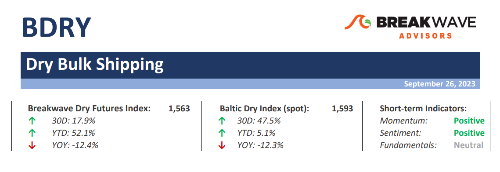
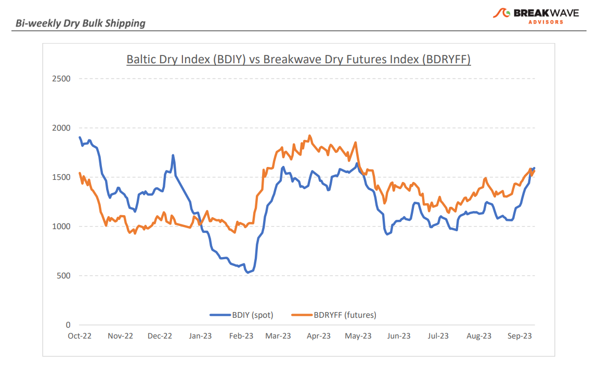
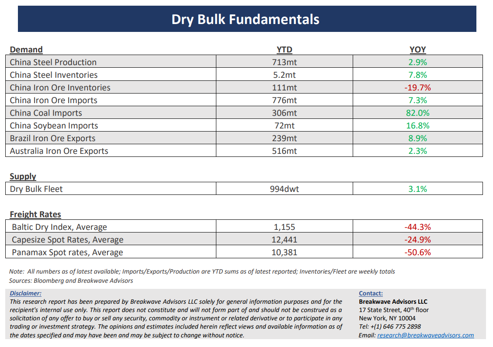

# Breakwave Bi-Weekly Dry Bulk Report - September 26, 2023

**Date:** September 26, 2023  
**Publisher:** Breakwave Advisors | **Category:** Market Insights  
**Original URL:** [https://www.breakwaveadvisors.com/insights/2023/9/26/breakwave-bi-weekly-drybulk-report-sep-26-2023-kx7ah](https://www.breakwaveadvisors.com/insights/2023/9/26/breakwave-bi-weekly-drybulk-report-sep-26-2023-kx7ah)  

---

> **Figure 1: Dbreporttop**  
> [Local Asset](file:///C:/Users/Dell/Github/Shipping/corpus/03-breakwave/insights/2023/assets/2023-09-26_breakwave-bi-weekly-drybulk-report-sep-26-2023-kx7ah_img_dbreporttop_f0ecc6191971.png)

**• Capesize spot rates approaching the 20,000 mark as seasonality kicks in**– With the summer dull days coming to an end, dry bulk activity is once again picking up, and with that, Capesize spot rates have begun to creep higher, although still inside the tight range that has prevailed for most of the past 18 months. “Unexciting” has been the word to characterize the state of the dry bulk market recently, but as always has been the case in the last few years, the surprise element is always one headline away. Are we about to experience a stronger than expected winter rally? It is easy to argue against such a development if we looked at the macro picture where global demand growth is clearly suffering, with China continuing to deal with its ailing real estate sector, high interest rates in Europe and the US hurting economic growth, and a strong US dollar being a major headwind for commodities. However, shipping remains an uncorrelated asset class, and its idiosyncratic supply/demand fundamentals could at any given time lead to (temporary) stronger rates, providing an important trading tool during periods when other asset classes move in tandem. Coal demand has been a key driver for dry bulk rates, and production disruptions due to well publicized mine accidents in China should continue to support strong import volumes. Iron ore activity remains strong, while bauxite trading has once again resumed, following the seasonal decline due to summer rains in West Africa. With fleet operating efficiency at all-time highs, winter weather unpredictability seems to be the key for a tightening market which could propel spot rates higher and beyond what is already priced in the futures curve.

**• Existing Chinese stimulus in the pipeline could represent almost 40% of 2024 estimated GDP growth**– The Chinese economy and the potential resumption in strong growth remains subject to policy initiatives that need to continue to fuel growth. We estimate that the already announced stimulative policies will account up to 2% boost in GDP growth of what looks like to be another ~5% rate for 2024. However, investor confidence is the main hurtle when it comes to real estate, the sector that is the biggest drag to economic growth in China, and there are no easy solutions to tackle this. The unwillingness of investors and ordinary citizens to engage in real estate transactions given the significant declines in prices over the past two years, continues to negatively affect a key sector of the economy that touches more than a quarter of China’s economic activity. The rebalancing process will take time, and China seems willing to continue to provide support to the economy through its local governments, though not in the massive way that could exacerbate the significant financial leverage issues that the country is facing.

**• Dry bulk focus shifts back to fundamentals**– Following a period of high uncertainty and significant disruptions across the commodity spectrum, the gradual normalization of trade is shifting the market’s attention back to the traditional demand and supply dynamics that have shaped dry bulk profitability for decades. As effective fleet supply growth for the next few years looks marginal, demand will be the main determinant of spot freight rates with China returning back to the driver’s seat as the dominant force of bulk imports and thus shipping demand.

> **Figure 2: Dbreportchart**  
> [Local Asset](file:///C:/Users/Dell/Github/Shipping/corpus/03-breakwave/insights/2023/assets/2023-09-26_breakwave-bi-weekly-drybulk-report-sep-26-2023-kx7ah_img_dbreportchart_5b125d2f51c5.png)

> **Figure 3: Dbreportbottom**  
> [Local Asset](file:///C:/Users/Dell/Github/Shipping/corpus/03-breakwave/insights/2023/assets/2023-09-26_breakwave-bi-weekly-drybulk-report-sep-26-2023-kx7ah_img_dbreportbottom_0586f41cf886.png)

### Subscribe:
