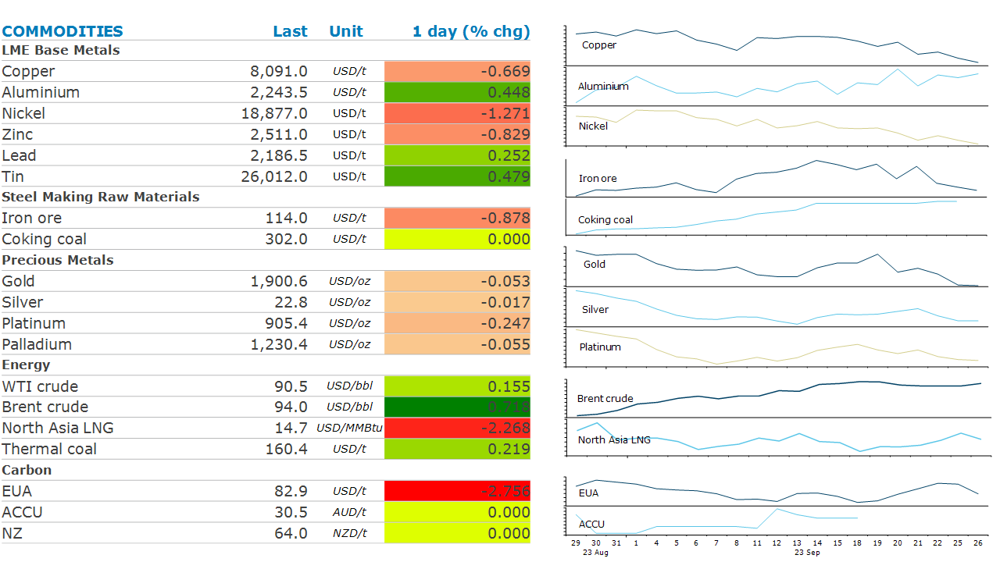

# Broader risk off tone weighs on sentiment

**Date:** September 27, 2023  
**Publisher:** Breakwave Advisors | **Category:** Market Insights  
**Original URL:** [https://www.breakwaveadvisors.com/insights/2023/9/27/broader-risk-off-tone-weighs-on-sentiment](https://www.breakwaveadvisors.com/insights/2023/9/27/broader-risk-off-tone-weighs-on-sentiment)  

---

*By*[*Daniel Hynes*](https://www.linkedin.com/in/dahynes/)

Commodity prices drifted lower amid a broad sell-off. A rally in the US dollar kept the market sentiment bleak, while supply issues supported energy prices.

> **Figure 1: 1695769016356**  
> **Interactive Data & Source:** [Linkedin](https://www.linkedin.com/newsletters/commodities-wrap-6692196755876012032/?fbclid=IwAR3kiXJqZdxmp9ZcRwBNI7FsBySI-XSC0pfPur1qzjt7OZp7PTE59Tsl1QI) | [Local Asset](file:///C:/Users/Dell/Github/Shipping/corpus/03-breakwave/insights/2023/assets/2023-09-27_broader-risk-off-tone-weighs-on-sentiment_img_1695769016356_b24f8eadaba5.png)

**Crude oil**prices fell below USD90/bbl in early trading session before recovering back to USD93/bbl. Prospects of higher interest rates for longer weighed on the market sentiment during early trading hours, while tighter fundamentals reversed the losses. Saudi Arabia extended its voluntary oil production cuts to the end of this year, producing 2mb/d less than a year ago. Further, recent Russian exports ban on gasoline and diesel means upward pressure on crude oil demand from refineries. While oil demand looks strong in China, some softening is visible in oil products which is seeing margins retreat.

Renewed risk of Norwegian supply saw**European gas**prices extending its gains towards EUR41/MWh. Production outages are increasing at Norwegian facilities. Skarv gas field production capacity is reduced due to operating challenges, and this is likely to continue for some time yet. Further, there are new issues propping up at Troll field, delaying its restart. Meanwhile, US gas exports from the Corpus Christi terminal are estimated to have fallen by 33% on Tuesday, according to BNEF data.**North Asian LNG**prices rose above USD15/MMBtu amid strong spot demand as winter restocking picked up in Japan and South Korea.

**Industrial metals**extended their losses due to concerns on China’s economic growth. Rising inflation expectations on the back of higher energy prices was another drag for the sector. Rising copper inventories at the LME was not a help either with the contango widening to a 30-year high. However, this was more related to an increase in supply flows than weakening demand. Iron ore extended its losses amid renewed debt problems in China’s property developers. Evergrande failed to repay its debt and defaulted USD547 million, raising concerns that government support will not be enough to revive the sector. Fears of weak property demand reverberated in lower steel restocking by property developers ahead of the Golden Week holiday.

**Gold**prices fell to USD1,900/oz as the US yields rose to a fresh multi-year high. Investors are adjusting to the anticipation that the Fed is unlikely to ease monetary policy next year. Rising yields are weighing on fund flows to gold ETF too. A renewed strength in the US dollar is another headwind, reducing appetite for gold investment. Gold ETF saw a disinvestment of 35t in September.

Data source:[Commodities Wrap](https://www.linkedin.com/newsletters/commodities-wrap-6692196755876012032/?fbclid=IwAR3kiXJqZdxmp9ZcRwBNI7FsBySI-XSC0pfPur1qzjt7OZp7PTE59Tsl1QI)
