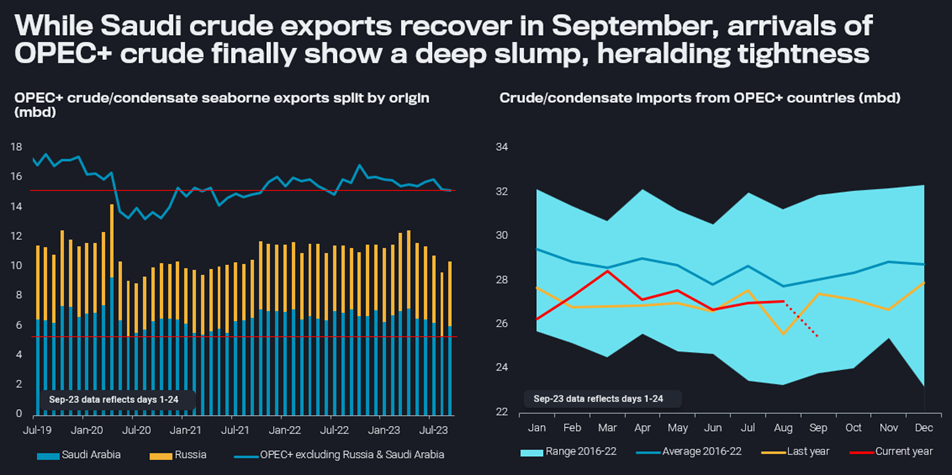
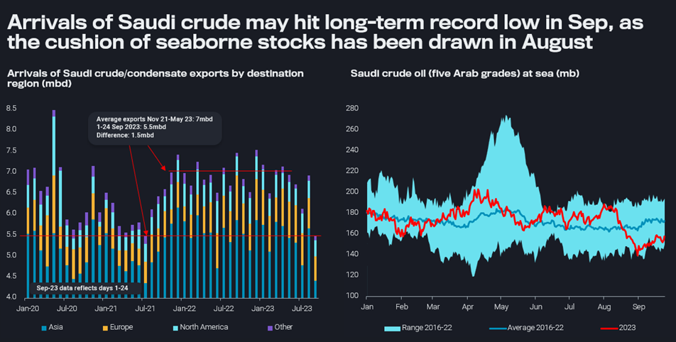

# Saudi crude exports inch upwards, but market remains tight

**Date:** September 28, 2023  
**Publisher:** Breakwave Advisors | **Category:** Market Insights  
**Original URL:** [https://www.breakwaveadvisors.com/insights/2023/9/28/saudi-crude-exports-inch-upwards-but-market-remains-tight](https://www.breakwaveadvisors.com/insights/2023/9/28/saudi-crude-exports-inch-upwards-but-market-remains-tight)  

---

## We Review the Latest Trends in OPEC+ Crude Exports and Arrivals in Consumer Markets, with a Particular Focus on Saudi Barrels, Including Those Inbetween at Sea.

*By*[*David Wech*](https://www.linkedin.com/search/results/all/?keywords=David%20Wech&origin=GLOBAL_SEARCH_HEADER&sid=xiQ)

Oil futures rallied by more than $20/b from late June to mid-September. The crucial change in the market over that time span were intensified and prolonged voluntary crude supply/export cuts by Saudi Arabia and Russia, respectively. Over the last week, the price momentum has paused a bit, and the crucial question is whether Saudi Arabia will stick to very low crude production target levels or start to raise supplies again, as oil trades closer to $100/b.

> **Figure 1: 20230926 1**  
> **Interactive Data & Source:** [Analytics Vortexa](https://analytics.vortexa.com/?dateRange=2020-01-01T00%3A00%3A00.000Z__2023-09-24T23%3A59%3A59.999Z&filtersEnabled=%5B%22p%22%2C%22o%22%2C%22d%22%2C%22d_r%22%2C%22v%22%2C%22intra%22%2C%22sts_o%22%2C%22c_o%22%2C%22w%22%5D&from=%5B%221c47e09ebf73cbb0fda6e36ffc125d4be50936d17888e0a7d2acb17a439db108%22%5D&geoBreakdownDestinationGlobal=shipping_region&metric=bpd&page=Flows&products=%5B%2254af755a090118dcf9b0724c9a4e9f14745c26165385ffa7f1445bc768f06f11%22%5D&tabId=c6f9e5c5-5194-4257-8a66-ff4ad1067951&timeSeriesProperty=origin_country&v=2) | [Local Asset](file:///C:/Users/Dell/Github/Shipping/corpus/03-breakwave/insights/2023/assets/2023-09-28_saudi-crude-exports-inch-upwards-but-market-remains-tight_img_20230926-1_2509ac94f831.png)

[OPEC+ crude/condensate seaborne exports](https://analytics.vortexa.com/?dateRange=2020-01-01T00%3A00%3A00.000Z__2023-09-24T23%3A59%3A59.999Z&filtersEnabled=%5B%22p%22%2C%22o%22%2C%22d%22%2C%22d_r%22%2C%22v%22%2C%22intra%22%2C%22sts_o%22%2C%22c_o%22%2C%22w%22%5D&from=%5B%221c47e09ebf73cbb0fda6e36ffc125d4be50936d17888e0a7d2acb17a439db108%22%5D&geoBreakdownDestinationGlobal=shipping_region&metric=bpd&page=Flows&products=%5B%2254af755a090118dcf9b0724c9a4e9f14745c26165385ffa7f1445bc768f06f11%22%5D&tabId=c6f9e5c5-5194-4257-8a66-ff4ad1067951&timeSeriesProperty=origin_country&v=2)&[imports from OPEC+ countries](https://analytics.vortexa.com/?dateRange=2020-01-01T00%3A00%3A00.000Z__2023-09-24T23%3A59%3A59.999Z&filtersEnabled=%5B%22p%22%2C%22o%22%2C%22d%22%2C%22d_r%22%2C%22v%22%2C%22intra%22%2C%22sts_o%22%2C%22c_o%22%2C%22w%22%5D&from=%5B%221c47e09ebf73cbb0fda6e36ffc125d4be50936d17888e0a7d2acb17a439db108%22%5D&geoBreakdownDestinationGlobal=shipping_region&metric=bpd&movementEvent=unloading_start&page=Flows&products=%5B%2254af755a090118dcf9b0724c9a4e9f14745c26165385ffa7f1445bc768f06f11%22%5D&productsBreakdown=grade&tabId=c6f9e5c5-5194-4257-8a66-ff4ad1067951&timeSeriesProperty=destination_region&v=2)(mbd)

Crude/condensate exports from OPEC+ countries have been more or less stable in the first 24 days of September, except for a marked recovery in Saudi exports by about 0.7mbd from 5.3mbd to 6mbd. VLCC freight rates bottoming out may also indicate a more persistent upside in exports.

What may be more important though is that OPEC+ cuts are now finally hitting arrival levels in consumer markets. Over Sep 1-24, 25.5mbd of OPEC+ crude/condensate arrived in importing countries, down 1.5mbd from August. So far this year, imports of OPEC+ barrels have been pretty steady, even slightly up by 300kbd on average y-o-y (Jan-Aug periods). In other words, OPEC+ cuts are really only markedly hitting refiners as of this month.

> **Figure 2: 20230926 2**  
> **Interactive Data & Source:** [Analytics Vortexa](https://analytics.vortexa.com/?dateRange=2020-01-01T00%3A00%3A00.000Z__2023-09-24T23%3A59%3A59.999Z&filtersEnabled=%5B%22p%22%2C%22o%22%2C%22d%22%2C%22d_r%22%2C%22v%22%2C%22intra%22%2C%22sts_o%22%2C%22c_o%22%2C%22w%22%5D&geoBreakdownDestinationGlobal=region&metric=bpd&movementEvent=unloading_start&page=Flows&products=%5B%22fbf27d9bb202b97315973628e92110a3e4f249e025b3bca228b3ec8fcfeef0e9%22%2C%222de26bee687547f180d9b64b05361d56c1145a9bb30147eb9c82eb3aaa97914d%22%2C%22b4b1826674c8975dec55514e47f925bd7622f356fde039c75ab739938ed50194%22%2C%22448d24e0dd61958694eeb59822acea8eeea85326e6cb67a0739856508107ef5b%22%2C%2219bcc501a60d16bb281db88b5b11ad2b3501812a10dc5dd82bd4a8ecadfa937a%22%2C%22ca7f607e2d17ee9708209d0a8f48e183e6099de55eec2e4d58797363cdf0f62b%22%2C%22740f1086353e5734afaf501997b8c0d8dc9917df06a4f51ce22fd15efc2443c3%22%5D&tabId=c6f9e5c5-5194-4257-8a66-ff4ad1067951&timeSeriesProperty=destination_region&toExcluded=%5B%229ab4381aab3268d41c92fe179c819cb9e01e5b4fc6c22b231124c2a83e59ff98%22%5D&v=2) | [Local Asset](file:///C:/Users/Dell/Github/Shipping/corpus/03-breakwave/insights/2023/assets/2023-09-28_saudi-crude-exports-inch-upwards-but-market-remains-tight_img_20230926-2_d4ff7fa5ec85.png)

[Arrivals of Saudi crude exports by destination region](https://analytics.vortexa.com/?dateRange=2020-01-01T00%3A00%3A00.000Z__2023-09-24T23%3A59%3A59.999Z&filtersEnabled=%5B%22p%22%2C%22o%22%2C%22d%22%2C%22d_r%22%2C%22v%22%2C%22intra%22%2C%22sts_o%22%2C%22c_o%22%2C%22w%22%5D&geoBreakdownDestinationGlobal=region&metric=bpd&movementEvent=unloading_start&page=Flows&products=%5B%22fbf27d9bb202b97315973628e92110a3e4f249e025b3bca228b3ec8fcfeef0e9%22%2C%222de26bee687547f180d9b64b05361d56c1145a9bb30147eb9c82eb3aaa97914d%22%2C%22b4b1826674c8975dec55514e47f925bd7622f356fde039c75ab739938ed50194%22%2C%22448d24e0dd61958694eeb59822acea8eeea85326e6cb67a0739856508107ef5b%22%2C%2219bcc501a60d16bb281db88b5b11ad2b3501812a10dc5dd82bd4a8ecadfa937a%22%2C%22ca7f607e2d17ee9708209d0a8f48e183e6099de55eec2e4d58797363cdf0f62b%22%2C%22740f1086353e5734afaf501997b8c0d8dc9917df06a4f51ce22fd15efc2443c3%22%5D&tabId=c6f9e5c5-5194-4257-8a66-ff4ad1067951&timeSeriesProperty=destination_region&toExcluded=%5B%229ab4381aab3268d41c92fe179c819cb9e01e5b4fc6c22b231124c2a83e59ff98%22%5D&v=2)(mbd) &[Saudi crude oil at sea](https://analytics.vortexa.com/?dateRange=2023-01-01T00%3A00%3A00.000Z__2023-09-24T23%3A59%3A59.999Z&frequency=day&geoBreakdownOriginGlobal=port&metric=bpd&movementEvent=oil_on_water_state&page=Flows&products=%5B%22b4b1826674c8975dec55514e47f925bd7622f356fde039c75ab739938ed50194%22%2C%22448d24e0dd61958694eeb59822acea8eeea85326e6cb67a0739856508107ef5b%22%2C%2219bcc501a60d16bb281db88b5b11ad2b3501812a10dc5dd82bd4a8ecadfa937a%22%2C%22ca7f607e2d17ee9708209d0a8f48e183e6099de55eec2e4d58797363cdf0f62b%22%2C%22740f1086353e5734afaf501997b8c0d8dc9917df06a4f51ce22fd15efc2443c3%22%5D&tabId=41d01d23-f09f-4745-9ad1-f80e0e86faec&v=2)(mb)

Saudi Arabia in particular managed to supply surprisingly high volumes to their buyers in the month of August, drawing down seaborne inventories (floating storage and in-transit volumes) by 1.5mbd on average. However, September arrivals may now come in at a multi-decade low, being on par with the lowest Covid-era month (July 2021) over the first 24 days of the month. Nevertheless, oil at sea volumes have barely recovered from a end-August low.

Unless demand disappoints strongly – and not much is currently pointing in that direction – crude markets are set to remain very tight, if Saudi Arabia produces and exports crude oil close to its own (voluntary) target levels. Given recent stockdraws, the price increases and potential political petitions from consumer hubs East and West, it would not be particularly surprising if Saudi crude exports continued to inch upwards. However, this would be done cautiously from a low level and is generally unlikely to turn the market upside down from pretty supportive to outright bearish.

Data Source:[Vortexa](https://www.vortexa.com//oil-gas-data-traders-analysts-data-scientists?gclid=Cj0KCQjw8_qRBhCXARIsAE2AtRZKOvMnbilZ_6_91d7huSFFy71pWLrnPwGwOHVzXsmsG-1a1mZnQw8aAt89EALw_wcB&hsa_acc=1782073842&hsa_ad=548425387665&hsa_cam=14746637662&hsa_grp=125038601902&hsa_kw=&hsa_mt=&hsa_net=adwords&hsa_src=g&hsa_tgt=dsa-1431852288425&hsa_ver=3&utm_campaign=%5BCD%5D%20-%20DSA%20-%20EMEA&utm_medium=cpc&utm_medium=ppc&utm_source=google&utm_source=adwords&utm_term=)
