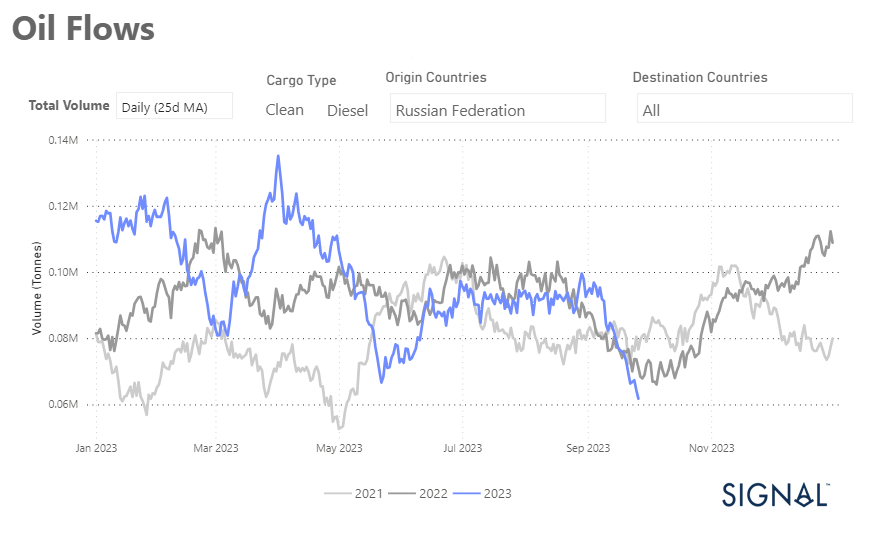
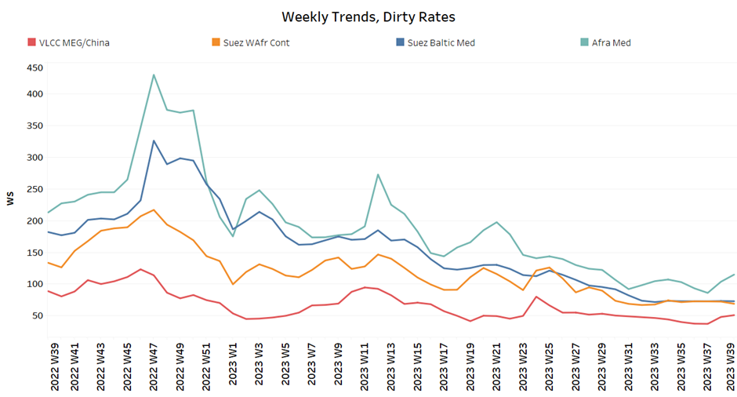
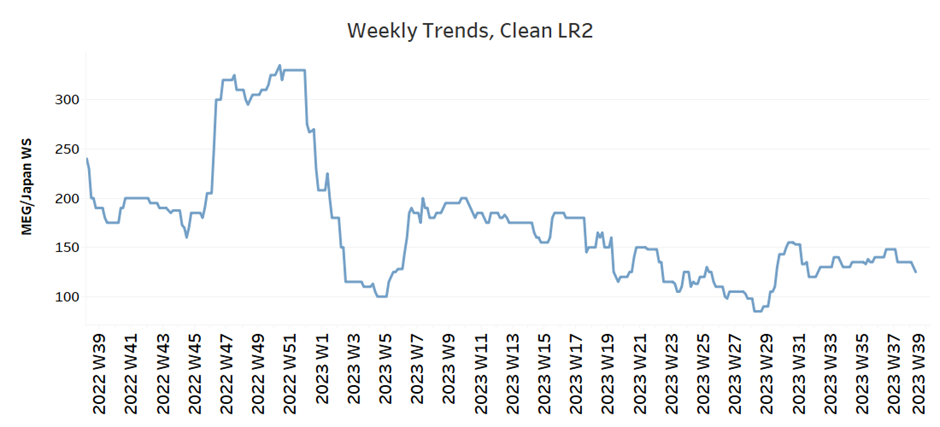
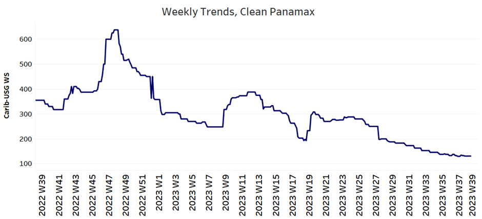
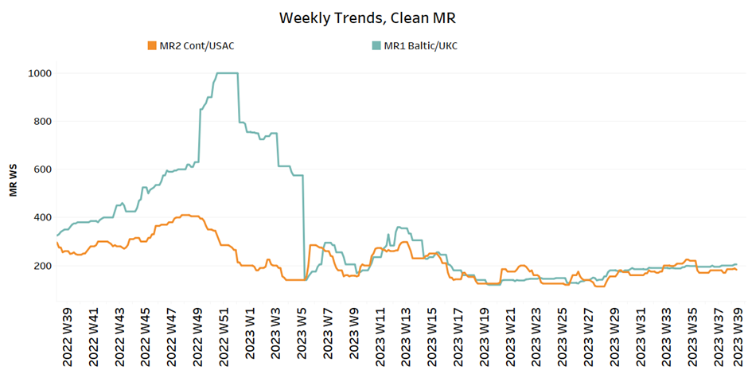
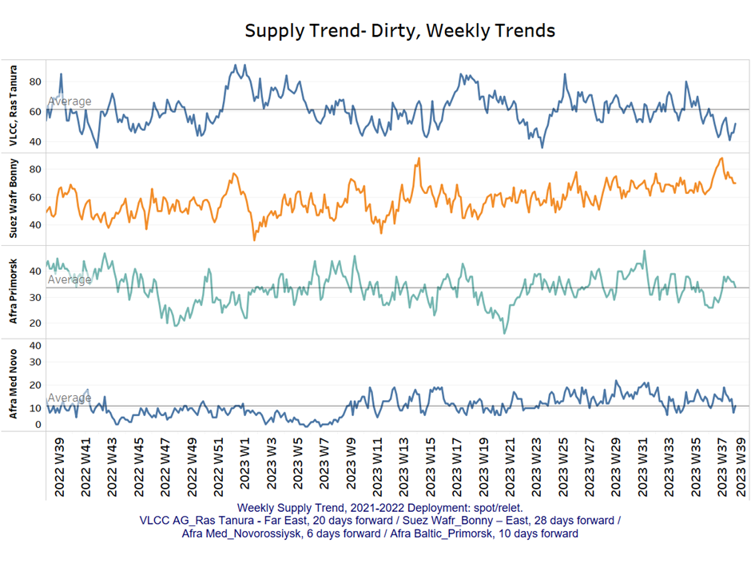
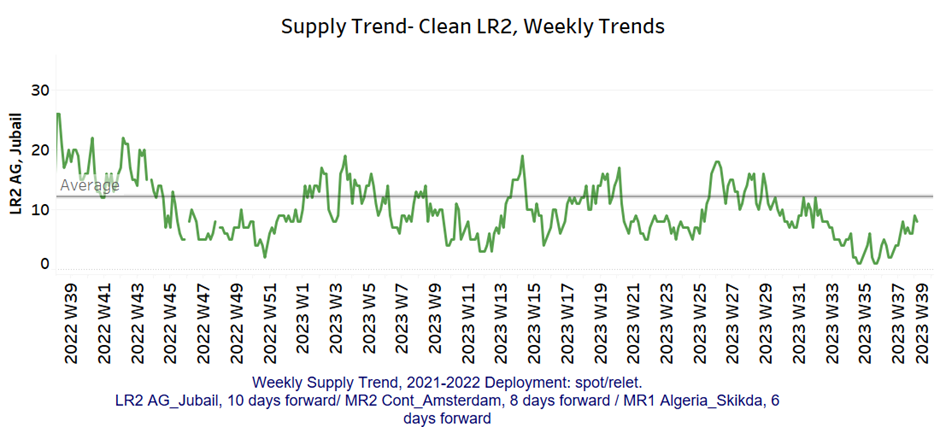
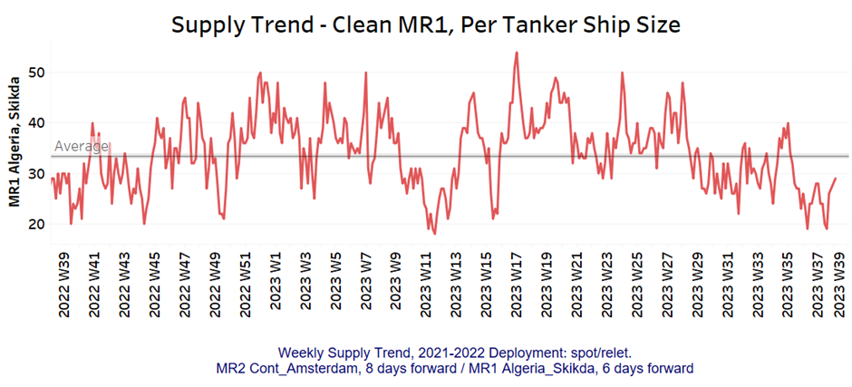
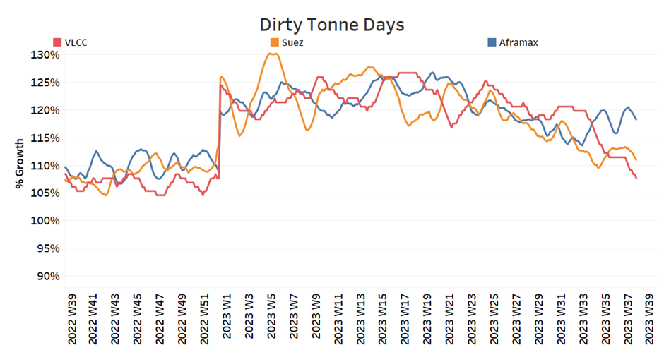
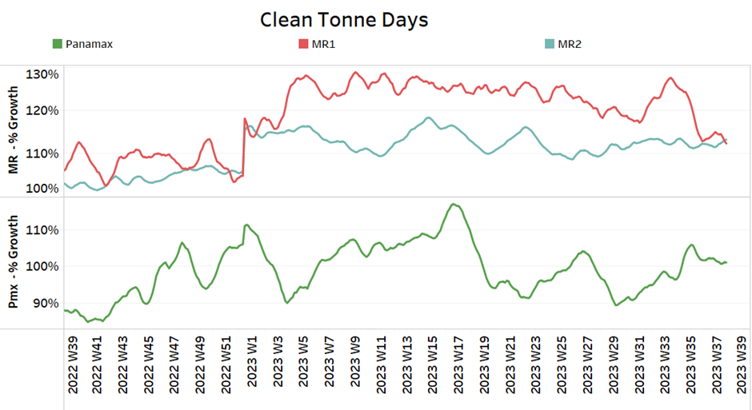

# Signal Tanker Weekly Report

**Date:** September 28, 2023  
**Publisher:** Breakwave Advisors | **Category:** Market Insights  
**Original URL:** [https://www.breakwaveadvisors.com/insights/2023/9/28/signal-tanker-weekly-report](https://www.breakwaveadvisors.com/insights/2023/9/28/signal-tanker-weekly-report)  

---

## Chart of the Week: Clean Diesel Oil Flows Russia to All Destinations

### Russian Diesel Oil Exports in September Hit the Lowest Level of the Year

> **Figure 1: Market Chart 1**  
> **Interactive Data & Source:** [Signal Ocean Platform](https://www.thesignalgroup.com/signal-ocean-platform) | [Local Asset](file:///C:/Users/Dell/Github/Shipping/corpus/03-breakwave/insights/2023/assets/2023-09-28_signal-tanker-weekly-report_img_unnamed-2023-09-28t130123172_3ff9cff24881.png)

In the last week of September, there is some optimism in the VLCC crude oil freight market after a difficult summer season. It should be noted, however, that while there are positive signs, growth rates in tonne days aren't yet robust. The real test is ahead as we move into October, with supply figures already showing a downward trend. This decline is expected to be a driving force for the recovery of the freight market in the coming months.

Interestingly, the clean segment has seen a significant decline in Russian diesel shipments to all destinations. Russia appears to be prioritising its domestic energy needs, as evidenced by the decline in exports. From a historical perspective, September recorded the lowest volume compared to the same month two years ago and all of 2023.
In summary, while there is hope for the VLCC crude oil freight market in the last week of September, it's important to monitor rate and demand trends through October closely. The declining supply trend and the unexpected drop in Russian diesel shipments are notable factors that could affect the market recovery in the coming months.

For more information on this week's trends, see the analysis sections below:

Freight Market, Supply and Demand

## Section 1/ Freight

### Market Rates (WS)

**‘Dirty’ WS​
VLCC - Suezmax - Aframax Mixed**

> **Figure 2: ​​​​​​The Crude Freight Sentiment Appears to Be Recovering For**  
> *​​​​​​The crude freight sentiment appears to be recovering for the second week in a row on the VLCC MEG -China route, while stable levels are being maintained on the Suezmax Wafr-Cont route, and stronger momentum is being seen on the Aframax-Med route.*  
> **Interactive Data & Source:** [Signal Ocean Platform](https://www.thesignalgroup.com/signal-ocean-platform) | [Local Asset](file:///C:/Users/Dell/Github/Shipping/corpus/03-breakwave/insights/2023/assets/2023-09-28_signal-tanker-weekly-report_img_unnamed-2023-09-28t131153572_7a65bcbb6ec4.png)

- **VLCC MEG-China**freight rates rose by 20% from the previous week, WS 51, with signs for a further rise at the end of the month
- **Suezmax**freight rates for shipments from West Africa to continental Europe recorded a downward revision to WS70, down 10% from a month ago, while rates on the Suez-Baltic-Med route remained unchanged at WS72 for three consecutive weeks.
- **Aframax**Med freight rates have exhibited an unexpected surge, reaching WS115 levels, marking a significant 30% increase compared to the preceding week.

> **Figure 3: ‘Product’ Wslr2 Weaker**  
> **Interactive Data & Source:** [Signal Ocean Platform](https://www.thesignalgroup.com/signal-ocean-platform) | [Local Asset](file:///C:/Users/Dell/Github/Shipping/corpus/03-breakwave/insights/2023/assets/2023-09-28_signal-tanker-weekly-report_img_unnamed-2023-09-28t131237700_ff54cd6b6aa5.png)

- **LR2**AG freight rates fell to 125 WS, down 7% week-on-week, while a weaker trend appears to be emerging for the end of the month.

> **Figure 4: PANAMAX (Sentiment: Weaker)**  
> **Interactive Data & Source:** [Signal Ocean Platform](https://www.thesignalgroup.com/signal-ocean-platform) | [Local Asset](file:///C:/Users/Dell/Github/Shipping/corpus/03-breakwave/insights/2023/assets/2023-09-28_signal-tanker-weekly-report_img_unnamed-2023-09-28t131341050_a7e2a87c0f5d.png)

- **Panamax**Carib-to-USG rates fell to 131 WS, down 60% from a year ago, with the downward trend continuing since the end of Week 27.

> **Figure 5: ‘Clean’mr Mixed**  
> **Interactive Data & Source:** [Signal Ocean Platform](https://www.thesignalgroup.com/signal-ocean-platform) | [Local Asset](file:///C:/Users/Dell/Github/Shipping/corpus/03-breakwave/insights/2023/assets/2023-09-28_signal-tanker-weekly-report_img_unnamed-2023-09-28t131501789_4cbd3d78d839.png)

- **MR1**rates for the Baltic continent increased to WS 200, up 12% from the previous week, but rates are still well below those of a year ago, up 45%.

- **MR2**rates for shipments from the continent to the U.S. remained at relatively flat levels around WS180, with no significant weekly downward revisions, while overall momentum appears to have slowed in September.

## Section 2/ Supply

### Supply Trend Lines for Key Load Areas

> **Figure 6: 'Dirty' (#Vessels) - Decreasing**  
> **Interactive Data & Source:** [Signal Ocean Platform](https://www.thesignalgroup.com/signal-ocean-platform) | [Local Asset](file:///C:/Users/Dell/Github/Shipping/corpus/03-breakwave/insights/2023/assets/2023-09-28_signal-tanker-weekly-report_img_unnamed-2023-09-28t131554367_87d9545e8936.png)

Crude oil tanker supply showed the first signs of decline, with the Ras Tanuara VLCC number below the annual average, while the Aframax number approached the annual average, with a tendency to fall to a lower level by the end of the month.

- **VLCC Ras Tanura**: The current number of ships is 52, almost 10 below the annual average, and intense volatility over the last two weeks.
- **Suezmax Wafr:**The figure was revised downward to 70 from a high of over 80 in the previous two weeks, and it remains to be seen whether the downward trend will continue, given the high number of ships recorded in previous weeks.
- **Aframax Primorsk:**The current number of ships is 34, the average for the year, and it remains to be seen if the decline will continue given the recent low number of week 37 (~26)
- **Aframax Med Novo:**The number of ships is now 11, 8 less than two weeks ago, with a downward trend in the second half of September.

‘

> **Figure 7: 'Clean'lr2 (#Vessels) - Increasing**  
> **Interactive Data & Source:** [Signal Ocean Platform](https://www.thesignalgroup.com/signal-ocean-platform) | [Local Asset](file:///C:/Users/Dell/Github/Shipping/corpus/03-breakwave/insights/2023/assets/2023-09-28_signal-tanker-weekly-report_img_unnamed-2023-09-28t131709021_6d6918a9c62a.png)

> **Figure 8: MR1 (#Vessels) - Increasing**  
> **Interactive Data & Source:** [Signal Ocean Platform](https://www.thesignalgroup.com/signal-ocean-platform) | [Local Asset](file:///C:/Users/Dell/Github/Shipping/corpus/03-breakwave/insights/2023/assets/2023-09-28_signal-tanker-weekly-report_img_unnamed-2023-09-28t132058230_945ead4bb45a.png)

- **Clean LR2 AG Jubail:**The number of ships sustained the increase of the third week of September, and rose further to 9 ships, 5 above the annual average.

- **Clean MR1 Algeria Skikda**: The current count is 29 ships, 10 more than a week ago, while the number is still below the annual average of 33.

## Section 3/ Demandsummary of Tanker Demand per Ship Size & Segment

> **Figure 9: ​​‘Dirty’ Decreasing**  
> **Interactive Data & Source:** [Signal Ocean Platform](https://www.thesignalgroup.com/signal-ocean-platform) | [Local Asset](file:///C:/Users/Dell/Github/Shipping/corpus/03-breakwave/insights/2023/assets/2023-09-28_signal-tanker-weekly-report_img_unnamed-2023-09-28t132448264_9dadf6c567ae.png)

- **Dirty**tonne days: At the end of September, the percentage increase in demand (in tonne days) was down for all crude oil vessel categories; despite signs of an upturn in Aframax, there was eventually a downward correction. In the VLCC segment, growth rates continued to be much steeper than eight weeks earlier.

> **Figure 10: ‘Clean’ Panamax / MR Decreasing**  
> **Interactive Data & Source:** [Signal Ocean Platform](https://www.thesignalgroup.com/signal-ocean-platform) | [Local Asset](file:///C:/Users/Dell/Github/Shipping/corpus/03-breakwave/insights/2023/assets/2023-09-28_signal-tanker-weekly-report_img_unnamed-2023-09-28t132538173_6025ba74dd29.png)

- **Panamax tonne days:**The growth rate has steadily increased over the last two weeks, with the last peak recorded in week 36.

- **Clean MR tonne days:**Downward pressure continues to be revised sharply downward for the MR1 size, while demand sentiment for MR2 appears to be gradually increasing toward the end of September.

Data Source:[Signal Ocean Platform](https://www.thesignalgroup.com/signal-ocean-platform)
