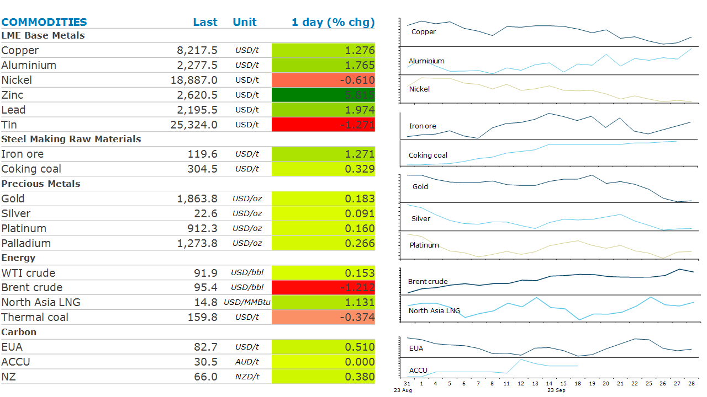

# Commodities Wrap

**Date:** September 29, 2023  
**Publisher:** Breakwave Advisors | **Category:** Market Insights  
**Original URL:** [https://www.breakwaveadvisors.com/insights/2023/9/29/commodities-wrap](https://www.breakwaveadvisors.com/insights/2023/9/29/commodities-wrap)  

---

*By*[*Daniel Hynes*](https://www.linkedin.com/in/dahynes/)

Commodity prices saw some mean reversion, with oil prices retreating from a recent high while metals pared some of their recent losses.

> **Figure 1: 1695941561675**  
> **Interactive Data & Source:** [Linkedin](https://www.linkedin.com/newsletters/commodities-wrap-6692196755876012032/?fbclid=IwAR3kiXJqZdxmp9ZcRwBNI7FsBySI-XSC0pfPur1qzjt7OZp7PTE59Tsl1QI) | [Local Asset](file:///C:/Users/Dell/Github/Shipping/corpus/03-breakwave/insights/2023/assets/2023-09-29_commodities-wrap_img_1695941561675_00272df4de9e.png)

**Crude oil**prices retreated after touching a high of USD97/bbl on Wednesday. US oil inventories fell to a multi-year seasonal low; this supported the steepening backwardated curve for both Brent and WTI. Production cuts by Saudi Arabia and Russia are significantly tightening the oil market balance. Saudi Arabia is likely to raise its official oil selling price to Asia for November sales, according to Bloomberg survey data. This all comes when demand in China and the US looks strong. Increase in international travel during the Golden Week holiday is boosting Chinese oil demand. In addition, supply of oil products is getting tighter with recent export curbs. China’s plans to limit fuel export quotas for this year could further tighten the oil products market. The market is already grappling with lower inventories and a recently imposed export ban of diesel and gasoline by Russia. Adding to this supply woes, US oil refineries will be shut for maintenance, taking some production off in the fourth quarter.

**European gas**inched marginally higher. Production outages disrupted supply flows ahead of the heating season, which is starting from next week. While European gas storage is nearly full, inventory withdrawals will be guiding prices. Any further disruptions in supply flows could see sharp withdrawals from inventories, leaving the market susceptible to price spikes. Russian gas production increased by 1.4bcm y/y to 47.7bcm in August, according to Bloomberg. However, North Asian LNG prices retreated as higher prices weighed on spot demand. Strong buying from Japan and South Korea failed to lift prices. Indian importers are delaying shipments as prices rose more than 10% in last two months.

**Industrial metals**gained some ground on Thursday on a retreating USD. Zinc prices rose to USD2,620/t as inventories declined, this saw cash-3m spread narrowing by USD14.50/t. Copper and aluminium pared their losses as well. Nickel was the only metal that fell due to rising inventories at the SHFE. Iron ore prices held near USD116/t.

**Gold**extended its losses to USD1,876/oz. A retreating USD failed to support prices. China’s gold spot premium fell sharply by USD30/oz. Lower prices saw some buying emerging, with ETF holdings rising by 17,484koz. Platinum was the outperformer in the space as prices rebounded to USD910/oz.

Data source:[Commodities Wrap](https://www.linkedin.com/newsletters/commodities-wrap-6692196755876012032/?fbclid=IwAR3kiXJqZdxmp9ZcRwBNI7FsBySI-XSC0pfPur1qzjt7OZp7PTE59Tsl1QI)
