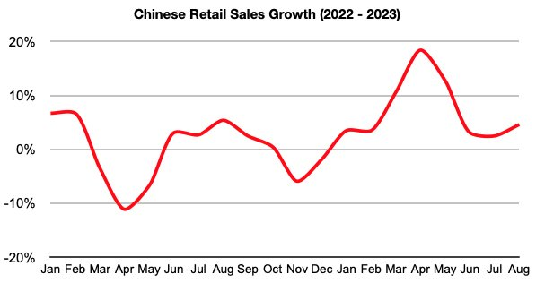

# Improvement in Chinese Consumer Spending

**Date:** October 02, 2023  
**Publisher:** Breakwave Advisors | **Category:** Market Insights  
**Original URL:** [https://www.breakwaveadvisors.com/insights/2023/10/2/improvement-in-chinese-consumer-spending](https://www.breakwaveadvisors.com/insights/2023/10/2/improvement-in-chinese-consumer-spending)  

---

*By*[*Jeffrey Landsberg*](https://www.linkedin.com/in/jeffrey-landsberg-70ab957/)

China's August retail sales data was recently released and showed year-on-year growth of 4.6%. This is much higher than the 2.5% growth that was reported in July (July’s 2.5% growth was the lowest reported all year) and it marks the largest growth seen since May. Noteworthy is that the 4.6% growth also came in much stronger than consensus was expecting (consensus was that August would again see growth of only 2.5% as was seen in July).

> **Figure 1: Chart 1 (83)**  
> [Local Asset](file:///C:/Users/Dell/Github/Shipping/corpus/03-breakwave/insights/2023/assets/2023-10-02_improvement-in-chinese-consumer-spending_img_chart1288329_cdcbb177afa8.jpg)

Remaining very significant to us is that Chinese consumers continue to buy more goods than they did a year ago. In comparison, consumers in the United States and various other nations continue to purchase less goods than they did a year ago. This is an important issue that we have continued to examine in Commodore's Weekly Dry Bulk Reports and Weekly China Reports. Our most recent Weekly China Report has discussed China's consumer spending in greater detail. Also remaining particularly notable outside of China is that retail sales growth in the United States has now come in less than inflation during nine of the last ten months.
