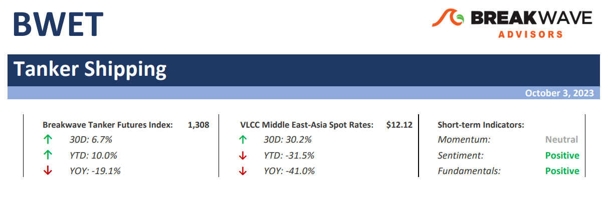
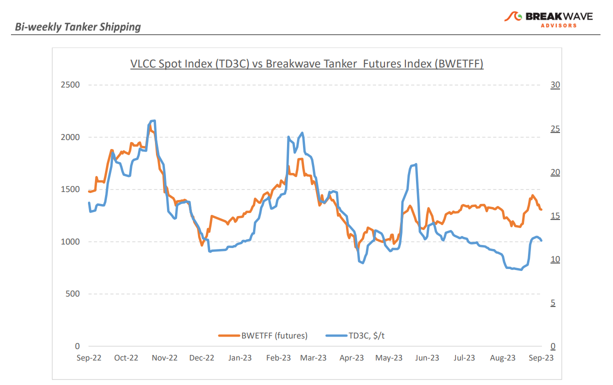
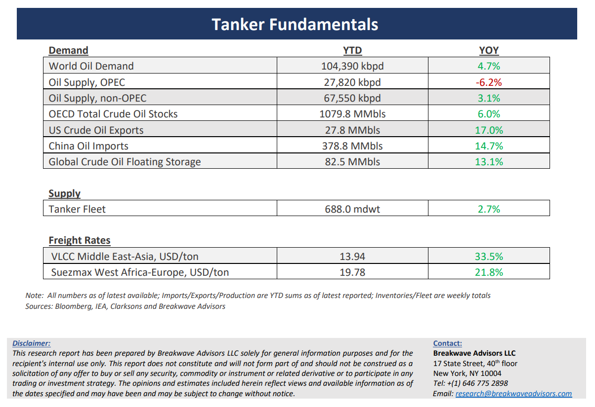

# Breakwave Bi-Weekly Tanker Report - October 3, 2023

**Date:** October 03, 2023  
**Publisher:** Breakwave Advisors | **Category:** Market Insights  
**Original URL:** [https://www.breakwaveadvisors.com/insights/2023/10/03/breakwave-bi-weekly-tanker-report-oct-03-2023-g4dd7](https://www.breakwaveadvisors.com/insights/2023/10/03/breakwave-bi-weekly-tanker-report-oct-03-2023-g4dd7)  

---

> **Figure 1: Tankerreporttop**  
> [Local Asset](file:///C:/Users/Dell/Github/Shipping/corpus/03-breakwave/insights/2023/assets/2023-10-03_breakwave-bi-weekly-tanker-report-oct-03-2023-g4dd7_img_tankerreporttop_d913bc16f9f7.png)

**• VLCC spot market sees uptick in late September amid ongoing Atlantic challenges**– Following a period of subdued fixing, the VLCC market experienced a brief period of elevated activity, which in turn pushed spot rates to relatively high levels rather fast, providing a ray of hope after the recent downturn. VLCC rates in the Middle East region went up considerably due to tightening vessel availability, with charterers scrambling to secure vessels for their October loading programs. Although there are encouraging signs following such a weekly upturn, the year-on-year comparison indicates that the market is still lagging, as freight rates struggle to find a stable footing. In the Atlantic, the tonnage list is still exerting pressure on the market, although shipowners continue to seek higher rates, especially as the winter season approaches. With September behind us, a crucial question remains unanswered: Will spot rates for VLCCs receive a boost from Chinese crude oil imports and the expected increase in fuel demand during the northern hemisphere winter season? In the Atlantic market, there is a scarcity of projected tonnage that will help avoid additional downward pressure on rates. At the same time, we expect higher oil export volumes out of the Middle East despite all the talk about lower production levels. Combine the above with the potential for inclement weather, and the ingredients for a winter rally are firmly in place.

**• Oil price forecasts move up as spot prices top $90 per barrel**– There is nothing that changes sentiment more than price, and the recent rally in oil prices have once again pushed major banks to revisit their own oil projections, which just a few months ago were sitting at much lower levels than today. Unfortunately, the lag effect on analyst projections remains an unspoken rule, and with oil prices exceeding $90 per barrel, the question now becomes how quickly OPEC will increase (“cheat”) production to take advantage of the rally in prices, now that the market expects a significant deficit as we head into the strongest quarter of the year in terms of demand. For those who have followed OPEC for a while, there is always a difference between actions and words, and already August saw an increase in exports despite all the talk about declining production. Our expectation is that supply will be higher than what most people expect, which should aid tanker volumes as we head into the winter. Such a supply increase combined with slower economic growth due to a challenging macro environment should in turn lead to lower oil prices. Once again, such a view is firmly against consensus, similar to our previous view in the summer for higher oil prices, when most investors were concerned about demand rather than supply.

**• Tanker cycle driven by tight supply, recovering demand**– The tanker market is recovering from a long period of staggered rates as the growth in new vessel supply shrinks while oil demand is recovering in line with the global economy. A historically low orderbook combined with favorable demand fundamentals should continue to support increased spot rate volatility, which combined with the ongoing geopolitical turmoil, should support freight rates in the medium term.

> **Figure 2: Tankerreportchart**  
> [Local Asset](file:///C:/Users/Dell/Github/Shipping/corpus/03-breakwave/insights/2023/assets/2023-10-03_breakwave-bi-weekly-tanker-report-oct-03-2023-g4dd7_img_tankerreportchart_9e6b2b7af1f3.png)

> **Figure 3: Tankerreportbottom**  
> [Local Asset](file:///C:/Users/Dell/Github/Shipping/corpus/03-breakwave/insights/2023/assets/2023-10-03_breakwave-bi-weekly-tanker-report-oct-03-2023-g4dd7_img_tankerreportbottom_51f6a7531839.png)

### Subscribe:
