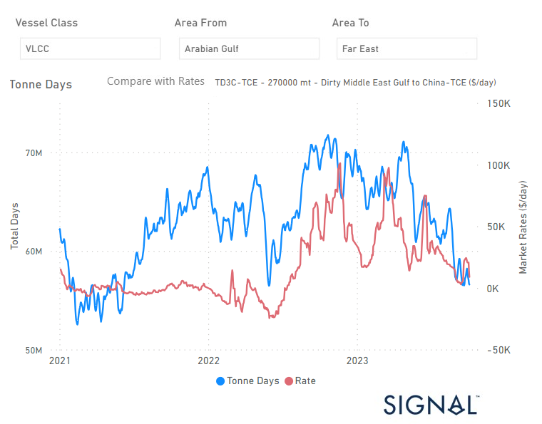
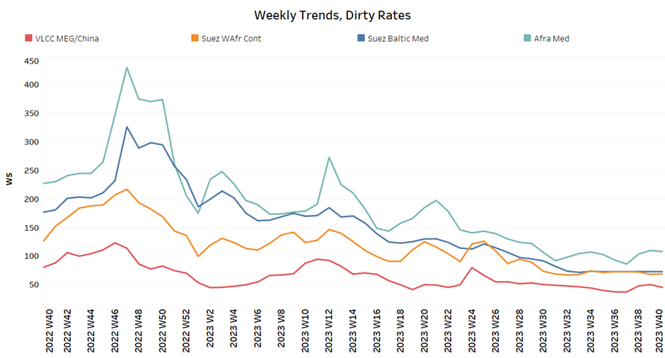
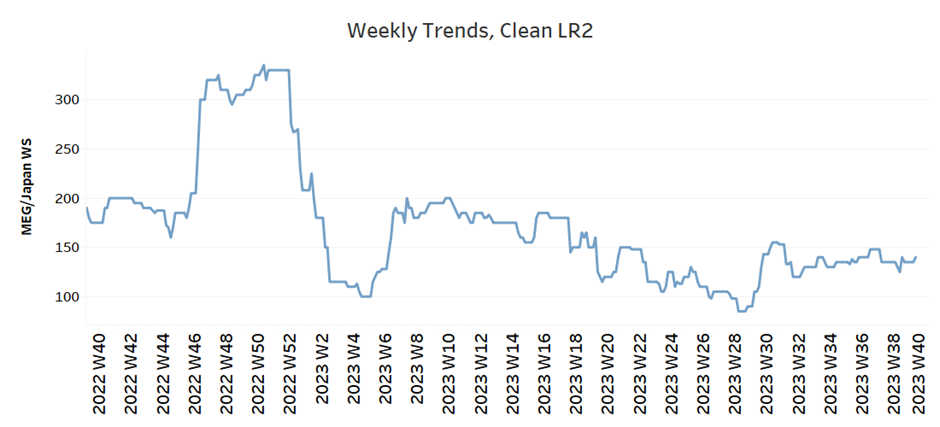
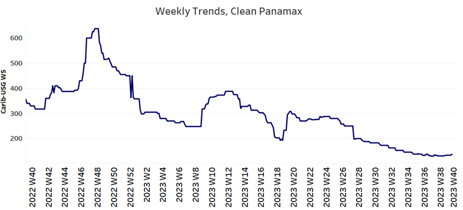
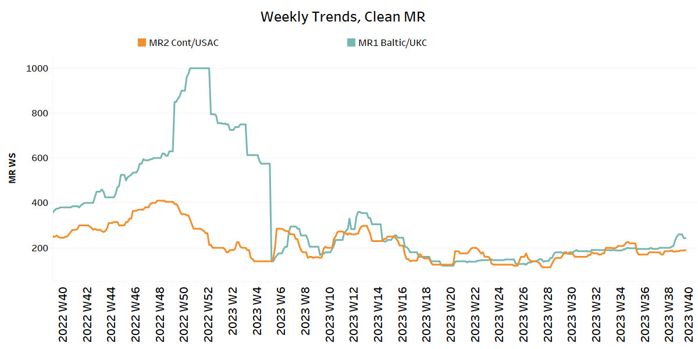
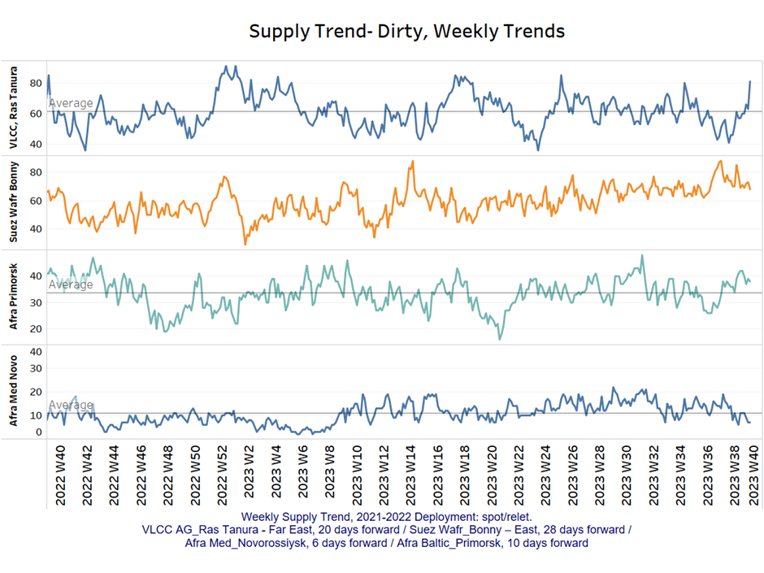
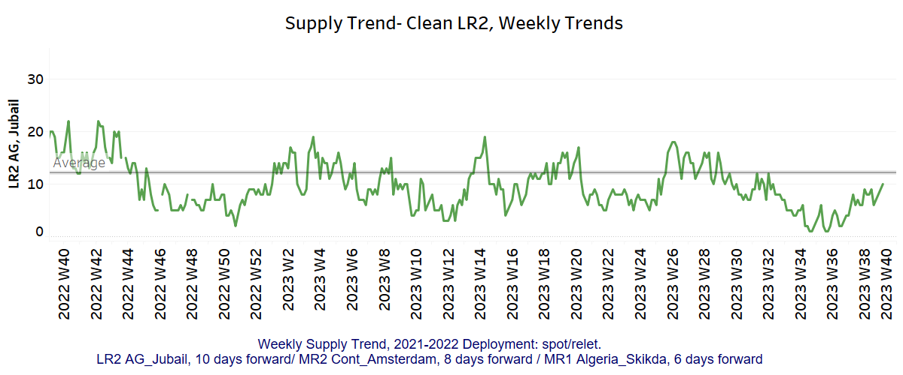
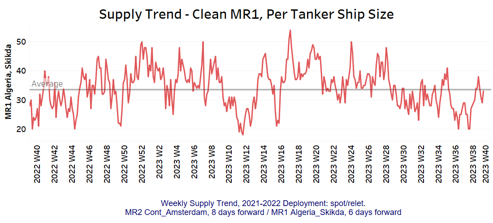
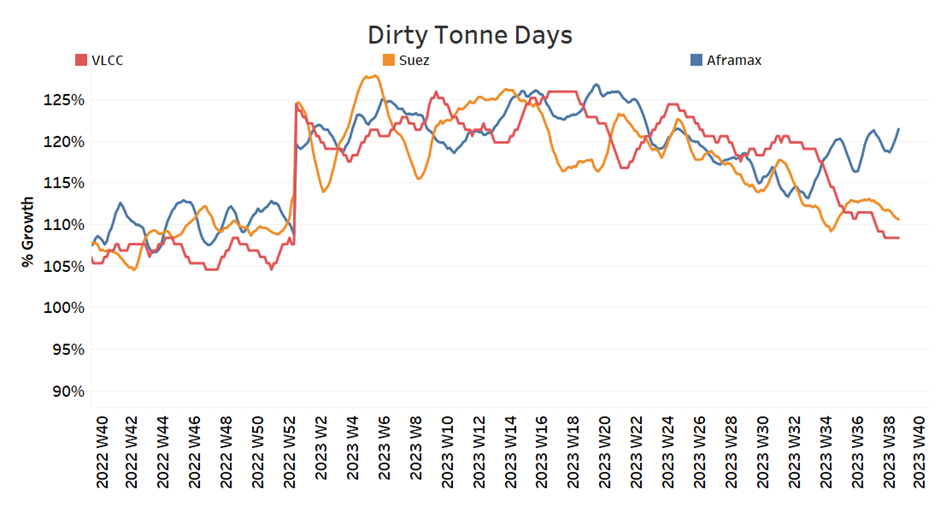
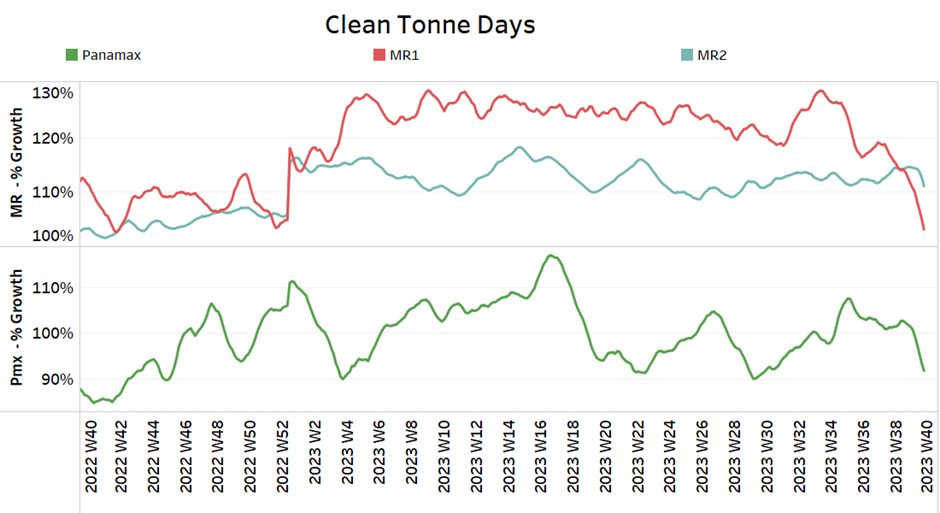

# Signal Tanker Weekly Report

**Date:** October 06, 2023  
**Publisher:** Breakwave Advisors | **Category:** Market Insights  
**Original URL:** [https://www.breakwaveadvisors.com/insights/2023/10/6/signal-tanker-weekly-report](https://www.breakwaveadvisors.com/insights/2023/10/6/signal-tanker-weekly-report)  

---

## Chart of the Week: VLCC Tonne Days From the AG to China

***VLCC Tonne days growth from AG to China has decreased to the lowest level since the end of 2022***

> **Figure 1: Market Chart 1**  
> **Interactive Data & Source:** [Signal Ocean Platform](https://www.thesignalgroup.com/signal-ocean-platform) | [Local Asset](file:///C:/Users/Dell/Github/Shipping/corpus/03-breakwave/insights/2023/assets/2023-10-06_signal-tanker-weekly-report_img_unnamed-2023-10-06t142709826_7baa02bd8069.png)

During the first week of October, the VLCC MEG China rates experienced a downward revision, amid hopes of a recovery. Looking at the demand, growth rates are still significantly lower than what they were the previous year leading to a negative sentiment in the crude freight market. Moreover, there are concerns about oil demand as oil prices dropped early in October due to Saudi Arabian oil supply cuts and a drop in US crude oil inventories.
The U.S. crude futures have been trading lower for the fourth time in five sessions, and they currently stand at $87.58 a barrel. If this trend continues, it would be the lowest closing price since Sept. 11.
In the meantime, OPEC has decided to leave oil production levels unchanged. The OPEC+ panel reviewed the oil market and ended a brief meeting on Wednesday without recommending any changes to the current oil production policy. This decision came after Saudi Arabia and Russia both released separate statements confirming their intention to stick to their respective voluntary supply cuts until the end of the year.
​​​​​​

For more information on this week's trends, see the analysis sections below:

Freight Market, Supply and Demand

## Section 1/ Freight

### Market Rates (WS)

> **Figure 2: ‘Dirty’ Ws​vlcc - Suezmax - Aframax Mixed**  
> **Interactive Data & Source:** [Signal Ocean Platform](https://www.thesignalgroup.com/signal-ocean-platform) | [Local Asset](file:///C:/Users/Dell/Github/Shipping/corpus/03-breakwave/insights/2023/assets/2023-10-06_signal-tanker-weekly-report_img_unnamed-2023-10-06t142928176_a3373711538b.png)

​​​​The VLCC MEG-China rates dropped again in early October, while the Suezmax and Aframax segments remained stable.

- VLCC MEG-China freight rates decreased to WS 40, down 20% from the previous week, although they remain 8% higher than a month ago.
- Suezmax freight rates for shipments from West Africa to continental Europe have remained steady, holding levels above WS70. Similarly, rates on the Suez-Baltic-Med route have maintained a consistent momentum, remaining unchanged at WS72 for four consecutive weeks.
- Aframax Med freight rates continued to hover around WS110 levels but dropped by 8% compared to the levels of a month ago.

> **Figure 3: ‘Product’ Wslr2 Steady**  
> **Interactive Data & Source:** [Signal Ocean Platform](https://www.thesignalgroup.com/signal-ocean-platform) | [Local Asset](file:///C:/Users/Dell/Github/Shipping/corpus/03-breakwave/insights/2023/assets/2023-10-06_signal-tanker-weekly-report_img_unnamed-2023-10-06t143034364_a669b26214ea.png)

- LR2 AG freight rates remained stable above WS130, with a 4% increase over a month.

> **Figure 4: Market Chart 4**  
> **Interactive Data & Source:** [Signal Ocean Platform](https://www.thesignalgroup.com/signal-ocean-platform) | [Local Asset](file:///C:/Users/Dell/Github/Shipping/corpus/03-breakwave/insights/2023/assets/2023-10-06_signal-tanker-weekly-report_img_unnamed-2023-10-06t143116358_060db119292b.png)

- Panamax Carib-to-USG rates fell to 134 WS, down 60% from a year ago, with the downward trend continuing since the end of Week 27.

## ‘Clean’mr Mixed

> **Figure 5: Clean**  
> **Interactive Data & Source:** [Signal Ocean Platform](https://www.thesignalgroup.com/signal-ocean-platform) | [Local Asset](file:///C:/Users/Dell/Github/Shipping/corpus/03-breakwave/insights/2023/assets/2023-10-06_signal-tanker-weekly-report_img_unnamed-2023-10-06t143224404_8c06d3358f57.png)

- MR1 rates for the Baltic continent increased to WS 250, up 20% from the previous week.

- MR2 rates for shipments from the continent to the U.S. increased to WS190, but still remain 15% lower than one month ago.

SECTION 2/ SUPPLY

Supply Trend Lines for Key Load Areas

> **Figure 6: 'Dirty' (#Vessels) - Mixed**  
> **Interactive Data & Source:** [Signal Ocean Platform](https://www.thesignalgroup.com/signal-ocean-platform) | [Local Asset](file:///C:/Users/Dell/Github/Shipping/corpus/03-breakwave/insights/2023/assets/2023-10-06_signal-tanker-weekly-report_img_unnamed-2023-10-06t143412190_be85dac738bf.png)

In early October, crude oil tanker supply showed a mixed picture. The supply trend for the Ras Tanura VLCC increased, while other crude tanker categories saw a downward correction from the end of the previous month.

- VLCC Ras Tanura: The number of ships increased to 80, exceeding both the previous week's count and the annual average.
- Suezmax Wafr: The figure demonstrated a downward trend, stabilizing at 70 after peaking at over 80 during week 38. However, it is uncertain if this trend will continue in the upcoming weeks of October.
- Aframax Primorsk: The current number of ships is 38, 4 above the average for the year, however, still significantly above the record low number of week 37 (~26).
- Aframax Med Novo: The number of ships has decreased to 7, which is 12 less than the peak in week 36.

> **Figure 7: 'Clean'lr2 (#Vessels) - Increasing**  
> **Interactive Data & Source:** [Signal Ocean Platform](https://www.thesignalgroup.com/signal-ocean-platform) | [Local Asset](file:///C:/Users/Dell/Github/Shipping/corpus/03-breakwave/insights/2023/assets/2023-10-06_signal-tanker-weekly-report_img_unnamed-2023-10-06t143543251_5fc6fca745d7.png)

> **Figure 8: MR1 (#Vessels) - Decreasing**  
> **Interactive Data & Source:** [Signal Ocean Platform](https://www.thesignalgroup.com/signal-ocean-platform) | [Local Asset](file:///C:/Users/Dell/Github/Shipping/corpus/03-breakwave/insights/2023/assets/2023-10-06_signal-tanker-weekly-report_img_unnamed-2023-10-06t143622653_a7627be58043.png)

- Clean LR2 AG Jubail: The number of recorded ships shows signs of increasing again, although there was a drop at the end of September. The recent figure brings the trend closer to the annual average.

- Clean MR1 Algeria Skikda: The current count is 33 ships, 3 more than a week ago, while the number is still below the annual average.

## Section 3/ Demandsummary of Tanker Demand per Ship Size & Segment

> **Figure 9: ​​‘Dirty’ Mixed**  
> **Interactive Data & Source:** [Signal Ocean Platform](https://www.thesignalgroup.com/signal-ocean-platform) | [Local Asset](file:///C:/Users/Dell/Github/Shipping/corpus/03-breakwave/insights/2023/assets/2023-10-06_signal-tanker-weekly-report_img_unnamed-2023-10-06t143749876_d46474000654.png)

- Dirty tonne days: The demand for Aframax increased, while VLCC and Suezmax faced a persistent downward correction, posing a challenge for the freight market sentiment in October.

> **Figure 10: ‘Clean’ Panamax / MR Decreasing**  
> **Interactive Data & Source:** [Signal Ocean Platform](https://www.thesignalgroup.com/signal-ocean-platform) | [Local Asset](file:///C:/Users/Dell/Github/Shipping/corpus/03-breakwave/insights/2023/assets/2023-10-06_signal-tanker-weekly-report_img_unnamed-2023-10-06t143834756_b3c7fb906d26.png)

- Panamax tonne days: The growth rate sharply declined in early October and continues to trend downwards.

- Clean MR tonne days: The MR1 segment experienced a record low growth rate throughout the year, while demand sentiment for MR2 softened.

Data Source:[Signal Ocean Platform](https://www.thesignalgroup.com/signal-ocean-platform)
