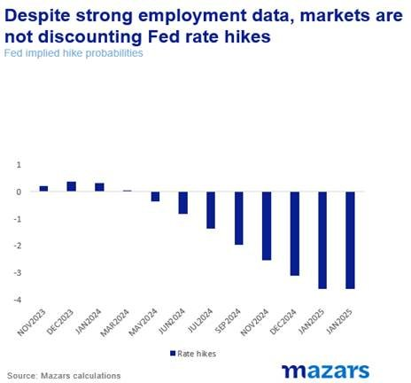
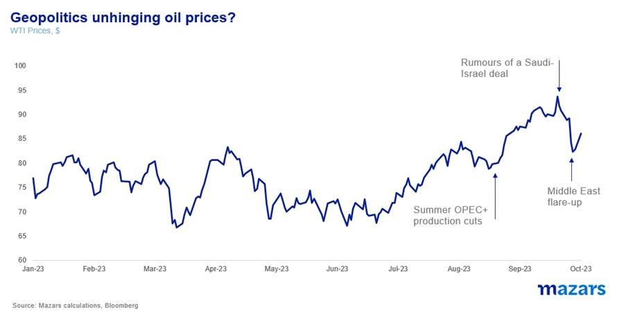
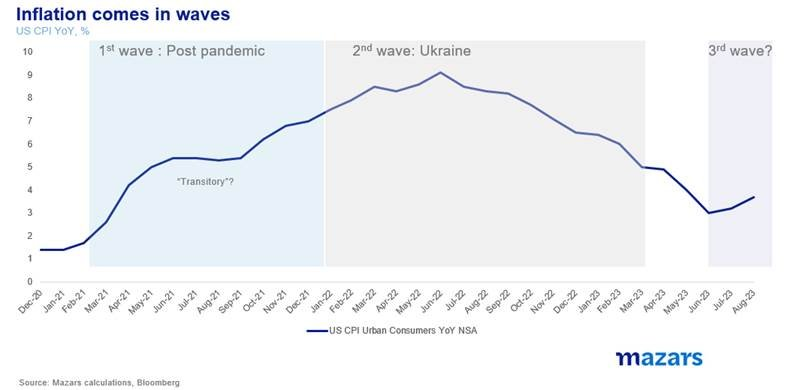
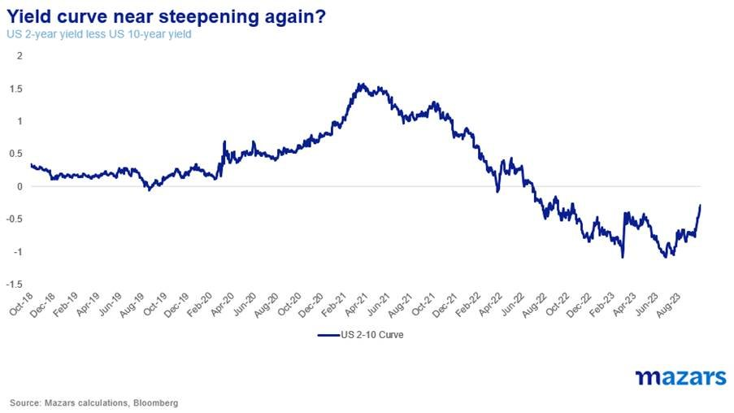
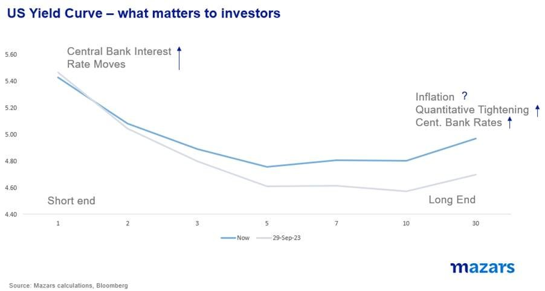

# Long-term yields come with risks

**Date:** October 09, 2023  
**Publisher:** Breakwave Advisors | **Category:** Market Insights  
**Original URL:** [https://www.breakwaveadvisors.com/insights/2023/10/9/long-term-yields-come-with-risks](https://www.breakwaveadvisors.com/insights/2023/10/9/long-term-yields-come-with-risks)  

---

*By*[*George Lagarias*](https://www.linkedin.com/in/george-lagarias-mba-3baa769/)

The resurgence of the Middle East conflict is likely to affect the possible Saudi-Israel deal which had been pushing oil prices down. Inflation may be pressured higher, due to a stronger-than-expected economy and a possible new wave of high energy prices.

1. For the past few weeks, the yield curve has been dis-inverting, i.e. longer bond yields are catching up to short-term yields.
2. Those who buy long bonds for the yield have inflation to contend with, as they don’t know whether they will lose money in real terms.
3. Those who buy for capital appreciation should be prepared for possible losses if yields go higher.

Last week added two key pieces of information: A robust (ish) US labour market, and a flare-up of tensions in the Middle East. Both of these are important to portfolio holders, especially those with a large allocation in bonds, especially long-dated bonds.

Let’s take things from the top. On Friday, the US announced a large jump in payrolls, which indicates that the labour market, and thus the economy, is strong, perhaps stronger than most economists expected at this particular juncture. Granted, unemployment didn’t tick down and hourly earnings did, but that’s all within the margin of statistical error. The bigger picture is and has been for some time, that the US is headed for a soft landing if any landing at all.

This is ostensibly bad news for those who hoped that the Fed would cut interest rates soon. Instead, markets may get another hike, although the probabilities of that remain divided.

> **Figure 1: Market Chart 1**  
> [Local Asset](file:///C:/Users/Dell/Github/Shipping/corpus/03-breakwave/insights/2023/assets/2023-10-09_long-term-yields-come-with-risks_img_image006281529_c7506438c866.jpg)

Again, in terms of the bigger picture, it doesn’t matter. The Fed has communicated that it plans to keep rates higher for longer. The question is not “When is the last rate hike”, but rather “how long is ‘longer’”.

When all is said and done, what this all means is that stronger-than-expected growth may result in stronger-than-expected inflation.

Adding to the issue is the recent conflict between Palestinians and Israelis. While it is tempting to classify this weekend’s incident as “one of those things”, it really isn’t.

· For one, we need to consider that global geopolitical entropy is increasing, leading to an unbalanced world. Incidents which were isolated may now have wider and unexpected repercussions.

· Second, if Ukraine has taught us anything, is that the wish for a ‘short war’ more often than not clashes with reality, especially if both adversaries prove to be intransigent.

· Third, this is the worst escalation of the conflict in years. Both sides are digging in for what is likely to be a prolonged clash. The more it lasts, experience shows, the more likely other parties could get dragged in, either militarily or diplomatically, making a resolution even harder.

Whatever the outcome, oil prices are going to be pressured upward, at least for the next few days.

Needless to say that the timing of this escalation is likely to mean that any rumoured deal between Saudi Arabia and Israel will be impacted. After the weekend’s developments, it is safe to say that it is difficult for the deal to go ahead. Prices rose again.

> **Figure 2: Market Chart 2**  
> [Local Asset](file:///C:/Users/Dell/Github/Shipping/corpus/03-breakwave/insights/2023/assets/2023-10-09_long-term-yields-come-with-risks_img_image00728429_d45eb0a65e9e.jpg)

With West Texas Crude near $90 again, we are risking a third wave of inflation. The first was the post-Covid supply chain disruptions, which were characterised as ‘transitory’. The second wave started when Russia invaded Ukraine, adding to pressures already built up. Cash-flush consumers and tight labour markets turned supply pressures into demand pressures, and inflation shot up to levels we haven’t seen in decades.

> **Figure 3: Market Chart 3**  
> [Local Asset](file:///C:/Users/Dell/Github/Shipping/corpus/03-breakwave/insights/2023/assets/2023-10-09_long-term-yields-come-with-risks_img_image00828429_1d16ba19f2be.jpg)

Now, as the first and second waves seem to subside, a result also of sharp rate hikes, renewed pressures from oil prices could well create a third wave. This could result in prolonged inflation, rates going higher or remaining higher for even longer than anticipated and growth suffering.

This is not bad news for bondholders, per se. Many are locking in high yields, especially at the shorter end, as the yield curve has been inverted (short-term bonds yielding higher than long-term bonds). Many are also locking in high yields over the longer term, hoping for not just the yield (they can get it higher at the shorter end), but also capital appreciation if yields fall (and prices rise).

For the past few weeks, the yield curve has been dis-inverting, i.e. longer bond yields are catching up to short-term yields.

> **Figure 4: Market Chart 4**  
> [Local Asset](file:///C:/Users/Dell/Github/Shipping/corpus/03-breakwave/insights/2023/assets/2023-10-09_long-term-yields-come-with-risks_img_image00928429_26f414d90680.jpg)

Now remember that inflation lives on the longer end of the curve. For it is investors who are tied to a yield for a long time that are mostly afraid of inflationary pressures. But apart from inflation, there’s another monster, much bigger, that lives on the longer end. The Fed. In the years preceding 2022, the US central bank has become the main buyer of US debt, especially on the long end. This was called “Quantitative Easing”. As the Fed was a big buyer of long bonds, it made sense for investors to buy long, and hope for capital appreciation as the Fed would eagerly take it from their hands. But now, the Fed is performing the opposite operation, “Quantitative Tightening”, selling long bonds to eager investors who like the yield.

> **Figure 5: Market Chart 5**  
> [Local Asset](file:///C:/Users/Dell/Github/Shipping/corpus/03-breakwave/insights/2023/assets/2023-10-09_long-term-yields-come-with-risks_img_image01028429_9223d01fef27.jpg)

The beauty of bonds is that they promise an exact return if held to maturity. But those who buy with thoughts of capital appreciation must be very careful. They need to remember, that the central bank is now a seller, not a buyer. They face a hawkish Fed and unpredictable inflation. The yield they get is hard-earned. Investors need to be prepared to hold the long bond to maturity, 10 or even 30 years, to get the return promised and hope that inflation will not diminish them.

Their best bet to make a hefty capital profit is probably an incident that would force an emergency cut in rates. But, barring a financial accident with lasting consequences, it is fathomable that rates, especially on the long end, could remain higher for a long time, even if shorter rates eventually subside. They could even go higher. In that case, losses for long bond holders who are not prepared to hold until maturity could be exponential.
