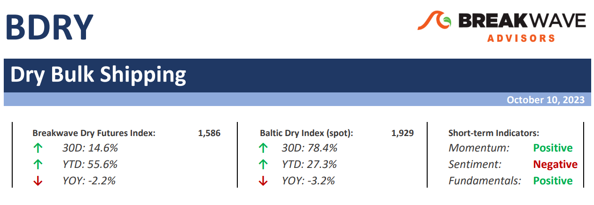
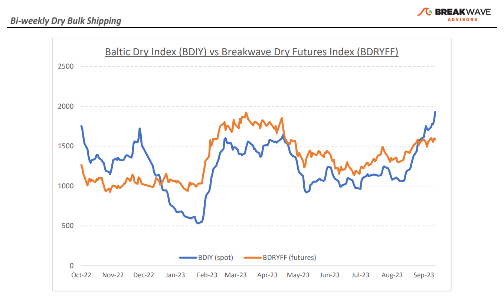
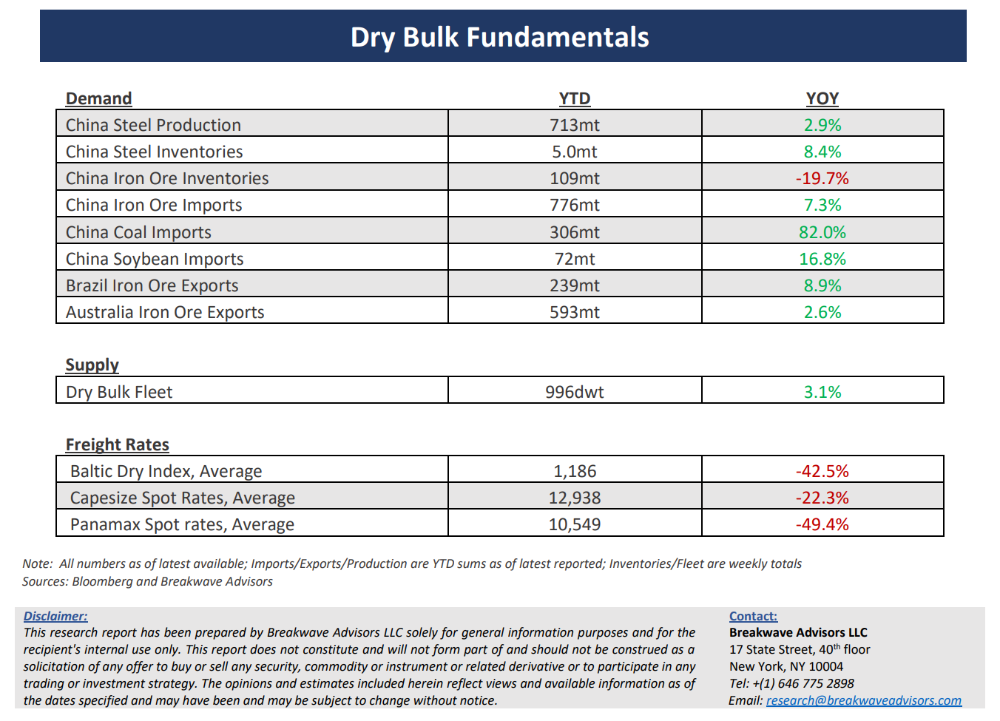

# Breakwave Bi-Weekly Dry Bulk Report - October 10, 2023

**Date:** October 10, 2023  
**Publisher:** Breakwave Advisors | **Category:** Market Insights  
**Original URL:** [https://www.breakwaveadvisors.com/insights/2023/10/10/breakwave-bi-weekly-drybulk-report-oct-10-2023-98rk6](https://www.breakwaveadvisors.com/insights/2023/10/10/breakwave-bi-weekly-drybulk-report-oct-10-2023-98rk6)  

---

> **Figure 1: Dbreporttop**  
> [Local Asset](file:///C:/Users/Dell/Github/Shipping/corpus/03-breakwave/insights/2023/assets/2023-10-10_breakwave-bi-weekly-drybulk-report-oct-10-2023-98rk6_img_dbreporttop_cc50cb61bd6f.png)

**• Capesize spot rates reach 16-month highs amid a tighter Atlantic market –**Once again, dry bulk volatility comes back with a vengeance as supply/demand balance in the Atlantic is now tilted towards stronger rates for the foreseeable future. Such a shift comes despite an unfavorable macro picture, with China continuing to suffer from weak steel demand (although we believe this is about to change as discussed below). Freight futures clearly demonstrate such a pessimism, with a sharply backwardated curve for the next several months against a Capesize spot market that is pushing towards the 30,000 mark. As we head into the busiest time of the year for Capesizes, we see two scenarios that can either propel rates to higher levels or lead to the much-anticipated correction in the near term. On the positive side, if Brazil can export more iron ore than expected for November/December (i.e., reaching the high end of Vale’s guidance), even if such product is of inferior quality, then the need for spot Capesize ships should come as a surprise to a market that is already tight due to increasing bauxite exports out of West Africa. On the other hand, if the decision is to stick to the “quality over quantity” mantra, then we believe the need for additional spot ships will be limited and Atlantic spot rates will gradually decline. The futures curve currently prices in the second scenario, which we, however, still believe is quite aggressive given that historically fourth quarter rates tend to hold better in such intermittent corrections compared to other periods in the year. Whatever the outcome might be, our view remains that the fourth quarter will be the strongest period of the year, as historical patterns are now back in a market that was significantly distorted in the past few years due to the pandemic.

**• China 2023 GDP estimates upgraded as stimulus begins to aid growth –**Following almost a year of gradual stimulus measures out of China’s government, it seems that the deceleration of growth has come to an end and the potential for some much-needed increase in economic activity is upon us. The Golden Week celebrations saw some encouraging consumer movement while recent industrial indicators also point to potential expansion in the near term. As such, several China-focused economists have recently upped their estimates for this year’s GDP growth back to at or above 5%. We also believe the next few months will see some much-needed restocking in commodities following almost a year of inventory draws, which in turn should lead to better shipping activity for dry bulk. Although strong seasonality during the next few months might mask such a secular trend, come early next year, the potential for a better than expected first half is increasing, always subject to prevailing weather conditions.

**• Dry bulk focus shifts back to fundamentals –**Following a period of high uncertainty and significant disruptions across the commodity spectrum, the gradual normalization of trade is shifting the market’s attention back to the traditional demand and supply dynamics that have shaped dry bulk profitability for decades. As effective fleet supply growth for the next few years looks marginal, demand will be the main determinant of spot freight rates with China returning back to the driver’s seat as the dominant force of bulk imports and thus shipping demand.

> **Figure 2: Dbreportchart**  
> [Local Asset](file:///C:/Users/Dell/Github/Shipping/corpus/03-breakwave/insights/2023/assets/2023-10-10_breakwave-bi-weekly-drybulk-report-oct-10-2023-98rk6_img_dbreportchart_fe9810718bdb.png)

> **Figure 3: Dbreportbottom**  
> [Local Asset](file:///C:/Users/Dell/Github/Shipping/corpus/03-breakwave/insights/2023/assets/2023-10-10_breakwave-bi-weekly-drybulk-report-oct-10-2023-98rk6_img_dbreportbottom_1d749fcd63dd.png)

### Subscribe:
