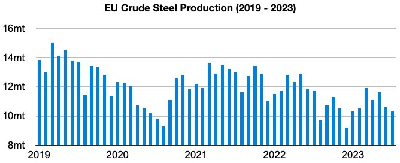
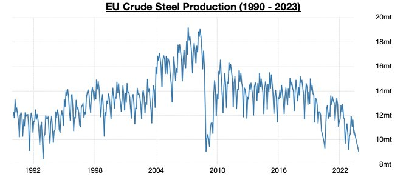

# Shades of 1992 in Europe

**Date:** October 10, 2023  
**Publisher:** Breakwave Advisors | **Category:** Market Insights  
**Original URL:** [https://www.breakwaveadvisors.com/insights/2023/10/9/shades-of-1992-in-europe](https://www.breakwaveadvisors.com/insights/2023/10/9/shades-of-1992-in-europe)  

---

*By*[*Jeffrey Landsberg*](https://www.linkedin.com/in/jeffrey-landsberg-70ab957/)

As we have been stressing in Commodore's Weekly Dry Bulk Reports, steel production has remained under very significant pressure in Europe. The most recently released data shows that European steel production totaled approximately 9.1 million tons in August. This is 1.2 million tons (-12%) less than was produced in July and is 600,000 tons (-6%) less than was reported last year for August 2022’s production.

> **Figure 1: Chart 1 (85)**  
> [Local Asset](file:///C:/Users/Dell/Github/Shipping/corpus/03-breakwave/insights/2023/assets/2023-10-10_shades-of-1992-in-europe_img_chart1288529_35307c13b930.jpg)

European steel production has contracted on a year-on-year basis for twenty-one straight months. August’s production has marked the smallest amount of steel produced in Europe since December 2008.

Also quite noteworthy is that other than in December 2008, August’s 9.1 million tons of steel production has marked the smallest amount of steel produced in Europe since December 1992.

> **Figure 2: Chart 2 (72)**  
> [Local Asset](file:///C:/Users/Dell/Github/Shipping/corpus/03-breakwave/insights/2023/assets/2023-10-10_shades-of-1992-in-europe_img_chart2287229_8aa43594de5a.jpg)

As we have continued to stress in our research, we believe very strongly that Europe (and many other economies, but not China) remains in a recession. In addition to European steel production flirting with 1992's low, citizens in Europe (and in many other economies) also continue to purchase less actual goods than they did a year ago. In Europe, retail sales growth has now come in less than inflation for eighteen consecutive months.
