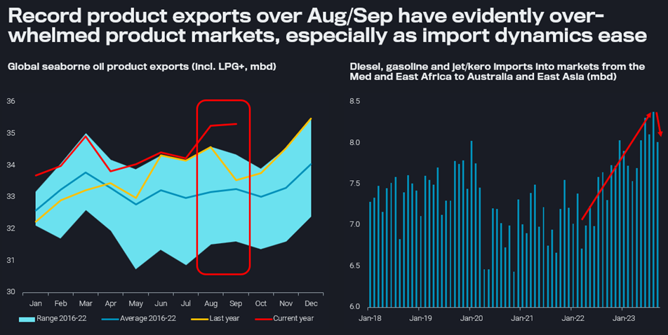
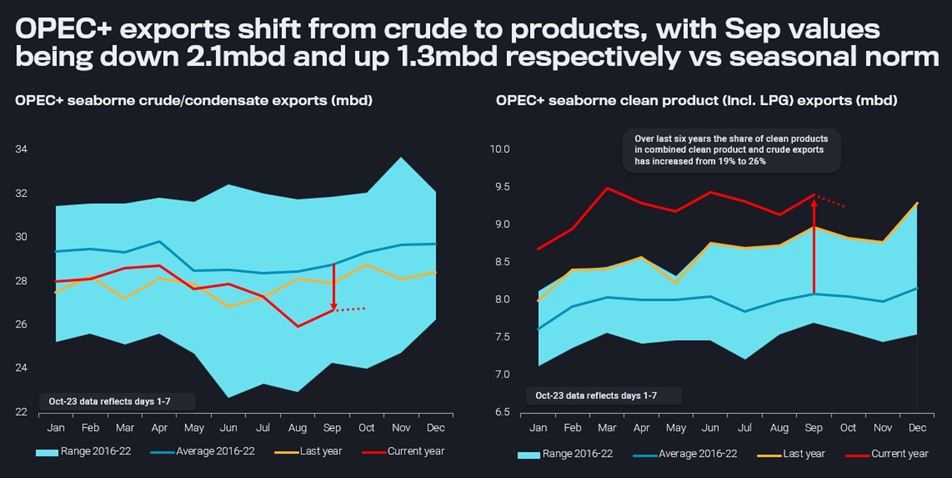

# When crude oil futures are not driven by crude oil fundamentals

**Date:** October 11, 2023  
**Publisher:** Breakwave Advisors | **Category:** Market Insights  
**Original URL:** [https://www.breakwaveadvisors.com/insights/2023/10/11/when-crude-oil-futures-are-not-driven-by-crude-oil-fundamentals](https://www.breakwaveadvisors.com/insights/2023/10/11/when-crude-oil-futures-are-not-driven-by-crude-oil-fundamentals)  

---

## We Try to Shed Some Light Into the Recent Selloff in Crude Oil at a Time of Rising Geopolitical Risks. Ample Seaborne Product Supplies Play a Crucial Role.

*By*[*David Wech*](https://www.linkedin.com/search/results/all/?fetchDeterministicClustersOnly=true&heroEntityKey=urn%3Ali%3Afsd_profile%3AACoAACdbGu4B25CFPSM8gOGM562N0GXP-oL0T1Y&keywords=david%20wech&origin=RICH_QUERY_SUGGESTION&position=0&searchId=b175ebeb-efa1-48b7-b4ba-63f6a6ac7777&sid=X%29%21&spellCorrectionEnabled=false)

With a fresh war in the Middle East, crude oil futures are on a roller-coaster ride. But except for a marginal $2/b post-war increase, the story is actually that oil prices have retreated markedly after the failed quest for the $100/b threshold. Has anything changed in crude oil fundamentals that warrants this steep decline?

At least from a narrow look at crude fundamentals the answer is probably no. OPEC+ curtailments are still keeping global seaborne crude supplies at very low levels. Not even record US exports can make up for that. Average exports since August from all countries are lower than anytime over the previous 12 months and down by 1.2mbd vs the average over that period.

According to Vortexa onshore inventory data for 112 countries, crude stocks are at a 15-month low, after having drawn by an average 1.5mbd over the last ten weeks. With crude on the water also declining, refiners are evidently struggling to secure sufficient fresh supplies for their operations. Physical crude differentials and market structure are still strong, albeit the global refining fleet is currently in peak maintenance. This suggests that once refiners start to procure crude for maximum seasonal runs over the winter months, even more physical crude tightness can easily emerge.

## Crude Futures Are Reflecting a Vast Array of Influencing Factors

This is where the less direct parameters come into play. Hedge funds and other money managers have sold more than 6mbd – roughly equivalent to current Saudi exports – in CME and ICE crude futures and options contracts over the five trading days ending October 3. Drivers may include purely technical trading indicators, renewed macroeconomic concerns, changes in the relative attractiveness of different asset classes, as well as a weakening oil demand outlook especially for the winter months.

As for the latter, a pronounced El Niño phenomenon, empowered by global warming, is keeping LNG, LPG and heating oil markets well chilled. This has likely contributed to a collapse in product cracks and therefore refinery margins over the last couple of weeks.

> **Figure 1: 20231010 2**  
> **Interactive Data & Source:** [Analytics Vortexa](https://analytics.vortexa.com/?dateRange=2020-01-01T00%3A00%3A00.000Z__2023-10-07T23%3A59%3A59.999Z&filtersEnabled=%5B%22p%22%2C%22o%22%2C%22d%22%2C%22d_r%22%2C%22v%22%2C%22intra_d%22%2C%22sts_o%22%2C%22c_o%22%2C%22w%22%5D&metric=bpd&page=Flows&products=%5B%22b68cbb746f8b9098c50e2ba36bcad83001a53bd362e9031fb49085d02c36659c%22%2C%225de0b00094e0fd7542c10f9f8a71b4008d55750f21dc905cda9b0f7f5f76bc08%22%5D&tabId=c6f9e5c5-5194-4257-8a66-ff4ad1067951&timeSeriesProperty=product_group_product&v=2) | [Local Asset](file:///C:/Users/Dell/Github/Shipping/corpus/03-breakwave/insights/2023/assets/2023-10-11_when-crude-oil-futures-are-not-driven-by-crude-oil-fundamentals_img_20231010-2_d893fe18f392.png)

[Global seaborne oil product exports](https://analytics.vortexa.com/?dateRange=2020-01-01T00%3A00%3A00.000Z__2023-10-07T23%3A59%3A59.999Z&filtersEnabled=%5B%22p%22%2C%22o%22%2C%22d%22%2C%22d_r%22%2C%22v%22%2C%22intra_d%22%2C%22sts_o%22%2C%22c_o%22%2C%22w%22%5D&metric=bpd&page=Flows&products=%5B%22b68cbb746f8b9098c50e2ba36bcad83001a53bd362e9031fb49085d02c36659c%22%2C%225de0b00094e0fd7542c10f9f8a71b4008d55750f21dc905cda9b0f7f5f76bc08%22%5D&tabId=c6f9e5c5-5194-4257-8a66-ff4ad1067951&timeSeriesProperty=product_group_product&v=2)(incl. LPG+, mbd) &[diesel, gasoline and jet/kero imports into markets from the Med and East Africa to Australia and East Asia](https://analytics.vortexa.com/?dateRange=2020-01-01T00%3A00%3A00.000Z__2023-09-30T23%3A59%3A59.999Z&filtersEnabled=%5B%22p%22%2C%22o%22%2C%22d%22%2C%22d_r%22%2C%22v%22%2C%22intra_d%22%2C%22sts_o%22%2C%22c_o%22%2C%22w%22%5D&geoBreakdownDestinationGlobal=shipping_region&metric=bpd&movementEvent=unloading_start&page=Flows&products=%5B%229256907ba7e4ed11ff03aa297a7e62e14484ce5a85c8118c7495b9120ad0e268%22%2C%22d72edbab2b5e2e249d8c216909945922a02eb017dd200f90876fee6fa180c743%22%2C%22deda35eb9ca56b54e74f0ff370423f9a8c61cf6a3796fcb18eaeeb32a8c290bb%22%5D&tabId=c6f9e5c5-5194-4257-8a66-ff4ad1067951&timeSeriesProperty=product_group_product&to=%5B%22e16b1c9b0dd4bbb886e175be752f3cf8658e342a79945529451f3a3eb7b9267c%22%2C%228595ad6a0fe12cf26201c69352a242f5760905387d4e8cd8735a5a626eede9c1%22%2C%2254c244fa8d2aae5a2318d3262422d2b2212a4ee46cd88619eadff653255823a5%22%2C%2211a213e88d9f4978177fdcf19a518a527f71616f5810aa775926ba4ba0383703%22%2C%22212fb4cfc862391faeacc63aa3ceb446a1c5ba6073da2a4e514a496e4c850635%22%2C%22870dde747fa67aa3dbd596940a2cebe1264d9ad0eb686329de64771efbfad54c%22%2C%227385c0408708f93bd601923f0718a6838411bc834c68b92f48aac74ed6ec9a4a%22%2C%220d42148db6075633f3a285f69f92d789fa3be741d37841367848a9a1ca8bc125%22%2C%22ed0fd676fb6e153b6f9a27b849ab37a67847d4eeb087880631773691aec87c4b%22%2C%22d80d85ad6eea3180c7b3e71c22f4ee2d144bd559a4d500dee280671a9cf1dead%22%2C%227bc5d2b5ea1cc552f6df9640185e8c7923106b0099a9c432437b8c5768aa670a%22%2C%228fa865b21fb2ffa0ae44ddf1d1fd93577d3a37781649380c80c870e5f1d12200%22%2C%220e62f0e257232123903546d411a3325cd27e78c9088c6ba0d54bfe26717ee1de%22%2C%22495efe20b09e696494da6ebf25995f25304d9576f8b97795d771274431dfc233%22%2C%22525f267018511d99a461db56eb0c3fd80290641ffe47cb5fe863678cfbff6619%22%2C%226659ee9603465ff979b3cf185951c988190197f93bbcf571f429b28ac89ce017%22%2C%2213092fe26ac4a02e3e3e6b9bef84e3e08400c646ba08672d53176044cbfaccda%22%5D&v=2)(mbd)

But the crucial factor is likely that product markets have been overwhelmed by the flood of clean product exports over August and September (see left-hand chart above), with strong contributions from both gasoline and diesel. This high level of seaborne supplies is simply at crossroads with seasonally shrinking demand after the peak Northern Hemisphere travel season. At the same time, import demand into the “growth belt” from the Med and East Africa all the way to Australia and East Asia has receded to a 5-month low in September (see right-hand chart above).

## OPEC+ Export Earnings Shift From Crude to Products

As a side note, OPEC+ countries are a key contributor to surging global product exports – at the same time they are curtailing crude supplies. Supported by new grassroot refineries in Kuwait, Oman, Saudi Arabia, and probably next year Nigeria, the 10mbd mark for seaborne clean product exports (including LPG) could be hit in 2024. This compares to a recent low in seaborne crude exports of 26mbd in August, and illustrates nicely how OPEC+ countries are crawling up the value chain.

> **Figure 2: 20231010 1**  
> **Interactive Data & Source:** [Analytics Vortexa](https://analytics.vortexa.com/?dateRange=2020-01-01T00%3A00%3A00.000Z__2023-10-07T23%3A59%3A59.999Z&filtersEnabled=%5B%22p%22%2C%22o%22%2C%22d%22%2C%22d_r%22%2C%22v%22%2C%22intra_d%22%2C%22sts_o%22%2C%22c_o%22%2C%22w%22%5D&from=%5B%221c47e09ebf73cbb0fda6e36ffc125d4be50936d17888e0a7d2acb17a439db108%22%5D&metric=bpd&page=Flows&products=%5B%2254af755a090118dcf9b0724c9a4e9f14745c26165385ffa7f1445bc768f06f11%22%5D&tabId=c6f9e5c5-5194-4257-8a66-ff4ad1067951&timeSeriesProperty=origin_country&v=2) | [Local Asset](file:///C:/Users/Dell/Github/Shipping/corpus/03-breakwave/insights/2023/assets/2023-10-11_when-crude-oil-futures-are-not-driven-by-crude-oil-fundamentals_img_20231010-1_df24555f5f52.png)

OPEC+ seaborne[crude/condensate](https://analytics.vortexa.com/?dateRange=2020-01-01T00%3A00%3A00.000Z__2023-10-07T23%3A59%3A59.999Z&filtersEnabled=%5B%22p%22%2C%22o%22%2C%22d%22%2C%22d_r%22%2C%22v%22%2C%22intra_d%22%2C%22sts_o%22%2C%22c_o%22%2C%22w%22%5D&from=%5B%221c47e09ebf73cbb0fda6e36ffc125d4be50936d17888e0a7d2acb17a439db108%22%5D&metric=bpd&page=Flows&products=%5B%2254af755a090118dcf9b0724c9a4e9f14745c26165385ffa7f1445bc768f06f11%22%5D&tabId=c6f9e5c5-5194-4257-8a66-ff4ad1067951&timeSeriesProperty=origin_country&v=2)and[clean product (incl. LPG)](https://analytics.vortexa.com/?dateRange=2020-01-01T00%3A00%3A00.000Z__2023-10-07T23%3A59%3A59.999Z&filtersEnabled=%5B%22p%22%2C%22o%22%2C%22d%22%2C%22d_r%22%2C%22v%22%2C%22intra_d%22%2C%22sts_o%22%2C%22c_o%22%2C%22w%22%5D&from=%5B%221c47e09ebf73cbb0fda6e36ffc125d4be50936d17888e0a7d2acb17a439db108%22%5D&metric=bpd&page=Flows&products=%5B%22b68cbb746f8b9098c50e2ba36bcad83001a53bd362e9031fb49085d02c36659c%22%5D&tabId=c6f9e5c5-5194-4257-8a66-ff4ad1067951&timeSeriesProperty=product_group_product&v=2)exports (mbd)

The above also illustrates that the usual simple cut economics looking only at crude volumes vs crude prices are overly simplistic, as about a third of oil export incomes are now made via products, which benefit equally (or even over-proportionally) from any outright crude price increase.

## $100/b Is Still in Sight

Now where will prices head from here onwards? Hard to tell as usual, but a further run to the $100/b mark should definitely not be excluded as an option. Refinery maintenance may help to eat through the current product surplus. Underlying oil demand is widely assessed to solid, so refined product supplies can quickly run short again. The first cold spells and/or extreme weather events and refinery outages may also re-animate product cracks.

And then there is of course a wild mix of geopolitical risks. The Russian gasoline and diesel export ban, which does not appear to be fully lifted, was just another reminder of risks in that part of the world. And while we consider a spreading of the current Israel war with repercussions on meaningful oil infrastructure in the Middle East as highly unlikely, similarly to an effective tightening of sanctions on Iran, it is a simple fact that every day 21mbd of crude and products are flowing through the somewhat vulnerable Strait of Hormuz.

Data Source:[Vortexa](https://www.vortexa.com//oil-gas-data-traders-analysts-data-scientists?gclid=Cj0KCQjw8_qRBhCXARIsAE2AtRZKOvMnbilZ_6_91d7huSFFy71pWLrnPwGwOHVzXsmsG-1a1mZnQw8aAt89EALw_wcB&hsa_acc=1782073842&hsa_ad=548425387665&hsa_cam=14746637662&hsa_grp=125038601902&hsa_kw=&hsa_mt=&hsa_net=adwords&hsa_src=g&hsa_tgt=dsa-1431852288425&hsa_ver=3&utm_campaign=%5BCD%5D%20-%20DSA%20-%20EMEA&utm_medium=cpc&utm_medium=ppc&utm_source=google&utm_source=adwords&utm_term=)
