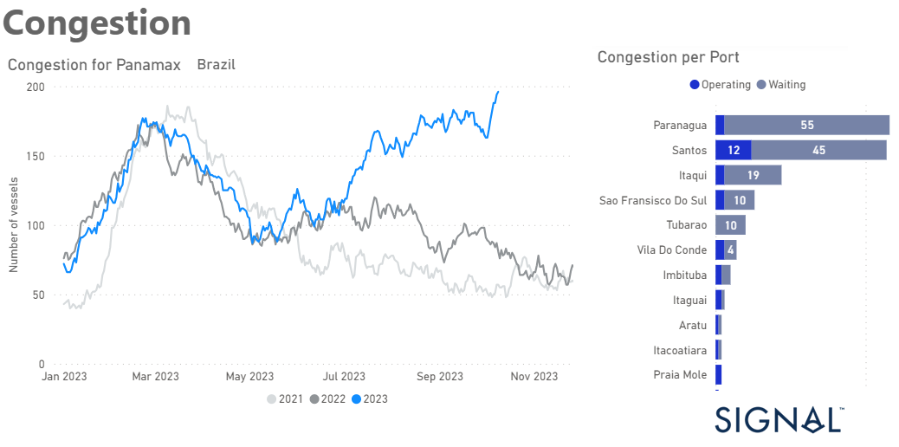
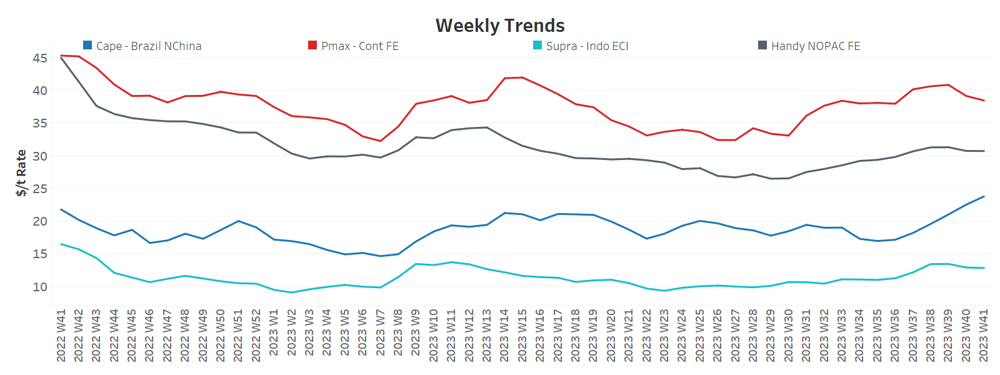
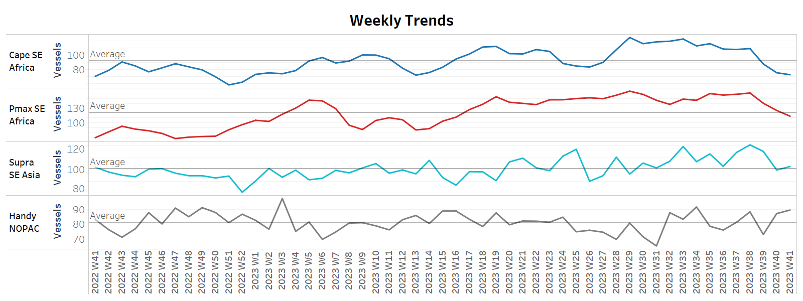
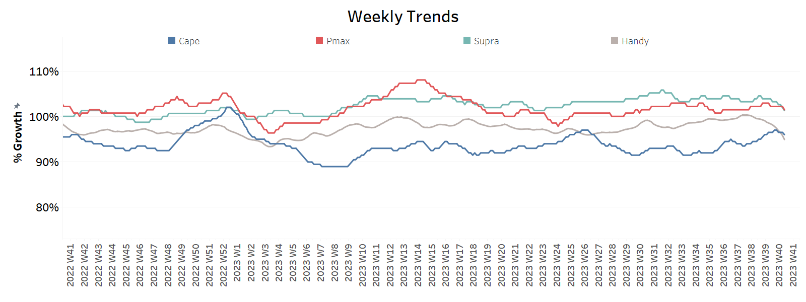
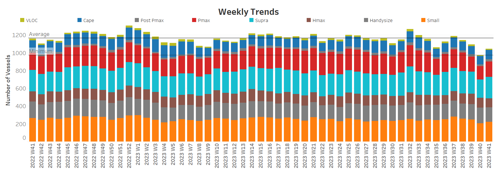

# Signal Dry Bulk Weekly Report

**Date:** October 12, 2023  
**Publisher:** Breakwave Advisors | **Category:** Market Insights  
**Original URL:** [https://www.breakwaveadvisors.com/insights/2023/10/12/signal-dry-bulk-weekly-report](https://www.breakwaveadvisors.com/insights/2023/10/12/signal-dry-bulk-weekly-report)  

---

## Chart of the Week :Dry Bulk Panamax, Brazalian Port Congestion​​​​​

**Congestion at Brazilian ports for Panamax bulkers increases significantly from summer onwards**

> **Figure 1: Market Chart 1**  
> **Interactive Data & Source:** [Signal Ocean Platform](https://www.thesignalgroup.com/signal-ocean-platform) | [Local Asset](file:///C:/Users/Dell/Github/Shipping/corpus/03-breakwave/insights/2023/assets/2023-10-12_signal-dry-bulk-weekly-report_img_unnamed-2023-10-12t131657751_d7f1b7e5e614.png)

The second week of October brought both promising and concerning developments in the shipping industry. In the Capesize Brazil to North China route, freight rates continued to exhibit strength, reaffirming their resilience in the face of various market dynamics. However, amidst these encouraging signs, a significant shift has occurred in the number of ballasters since the end of September.
The decrease in ballasters could indicate a change in market dynamics or a response to the evolving conditions in the shipping industry.​​​In contrast to the Capesize sector, the Panamax segment is experiencing a noticeable downward trend in freight rates.
Interestingly, the increase in Brazilian port congestion, as visually represented in the provided image, could potentially serve as a significant driver for an upturn in rates. The congestion in Brazilian ports may disrupt shipping schedules and increase demand for available vessels, thereby exerting upward pressure on freight rates.

​​​For more information on this week's trends, see the analysis sections below:

Freight Market, Supply, Demand and Port Congestion

## Section 1/ Freight

‘The Big Picture’ - Capesize and Panamax Bulkers and Smaller Ship Sizes
Market Rates ($/t) Firmer

> **Figure 2: Market Chart 2**  
> **Interactive Data & Source:** [Signal Ocean Platform](https://www.thesignalgroup.com/signal-ocean-platform) | [Local Asset](file:///C:/Users/Dell/Github/Shipping/corpus/03-breakwave/insights/2023/assets/2023-10-12_signal-dry-bulk-weekly-report_img_unnamed-2023-10-12t131813416_6a1b3f0723a4.png)

**The second week of October recorded a notable rise in Capesize rates for Brazil to North China, while downward pressure emerged in the Panmax Cont-FE route.**

- **Capesize**vessel freight rates from Brazil to North China rose to almost $24/ton, marking a 11% weekly increase and 37% monthly gain.
- **Panamax**vessel freight rates from the Continent to the Far East have dipped below the $39 per tonne mark, displaying indications of persisting at levels weaker than those observed two weeks ago.
- **Supramax**vessel freight rates on the Indo-ECI route fell by 3% to $12 per tonne on a weekly basis, with a 12% monthly increase compared to the same week in October.
- **Handysize**freight rates for the NOPAC Far East route fell below $31/tonne, while the previous week appears to have been the last peak for the smaller ship size segment.

## Section 2/ Supply

> **Figure 3: Supply Trend Lines for Key Load Areasballasters (#Vessels) Mixed**  
> **Interactive Data & Source:** [Signal Ocean Platform](https://www.thesignalgroup.com/signal-ocean-platform) | [Local Asset](file:///C:/Users/Dell/Github/Shipping/corpus/03-breakwave/insights/2023/assets/2023-10-12_signal-dry-bulk-weekly-report_img_unnamed-2023-10-12t131942529_49263932a03c.png)

In terms of the number of ballast vessels, the second week of October showed a mixed picture with a downward trend in the Capesize and Panamax segments, while the increase in the smaller Handysize segment continued.

- **Capesize SE Africa:**The number of ballasters dropped to 72, 4 lower than the previous week, and 20 below the annual average.
- **Panamax SE Africa:**The number of ballasters has fallen below the annual average of 120 for the first time since the end of week 13, and the downward trend now seems clear since the last peak in week 38 (~162).
- **Supramax SE Asia:**The number of ballast ships exceeded the annual average of 100, with an increasing trend for the next few days, but remained 20 less than the peak of week 38.
- **Handysize NOPAC:**The number of ballast ships increased to 89, 4 more than the previous week, and approaching the level of previous peaks above the threshold of 90.

## Section 3/ Demand

> **Figure 4: Summary of Dry Bulk Demand, per Ship Sizetonne Days Decreasing**  
> **Interactive Data & Source:** [Signal Ocean Platform](https://www.thesignalgroup.com/signal-ocean-platform) | [Local Asset](file:///C:/Users/Dell/Github/Shipping/corpus/03-breakwave/insights/2023/assets/2023-10-12_signal-dry-bulk-weekly-report_img_unnamed-2023-10-12t132101535_d3d44b127d9e.png)

Signs of recovery in the Capesize segment now appear to have peaked, while a downward trend is evident for the other ship size segments.

- **Capesize**: Demand growth in tons per day peaked last week, and there are concerns about a prolonged recovery as the Golden Week for the Chinese economy came to an end.
- **Panamax**: The growth rate has remained stable since September, with no signs of spikes, while there seems to be a downward correction in the second week of October.
- **Supramax**: The growth rate remained at the lowest level since the end of week 37, while downward pressure points to further persistency.
- **Handysize**: Demand continued the sharp decline after week 37, putting pressure on freight rates.

## Section 4/ Port Congestion

> **Figure 5: Dry Bulk Ships Congested at Chinese Portsno of Vessels Increasing**  
> **Interactive Data & Source:** [Signal Ocean Platform](https://www.thesignalgroup.com/signal-ocean-platform) | [Local Asset](file:///C:/Users/Dell/Github/Shipping/corpus/03-breakwave/insights/2023/assets/2023-10-12_signal-dry-bulk-weekly-report_img_unnamed-2023-10-12t132331971_b2a472eea49d.png)

The level of ship congestion increased in the second week of October, with an upward trend in the Capesize, Panamax and Surpamax segments.

- **Capesize**: The number of congested vessels has increased by 10 from the previous week to 104, and it remains to be seen whether the number of congested vessels will continue to exceed 100.
- **Panamax:**The number of congested ships currently stands at 176, and it has remained below 200 since week 35. This figure represents an increase of approximately 30 ships compared to the first week of October.​​
- **Supramax:**The number of ships is now around 40 vessels more than the previous week at around 240, despite early signs of holding around 200 in the first week of October.
- **Handysize:**The number of congested ships has dropped from a low of 167 in week 34 to a further downward trend in the next few days.

Data Source:[Signal Ocean Platform](https://www.thesignalgroup.com/signal-ocean-platform)
