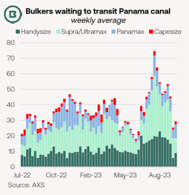
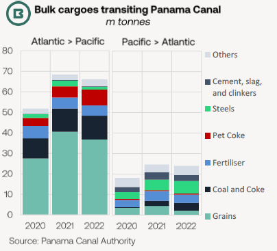
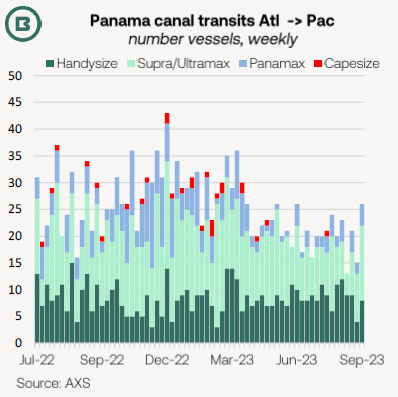
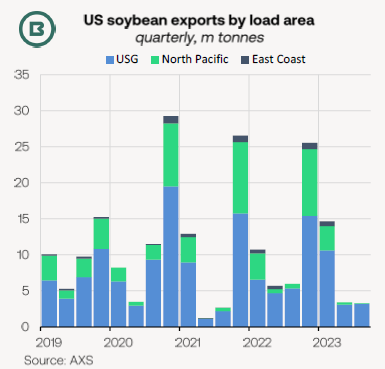
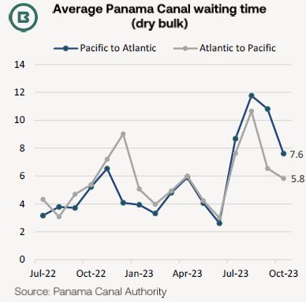

# The Big Picture: Panama Canal avoidance

**Date:** October 13, 2023  
**Publisher:** Breakwave Advisors | **Category:** Market Insights  
**Original URL:** [https://www.breakwaveadvisors.com/insights/2023/10/13/braemar-weekly-dry-market-report](https://www.breakwaveadvisors.com/insights/2023/10/13/braemar-weekly-dry-market-report)  

---

## The Big Picture: Panama Canal Avoidance

- *Panama Canal avoidance, as opposed to congestion, has been the main consequence of transit restrictions for the dry bulk freight market.*
- *Transit numbers on the main laden Atlantic-to-Pacific direction have lagged 2022 substantially.*
- *This not only reflects Canal avoidance but also underperformance in US grain exports this year.*

Due to low water levels, dry bulk carrier queues at the Panama Canal spiked in early August.

> **Figure 1: Market Chart 1**  
> [Local Asset](file:///C:/Users/Dell/Github/Shipping/corpus/03-breakwave/insights/2023/assets/2023-10-13_braemar-weekly-dry-market-report_img_image6_7bef9b6cb19f.png)

Since then, lower numbers of waiting bulkers (mostly Supra/Ultramax and Handysize) at both Canal entrances can be viewed as a response to transit restrictions, while some receivers may be deterred from including the Panama Canal due to uncertainties surrounding waiting times (see chart on the next page), leading to avoidance and more longer-haul voyages that would normally be the case.

In terms of laden bulkers, southbound (Atlantic to Pacific) trades through the Canal predominate.

The second chart, top right, shows that in 2022 coal/coke cargoes reached 11m tonnes, petcoke 8m tonnes, both overshadowed by grain trade totalling 37m tonnes for the year, all confirmed by the ACP.

> **Figure 2: Market Chart 2**  
> [Local Asset](file:///C:/Users/Dell/Github/Shipping/corpus/03-breakwave/insights/2023/assets/2023-10-13_braemar-weekly-dry-market-report_img_image7_2913406dd084.png)

However, the third chart, below, demonstrates that southbound bulker traffic in the year to date has fallen significantly below year-ago levels.

**At first glance, this could be assumed to reflect Canal avoidance by bulkers, and that is likely to be true—in part.**

**Panamaxes witnessed the biggest decline in Atlantic-to-Pacific crossings,**and that reduction is clearly evident from the Q2 this year onwards, which pre-dates low water restrictions.

> **Figure 3: Market Chart 3**  
> [Local Asset](file:///C:/Users/Dell/Github/Shipping/corpus/03-breakwave/insights/2023/assets/2023-10-13_braemar-weekly-dry-market-report_img_image8_5b9a2d55af64.png)

The rest of the reason lies in a disappointing year for US grain exporters. In the six months between March and August, combined exports of corn, soybeans and wheat fell 18.6m tonnes YoY to 44.2m tonnes.

Indeed, soybean exports, with their China focus and high Panamax share, dwindled to a mere 800,000 tonnes in June from 2.3m tonnes in the same month of 2022.

> **Figure 4: Market Chart 4**  
> [Local Asset](file:///C:/Users/Dell/Github/Shipping/corpus/03-breakwave/insights/2023/assets/2023-10-13_braemar-weekly-dry-market-report_img_image9_12fe8966b1f7.png)

Soybean departures tend to concentrate in the Q4, implying that the positive effects on ship supply/demand balances will continue, unless there is a radical change in transit arrangements.

Approaching 40% of all exports were shipped from terminals in the Pacific Northwest of the country, adding to Nopac trade volumes.

The International Grains Council (IGC) noted that storm activity is expected to disrupt operations this week, but ultimately could improve Mississippi water levels and may help boost soybean shipments from the US Gulf.

> **Figure 5: Market Chart 5**  
> [Local Asset](file:///C:/Users/Dell/Github/Shipping/corpus/03-breakwave/insights/2023/assets/2023-10-13_braemar-weekly-dry-market-report_img_image10_f975302c9c51.png)
