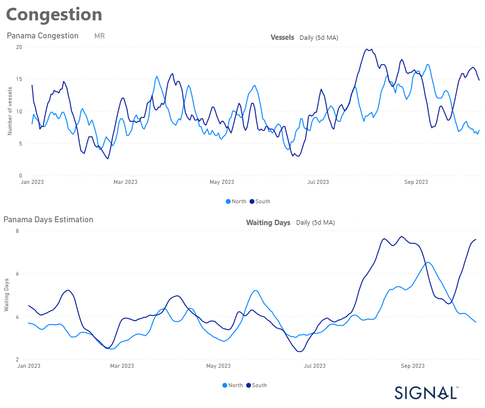
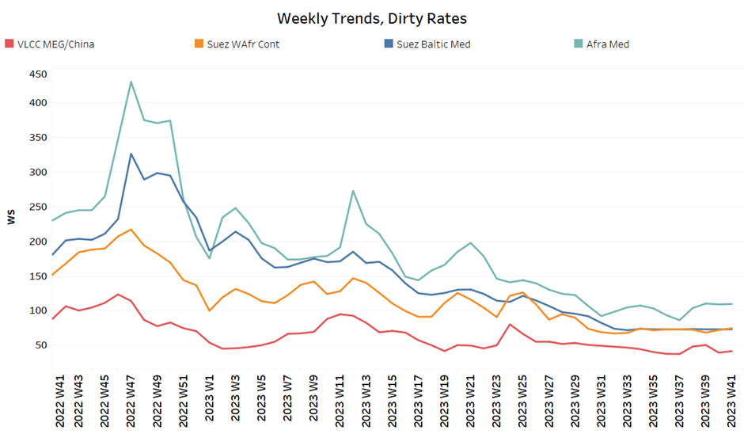
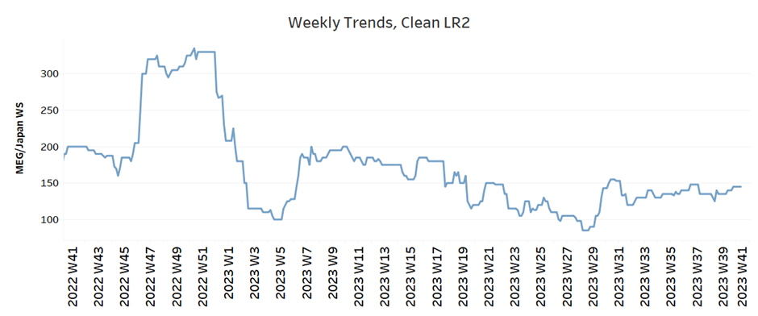
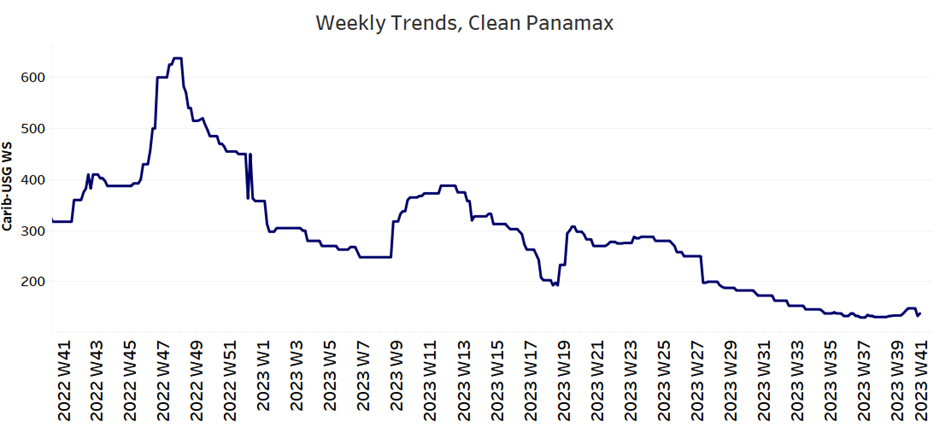
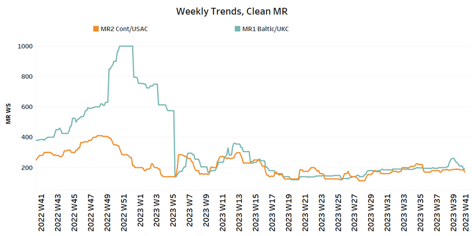
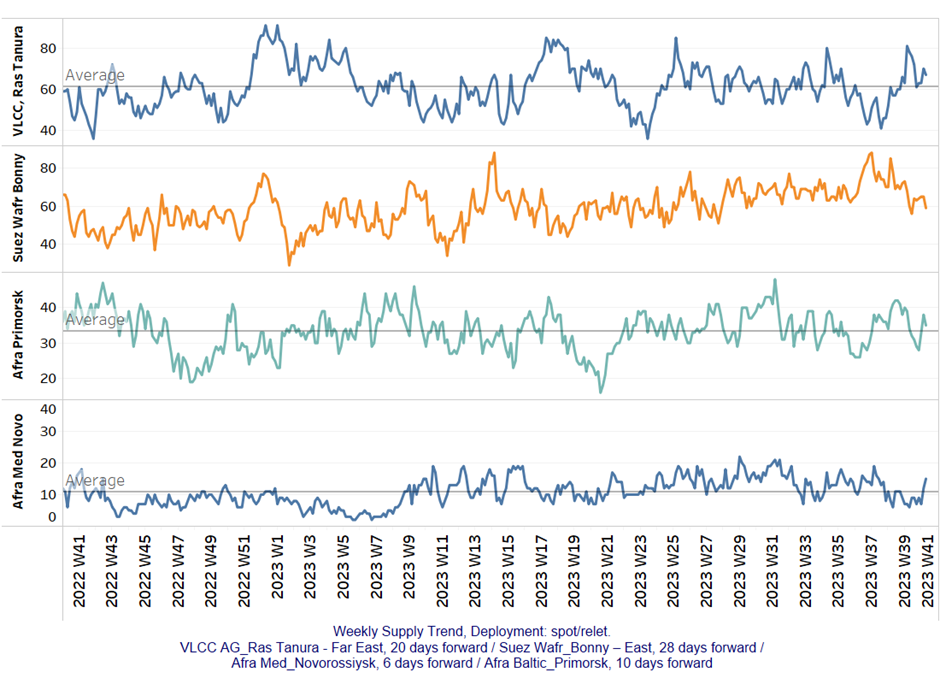
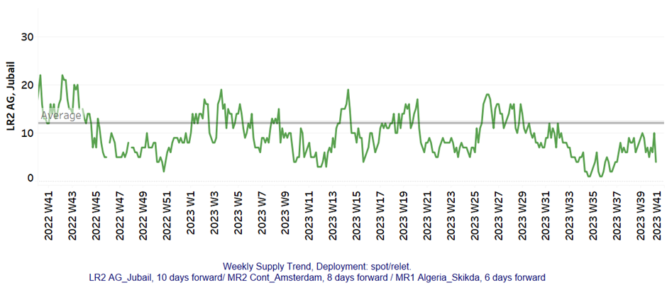
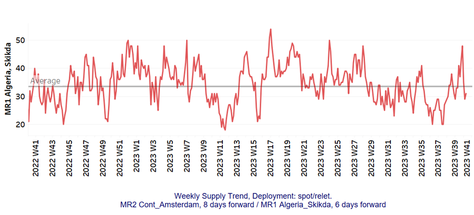
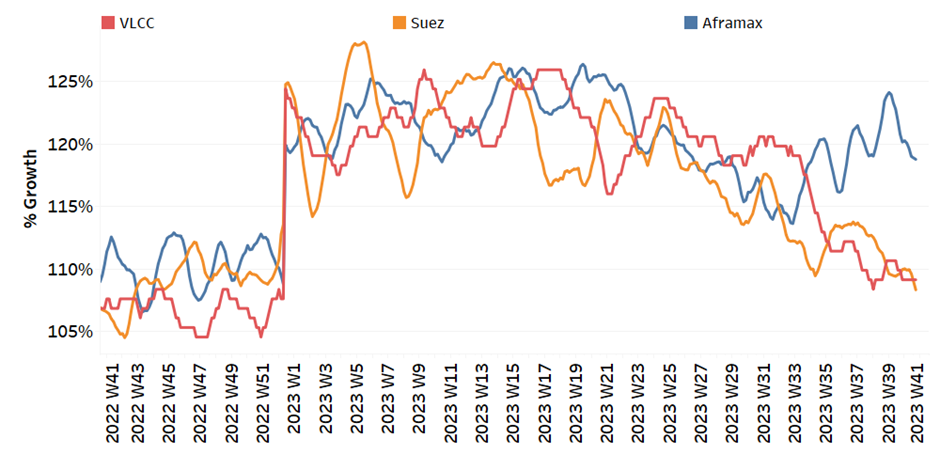
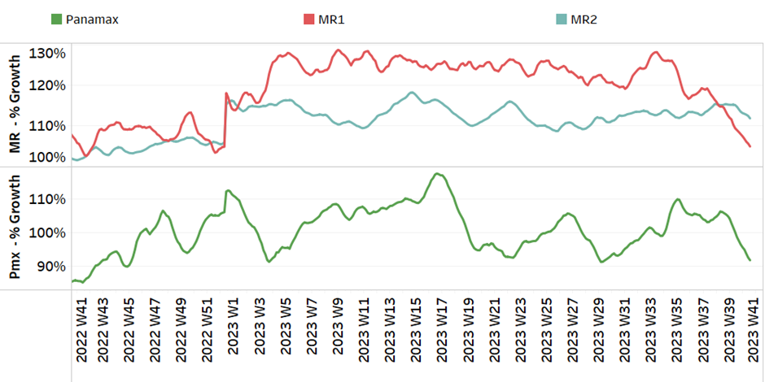

# Signal Tanker Weekly Report

**Date:** October 13, 2023  
**Publisher:** Breakwave Advisors | **Category:** Market Insights  
**Original URL:** [https://www.breakwaveadvisors.com/insights/2023/10/13/signal-tanker-weekly-report](https://www.breakwaveadvisors.com/insights/2023/10/13/signal-tanker-weekly-report)  

---

## Chart of the Week: MR Panama Canal Congestion

### Downward Revision of the Number of MR Ships, But Still Longer Waiting Times in the South

> **Figure 1: Market Chart 1**  
> **Interactive Data & Source:** [Signal Ocean Platform](https://www.thesignalgroup.com/signal-ocean-platform) | [Local Asset](file:///C:/Users/Dell/Github/Shipping/corpus/03-breakwave/insights/2023/assets/2023-10-13_signal-tanker-weekly-report_img_unnamed-2023-10-13t130800516_e2236116c3f5.png)

In the second week of October, the VLCC MEG-China route is trending upward. However, the sustainability of this positive trend remains uncertain due to mounting concerns stemming from geopolitical tensions that are casting a shadow over the energy sector.
Notably, Israel's conflict with Hamas has ignited apprehensions of a potential surge in oil prices, with the possibility of breaching the $100 per barrel mark within a matter of weeks, or even days, should the situation in the Middle East escalate further. Currently, the benchmark Brent crude oil price hovers around $88 per barrel, marking a 4% increase since the onset of the Hamas-Israel conflict. Current projections indicate that oil prices may fluctuate within a range of $80 to $100 per barrel in the forthcoming months.

Meanwhile, when assessing the congestion at the Panama Canal, the situation remains particularly challenging in the southern region for MR tankers. Nevertheless, there are initial indications of a potential decrease in the number of vessels waiting and the duration of waiting days.
​​​​​​

For more information on this week's trends, see the analysis sections below:

Freight Market, Supply and Demand

## Section 1/ Freight

Market Rates (WS)

‘Dirty’ WS​
VLCC - Suezmax - Aframax Firmer

> **Figure 2: ​​​​The VLCC MEG -China Rates Showed the First Signs of Stronger**  
> *​​​​The VLCC MEG -China rates showed the first signs of stronger momentum after the downward correction in early October, while Aframax rates recorded a positive outlook compared to the week 37 lows.*  
> **Interactive Data & Source:** [Signal Ocean Platform](https://www.thesignalgroup.com/signal-ocean-platform) | [Local Asset](file:///C:/Users/Dell/Github/Shipping/corpus/03-breakwave/insights/2023/assets/2023-10-13_signal-tanker-weekly-report_img_unnamed-2023-10-13t130811370_4d19a20fe441.png)

- VLCC MEG-China freight rates rose above WS 40, up 5% from the previous week and up 16% from a month ago.
- Suezmax freight rates for shipments from West Africa to continental Europe have held above WS70 since the end of week 39. Rates on the Suez-Baltic-Med route have also maintained steady momentum and have been unchanged at WS72 for more than a month.
- Aframax Med freight rates continued to hover around WS110 levels, with a tendency toward firmer momentum as we approach the second half of October.

> **Figure 3: ‘Product’ Wslr2 Firmer**  
> **Interactive Data & Source:** [Signal Ocean Platform](https://www.thesignalgroup.com/signal-ocean-platform) | [Local Asset](file:///C:/Users/Dell/Github/Shipping/corpus/03-breakwave/insights/2023/assets/2023-10-13_signal-tanker-weekly-report_img_unnamed-2023-10-13t130943724_c49b7271a477.png)

- LR2 AG freight rates rose to WS145, a 4% increase in one month and one of the highest levels since the last low in week 31.

> **Figure 4: PANAMAX (Sentiment: Weaker)**  
> **Interactive Data & Source:** [Signal Ocean Platform](https://www.thesignalgroup.com/signal-ocean-platform) | [Local Asset](file:///C:/Users/Dell/Github/Shipping/corpus/03-breakwave/insights/2023/assets/2023-10-13_signal-tanker-weekly-report_img_unnamed-2023-10-13t131126749_0a95a5075f32.png)

- Panamax Carib-to-USG rates appeared to be hovering around 137 WS, down 58% from a year ago, although there were signs of a slight uptick for the first time since the end of Week 27.

> **Figure 5: ‘Clean’mr Weaker**  
> **Interactive Data & Source:** [Signal Ocean Platform](https://www.thesignalgroup.com/signal-ocean-platform) | [Local Asset](file:///C:/Users/Dell/Github/Shipping/corpus/03-breakwave/insights/2023/assets/2023-10-13_signal-tanker-weekly-report_img_unnamed-2023-10-13t131259929_00c6a8f362c4.png)

- **MR1 rate**s for the Baltic continent dropped to WS 190, down 19% from the previous week.

- **MR2 rates**for shipments from the continent to the U.S. fell to WS170, 30% lower than a year ago in a similar week, but at the same level as a month ago.

## Section 2/ Supply

> **Figure 6: 'Dirty' (#Vessels) - Mixed**  
> **Interactive Data & Source:** [Signal Ocean Platform](https://www.thesignalgroup.com/signal-ocean-platform) | [Local Asset](file:///C:/Users/Dell/Github/Shipping/corpus/03-breakwave/insights/2023/assets/2023-10-13_signal-tanker-weekly-report_img_unnamed-2023-10-13t131457367_5ffe0ce134b7.png)

- The supply trend for the Ras Tanura VLCC continued the upward trend of the last two weeks, while Aframax saw another upward correction.​​​​

- VLCC Ras Tanura: The number of ships has risen to 70, above the annual average of 60, with a clear downward trend at the end of week 39.
- Suezmax Wafr: The number of ships has fallen to 59, a significant drop from the peak in week 39 (~85).
- Aframax Primorsk: The current number of ships is 35, 3 above the average for the year, however, still significantly above the record low number of week 37 (~26).
- Aframax Med Novo: The number of ships has increased to 15, which is 9 more than the low in week 39.

> **Figure 7: 'Clean'lr2 (#Vessels) - Decreasing**  
> **Interactive Data & Source:** [Signal Ocean Platform](https://www.thesignalgroup.com/signal-ocean-platform) | [Local Asset](file:///C:/Users/Dell/Github/Shipping/corpus/03-breakwave/insights/2023/assets/2023-10-13_signal-tanker-weekly-report_img_unnamed-2023-10-13t131554828_19baea6381d2.png)

> **Figure 8: MR1 (#Vessels) - Decreasing**  
> **Interactive Data & Source:** [Signal Ocean Platform](https://www.thesignalgroup.com/signal-ocean-platform) | [Local Asset](file:///C:/Users/Dell/Github/Shipping/corpus/03-breakwave/insights/2023/assets/2023-10-13_signal-tanker-weekly-report_img_unnamed-2023-10-13t131642091_fb95e97183eb.png)

- **Clean LR2 AG Jubail:**The number of recorded ships shows signs of decrease with the recent figure dropping to 4, which is 8 lower than the annual average.

- **Clean MR1 Algeria Skikda:**The current count is 31 ships, 4 less than a week ago, while the number is still below the annual average.

## Section 3/ Demand (Tonne Days)

> **Figure 9: ​​‘Dirty’ Decreasing**  
> **Interactive Data & Source:** [Signal Ocean Platform](https://www.thesignalgroup.com/signal-ocean-platform) | [Local Asset](file:///C:/Users/Dell/Github/Shipping/corpus/03-breakwave/insights/2023/assets/2023-10-13_signal-tanker-weekly-report_img_unnamed-2023-10-13t131759305_9f6881a9104b.png)

- Dirty tonne days: The picture has turned negative in all crude tanker size categories, although demand for Aframax vessels appeared to be rising in early October.

> **Figure 10: ‘Clean’ Decreasing**  
> **Interactive Data & Source:** [Signal Ocean Platform](https://www.thesignalgroup.com/signal-ocean-platform) | [Local Asset](file:///C:/Users/Dell/Github/Shipping/corpus/03-breakwave/insights/2023/assets/2023-10-13_signal-tanker-weekly-report_img_unnamed-2023-10-13t131930224_ef8833f29987.png)

- Pa**namax tonne days**: The growth rate has continued to decline since the end of the 39th week, and there are still no signs of an imminent recovery.

- **Clean MR tonne days:**The MR1 continues to experience record low growth rates, while MR2 demand has experienced a softer downward correction and is struggling for steady growth.

Data Source:[Signal Ocean Platform](https://www.thesignalgroup.com/signal-ocean-platform)
