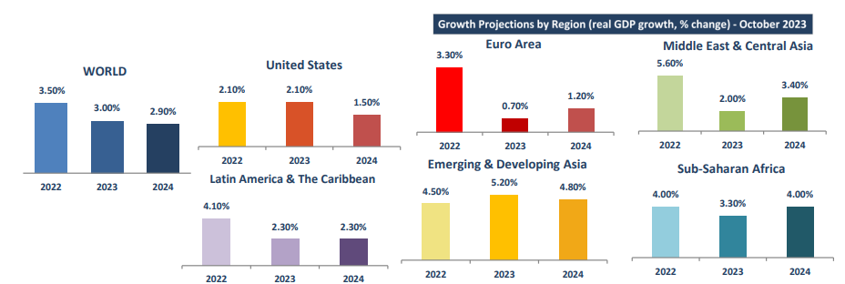

# Doric Weekly Market Insight

**Date:** October 16, 2023  
**Publisher:** Breakwave Advisors | **Category:** Market Insights  
**Original URL:** [https://www.breakwaveadvisors.com/insights/2023/10/16/60egsxwobcgroizsuhqxbx395x86an](https://www.breakwaveadvisors.com/insights/2023/10/16/60egsxwobcgroizsuhqxbx395x86an)  

---

## On Tuesday, the Imf Cut Its Growth Forecasts for China and the Euro Zone, Stressing That Overall Global Growth Remained Low and Uneven Despite What It Called the "Remarkable Strength" of the Us Economy.

*By*[*Michalis Voutsinas*](https://www.linkedin.com/in/michalis-voutsinas-587544163/)

With most of the segments concluding the forty-first trading week in the black, the Baltic Dry Index balanced at 1945 points on this Friday’s closing, some seven percent higher year-on-year! However, it has to be noted that the gearless segment ended below their intraweek highs whereas the geared ones touched their highest values for the current trading month this Friday. Largely ignoring the upcoming maintenance programs of steel mills in China, the leading Capesize submarket is currently trading at sixteenth month highs, lingering today at $27,591 daily. With the ECSA market taking a breather lately, Panamaxes and Supramaxes lay today at $14,526 and $13,950 daily respectively, tick below late September multi-month maxima. Touching five-and-a-half month highs, Handysizes remained consistent on their upward trend during the last trading days, hovering this Friday at $12,361 daily.

On the macroeconomic background, on Tuesday, the International Monetary Fund cut its growth forecasts for China and the euro zone and said overall global growth remained low and uneven despite what it called the "remarkable strength" of the US economy. In particular, global growth is projected to decelerate from 3.5 percent in 2022 to 3.0 percent in 2023 and 2.9 percent in 2024 on an annual average basis. There is a downward revision of 0.1 percentage point for 2024 compared with the July 2023 World Economic Outlook projection. Still remaining below the historical average across broad income groups, growth bottomed out in the fourth quarter of 2022. However, in some major economies, it is not expected to bottom out until the second half of 2023.

Advanced economies continue to drive the decline in annual average growth from 2022 to 2023, with stronger services activity offset by weaker manufacturing. About 90 percent of advanced economies are projected to see lower growth in 2023. On average, these economies are expected to have broadly stable growth in 2024 with a pickup in 2025. Growth in the euro area is projected to drop from 3.3 percent in 2022 to 0.7 percent in 2023, before rising to 1.2 percent in 2024. The forecast is revised downward by 0.2 percentage point and 0.3 percentage point for 2023 and 2024, respectively, compared with the Fund’s previous update. Among other major advanced economies, growth in the United Kingdom is projected to decline from 4.1 percent in 2022 to 0.5 percent in 2023, with a 0.1 percentage point upward revision. In Japan, growth is set to rise from 1.0 percent in 2022 to 2.0 percent in 2023, buoyed by pent-up demand and accommodative policies. In reference to the world’s largest economy, US growth is projected at 2.1 percent in 2023 and 1.5 percent in 2024. The forecast is revised upward by 0.3 percentage point for 2023 and by 0.5 percentage point for 2024.

For emerging market and developing economies, growth is projected to decline relatively modestly, from 4.1 percent in 2022 to 4.0 percent in both 2023 and 2024, with a downward revision of 0.1 percentage point for 2024. The forecast for Russia is for a rise from - 2.1 percent in 2022 to 2.2 percent in 2023, with an upward revision of 0.7 percentage point for 2023. In sync, an upward revision is also noted for Ukraine, with projected growth for 2023 balancing at 2.0 percent. Brazil’s GDP growth has been revised upward by 1.0 percentage point to 3.1 percent, driven by buoyant agriculture and resilient services in the first half of 2023. Conversely, growth in the Middle East and Central Asia is set to drop from 5.6 percent in 2022 to 2.0 percent in 2023, before picking up to 3.4 percent in 2024. As far as Nigeria goes, growth is projected to decline from 3.3 percent in 2022 to 2.9 percent in 2023 and 3.1 percent in 2024, with negative effects of high inflation on consumption taking hold. In South Africa, growth is expected to decelerate from 1.9 percent in 2022 to 0.9 percent in 2023, with the decline reflecting mainly power shortages.

In reference to the two pillars of the dry bulk market, a significant divergence has become apparent. The International Monetary Fund lifted its 2023-24 growth projection for India to 6.3 percent from its July estimate of 6.1 percent, citing "stronger-than-expected consumption" during the June quarter. Reacting to the International Monetary Fund's report, Prime Minister Narendra Modi stressed that "Powered by the strength and skills of our people, India is a global bright spot, a powerhouse of growth and innovation. We will continue to strengthen our journey towards a prosperous India, further boosting our reforms trajectory". On the contrary, growth projections for China's economy for both 2023 and 2024 were downgraded as the country's real estate crisis as well as weakened consumer and business confidence pose "significant risks". The outlook projects China's economy will grow 5 percent this year and 4.2 percent in 2024, a cut of 0.1 and 0.2 percentage points, respectively, from a previous forecast in July.

Along with China’s decelerating economy and high interest rates, the International Monetary Fund stressed that escalating geopolitical disputes have had a clear negative bearing on the momentum of global growth as well as on the goal of a shared global prosperity.

> **Figure 1: 1**  
> **Interactive Data & Source:** [Doric](https://www.doric.gr/) | [Local Asset](file:///C:/Users/Dell/Github/Shipping/corpus/03-breakwave/insights/2023/assets/2023-10-16_60egsxwobcgroizsuhqxbx395x86an_img_1_fee90dcffba5.png)

Data source:[Doric](https://www.doric.gr/)
