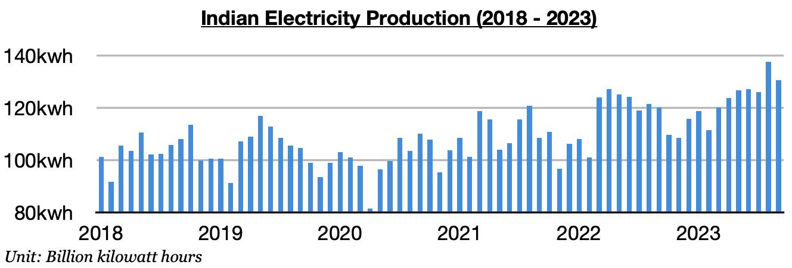
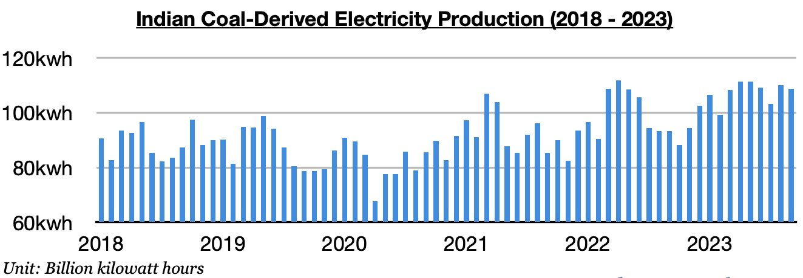

# Indian Electricity Production Remains Robust

**Date:** October 17, 2023  
**Publisher:** Breakwave Advisors | **Category:** Market Insights  
**Original URL:** [https://www.breakwaveadvisors.com/insights/2023/10/17/31xo3tk10o9m49kwwn7ljn2h2jelkx](https://www.breakwaveadvisors.com/insights/2023/10/17/31xo3tk10o9m49kwwn7ljn2h2jelkx)  

---

*By*[*Jeffrey Landsberg*](https://www.linkedin.com/in/jeffrey-landsberg-70ab957/)

As we discussed earlier this month in one of Commodore's Weekly Dry Bulk Reports, India produced approximately 130.5 billion kilowatt hours of electricity in September. This is down month-on-month by 7 billion kilowatt hours (-5%) from August’s record production, but it is up year-on-year by 10.5 billion kilowatt hours (9%). India’s electricity output has remained extremely strong and has now increased on a year-on-year basis for four straight months. Previously, it had contracted on a year-on-year basis for two straight months.

> **Figure 1: Chart 1 (86)**  
> [Local Asset](file:///C:/Users/Dell/Github/Shipping/corpus/03-breakwave/insights/2023/assets/2023-10-17_31xo3tk10o9m49kwwn7ljn2h2jelkx_img_chart1288629_802a069400fb.jpg)

Hydropower output remains in a year-on-year contraction and continues to result in stronger coal consumption. Hydropower output totaled 16.4 billion kilowatt hours. This is down month-on-month by 5.5 million kilowatt hours (-26%) and is down year-on-year by 5.6 billion kilowatt hours (-26%). Monsoon season this year saw hydropower output total 70 billion kilowatt hours. This has marked the lowest output seen since 2018 and is basically the same output that was seen in 2019.

> **Figure 2: Chart 1 (86)**  
> [Local Asset](file:///C:/Users/Dell/Github/Shipping/corpus/03-breakwave/insights/2023/assets/2023-10-17_31xo3tk10o9m49kwwn7ljn2h2jelkx_img_chart1288629_802a069400fb.jpg)

Coal-derived electricity generation totaled 108.7 billion kilowatt hours. This is down month-on-month by 1.3 billion kilowatt hours (-1%) but is up year-on-year by 15.4 billion kilowatt hours (17%). India’s coal-derived electricity generation has now increased on a year-on-year basis during each of the last five months.

> **Figure 3: Chart 3 (51)**  
> [Local Asset](file:///C:/Users/Dell/Github/Shipping/corpus/03-breakwave/insights/2023/assets/2023-10-17_31xo3tk10o9m49kwwn7ljn2h2jelkx_img_chart3285129_fd9e511f060c.jpg)
