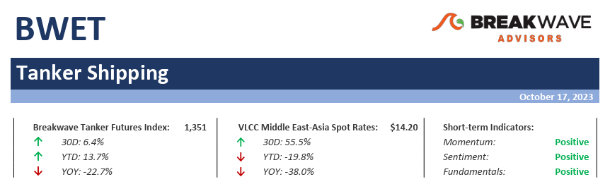
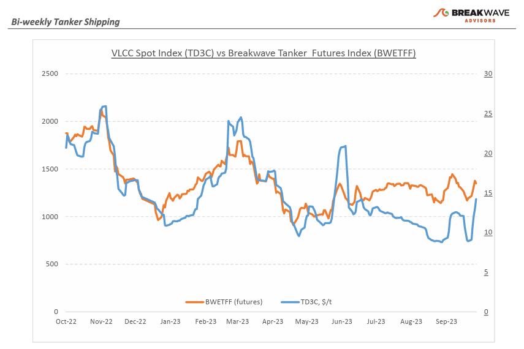
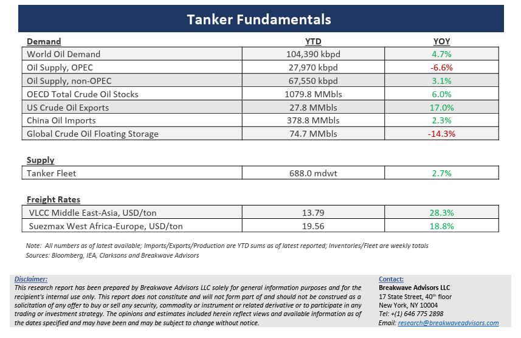

# Breakwave Bi-Weekly Tanker Report - October 17, 2023

**Date:** October 17, 2023  
**Publisher:** Breakwave Advisors | **Category:** Market Insights  
**Original URL:** [https://www.breakwaveadvisors.com/insights/2023/10/17/breakwave-bi-weekly-tanker-report-oct-17-2023-e7jc6](https://www.breakwaveadvisors.com/insights/2023/10/17/breakwave-bi-weekly-tanker-report-oct-17-2023-e7jc6)  

---

> **Figure 1: Tankerreporttop**  
> [Local Asset](file:///C:/Users/Dell/Github/Shipping/corpus/03-breakwave/insights/2023/assets/2023-10-17_breakwave-bi-weekly-tanker-report-oct-17-2023-e7jc6_img_tankerreporttop_9ff43f2db11b.png)

**• VLCC spot market activity surges as geopolitical tensions spike –**The recent surprising sad events in the Middle East once again reminded us how important energy security is. Tanker owners have been through numerous cycles of geopolitical uncertainty and know that during such uncertain periods charterers are willing to pay up to secure tonnage and thus the option to lift oil. In addition, the fact that Chinese charterers returned to the market following a week of holidays, aided demand, leading to a significant increase in spot rates in both the Atlantic as well as the Middle East markets. Although there has been no meaningful disruption in oil supply, the thought of a broader conflict that might involve some of the largest oil exporters in the world, has been enough to boost sentiment especially in a market that is generally quite positive on the development of spot rates. One should always keep in mind that even in a spot-oriented markets, the lead times between fixing a tanker and actually getting delivery of oil are long, so the reaction to the recent Middle East turmoil mainly reflects uncertainty about the future, not the present. Looking forward, the prevailing expectation in the Atlantic market is that freight sentiment will remain stable over the next 30 days due to the anticipated shortage of available tonnage. Although there is no crystal ball for tanker owners, a tanker vessel today is a valuable asset to hold given the volatile times, and thus, we see little reason to turn negative, especially given that spot rates still remain well below last year’s levels.

**• Oil price drops despite geopolitical turmoil as attention turns to demand –**Once again, oil prices demonstrated the impact that pure sentiment-driven traders have in the market, as recent swings in prices reflect a herd mentality towards well described narratives of supply (and inventories) and demand datapoints that unfortunately are very difficult to analyze. After reaching a multi-month high of almost $95 per barrel, oil prices collapsed towards the low $80s per barrel, before recovering a bit as a result of the recent Middle East conflict developments. The established range of prices reflect indeed a tight market, as demand should remain quite strong in the winter (IEA estimated a record high demand of 101.8 million barrel per day for 2023) while the implemented OPEC+ cuts of more than 2.5 mbpd have reduced supply, partly offset by higher production from oil-producing countries outside of the alliance (US and Brazil are two major regions that combined with the rest of the non-OPEC world have added ~1.9 mbpd in the first nine months of the year) For the tanker market, such a “substitution” barrels are welcomed, as the distance factor is pushing demand even higher (longer distances require more ships).

**• Tanker cycle driven by tight supply, recovering demand –**The tanker market is recovering from a long period of staggered rates as the growth in new vessel supply shrinks while oil demand is recovering in line with the global economy. A historically low orderbook combined with favorable demand fundamentals should continue to support increased spot rate volatility, which combined with the ongoing geopolitical turmoil, should support freight rates in the medium term.

> **Figure 2: Tankerreportchart**  
> [Local Asset](file:///C:/Users/Dell/Github/Shipping/corpus/03-breakwave/insights/2023/assets/2023-10-17_breakwave-bi-weekly-tanker-report-oct-17-2023-e7jc6_img_tankerreportchart_61555c32ae08.png)

> **Figure 3: Tankerreportbottom**  
> [Local Asset](file:///C:/Users/Dell/Github/Shipping/corpus/03-breakwave/insights/2023/assets/2023-10-17_breakwave-bi-weekly-tanker-report-oct-17-2023-e7jc6_img_tankerreportbottom_6fef8a907659.png)

### Subscribe:
