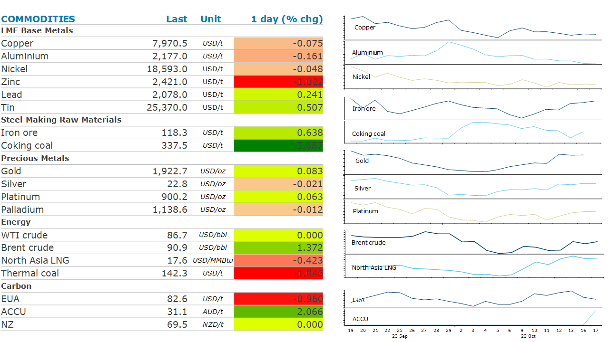

# Sentiment weakened by risk off tone across markets

**Date:** October 18, 2023  
**Publisher:** Breakwave Advisors | **Category:** Market Insights  
**Original URL:** [https://www.breakwaveadvisors.com/insights/2023/10/18/sentiment-weakened-by-risk-off-tone-across-markets](https://www.breakwaveadvisors.com/insights/2023/10/18/sentiment-weakened-by-risk-off-tone-across-markets)  

---

*By*[*Daniel Hynes*](https://www.linkedin.com/in/dahynes/)

A risk off tone across markets weighed on sentiment amid concerns of tight monetary policy and darkening geopolitical backdrop.

> **Figure 1: 1697577834252**  
> **Interactive Data & Source:** [Linkedin](https://www.linkedin.com/newsletters/commodities-wrap-6692196755876012032/?fbclid=IwAR3kiXJqZdxmp9ZcRwBNI7FsBySI-XSC0pfPur1qzjt7OZp7PTE59Tsl1QI) | [Local Asset](file:///C:/Users/Dell/Github/Shipping/corpus/03-breakwave/insights/2023/assets/2023-10-18_sentiment-weakened-by-risk-off-tone-across-markets_img_1697577834252_998be051bf0d.png)

**Crude oil**prices traded in a tight range as the market weighed up diplomatic efforts in the Middle East against the broader impact of geopolitical tensions on oil supply. The White House confirmed that President Joe Biden will travel to Israel this week in an effort to prevent a regional outbreak of the Israel-Hamas war. This follows a Middle Eastern tour by US Secretary of State Antony Blinken as the US tries to ease tensions. However, the market remains on edge as Israel works on plans for a ground offensive into Gaza. Oil prices were briefly under pressure following comments from Russia’s central bank that reiterated expectations that OPEC+ may consider an increase in output at the beginning of 2024. That was later rebuked by Russian Deputy Prime Minister Alexander Novak, who said it’s still too early to talk about what market decisions OPEC+ alliance may make at its meeting in November.

The**European gas**prices edged lower as the market watched the diplomatic efforts to prevent an escalation of the Israel-Hamas war. This comes amid muted demand, with weather conditions expected to be mostly mild this winter and the region’s gas inventories nearly full.**North Asian LNG**prices pushed higher as the region’s buyers started enquiring about LNG cargoes for delivery over winter. The spectre of strong demand comes as supply risks remain elevated. Unions in Australia have reiterated a plan to begin strikes this week at Chevron’s LNG facilities. A previous round of walkouts was halted after both sides accepted a proposed settlement. Unions have subsequently criticised efforts to finalise the agreement, leading to the renewed risk of supply disruption.

The**base metals**complex struggled to keep its head above water amid a risk-off tone across markets. This was sparked by demand concerns after stronger than expected US retail sales raised the prospect of interest rates remaining high for the foreseeable future. The geopolitical backdrop is also weighing on sentiment.**Copper**fell below the key USD8,000/t level as signs of tightness ease. LMG inventories are near a two year high, while output is rising. China’s output rose to a record high in August. Escondida, the world’s largest copper mine, recorded growth of 5% y/y in Q3 2023. This follows its best month in over three years in June when it produced 120.3kt.

**Gold**shrugged of rising yields and a stronger USD to end the session higher as the tensions in the Middle East boost safe-haven buying. Iran-backed Hezbollah said it launched attacks against several Israeli targets near the border with Lebanon. Any escalation should see this buying remain strong. This comes amid strong demand from the physical market, both from central banks as well as consumers in both India and China.

Data source:[Commodities Wrap](https://www.linkedin.com/newsletters/commodities-wrap-6692196755876012032/?fbclid=IwAR3kiXJqZdxmp9ZcRwBNI7FsBySI-XSC0pfPur1qzjt7OZp7PTE59Tsl1QI)
