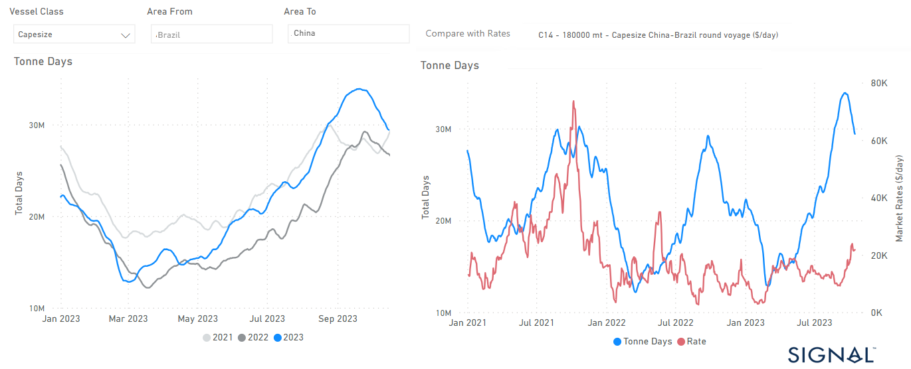
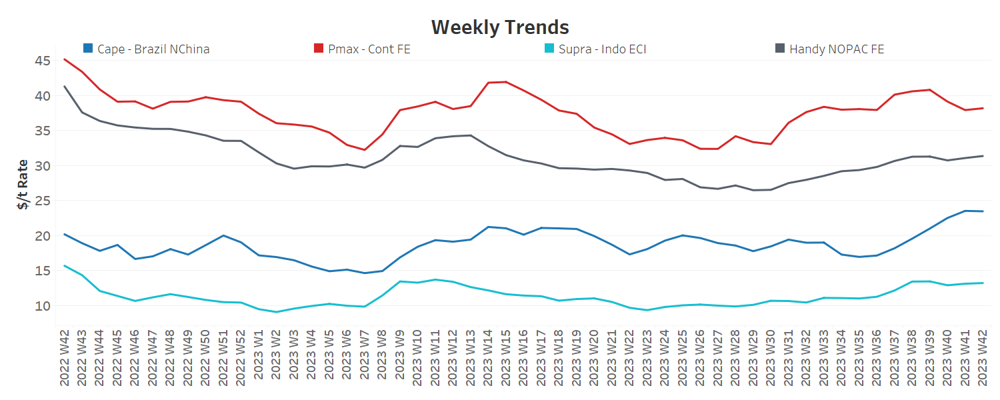
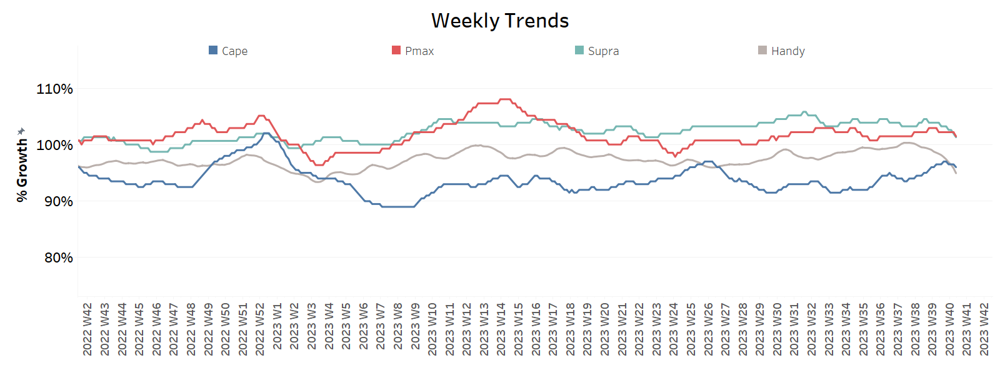
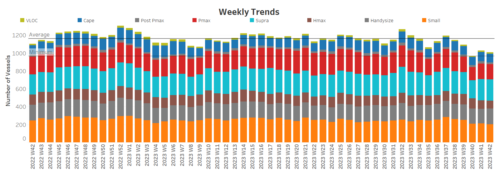

# Dry Bulk Capesize Demand

**Date:** October 18, 2023  
**Publisher:** Breakwave Advisors | **Category:** Market Insights  
**Original URL:** [https://www.breakwaveadvisors.com/insights/2023/10/18/signal-dry-bulk-weekly-report](https://www.breakwaveadvisors.com/insights/2023/10/18/signal-dry-bulk-weekly-report)  

---

## Chart of the Week : Dry Bulk Capesize Demand​​​​​

***Capesize tonne days growth from Brazil to China reaches new high, surpassing last year's growth***

> **Figure 1: Market Chart 1**  
> [Local Asset](file:///C:/Users/Dell/Github/Shipping/corpus/03-breakwave/insights/2023/assets/2023-10-18_signal-dry-bulk-weekly-report_img_unnamed-2023-10-18t140041980_a7bb9fcffdc3.png)

The third week of October witnessed robust Capesize Brazil to China freight rates, as indicated in the chart above. Furthermore, the demand in tonne days exhibited a noteworthy surge in recent days. Nevertheless, the recent uptick in the number of ballasters presents a downward pressure to the latest recovery signs.

On Monday, the price of iron ore saw an upswing following China's recent stimulus measures. China's central bank stepped up liquidity support for the banking sector by establishing medium-term lending facilities (MLF) of 789 billion yuan. In response to maturing MLF loans worth 500 billion yuan, the bank is injecting fresh liquidity into the banking system. According to Fastmarkets, the price of 62% Fe imported into northern China rose 1.84% on Monday to reach $120.20 per ton.

​​​For more information on this week's trends, see the analysis sections below:

Freight Market, Supply, Demand and Port Congestion

## Section 1/ Freight

‘The Big Picture’ - Capesize and Panamax Bulkers and Smaller Ship Sizes

Market Rates ($/t) Mixed

> **Figure 2: Market Chart 2**  
> [Local Asset](file:///C:/Users/Dell/Github/Shipping/corpus/03-breakwave/insights/2023/assets/2023-10-18_signal-dry-bulk-weekly-report_img_unnamed-2023-10-18t140327944_c70997c2a0c2.png)

In terms of the number of ballast vessels, the third week of October saw an upward trend in all ship size segments, with peaks in Supramax and Handysize.

- Capesize SE Africa: The number of ballasters rose to 88, 13 higher than the low of week 39, and 3 below the annual average.
- Panamax SE Africa: The number of ballasters has approached the annual average of 120, and the downward trend of the past few weeks now seems to be following an upward trend to exceed the annual trend in the next few days.
- Supramax SE Asia: The number of ballast ships reached a high of 135, which is almost 30 more than the previous week, and it seems that the number of ships has recently reached a new high that did not exist last year.
- Handysize NOPAC: The number of ballast ships increased to 100, 25 more than the low in week 39, while the recent number is a new record throughout the year.

## Section 3/ Demand

> **Figure 3: Summary of Dry Bulk Demand, per Ship Sizetonne Days Mixed**  
> [Local Asset](file:///C:/Users/Dell/Github/Shipping/corpus/03-breakwave/insights/2023/assets/2023-10-18_signal-dry-bulk-weekly-report_img_unnamed-2023-10-18t140437166_057b6a0c9d41.png)

There are still signs of recovery in the Capesize segment, while the downward trend continues in the other ship size categories.

- Capesize: Demand growth peaked in the previous week and seemed to stabilise towards the end of the month.
- Panamax: The growth rate is still stable since September, with no signs of spikes.
- Supramax: The growth rate reserved the lowest level since the end of week 37, while downward pressure will continue even more fiercely at the end of the month.
- Handysize: Demand continued the sharp decline and fell to one of the lowest levels since the beginning of this year.

## Section 4/ Port Congestion

> **Figure 4: Dry Bulk Ships Congested at Chinese Portsno of Vessels Decreasing**  
> [Local Asset](file:///C:/Users/Dell/Github/Shipping/corpus/03-breakwave/insights/2023/assets/2023-10-18_signal-dry-bulk-weekly-report_img_unnamed-2023-10-18t141543068_fc64463f1b52.png)

The level of ship congestion decreased in the third week of October, with a downward trend in the Capesize, Panamax and Handysize segments.

- Capesize: The number of congested vessels fell below 100, defying previous records of a higher level.
- Panamax: The number of congested ships is currently 167 and has remained below 200 since week 35. This figure represents a decrease of 6 vessels compared to the second week of October.​​​​​​
- Supramax: The number of ships is now at the same level of the previous week around 240, despite early signs of holding around 200 in the first week of October.
- Handysize: The number of congested ships increased from a low of 163 to over 170 in the current week with an increasing trend in the coming days.
