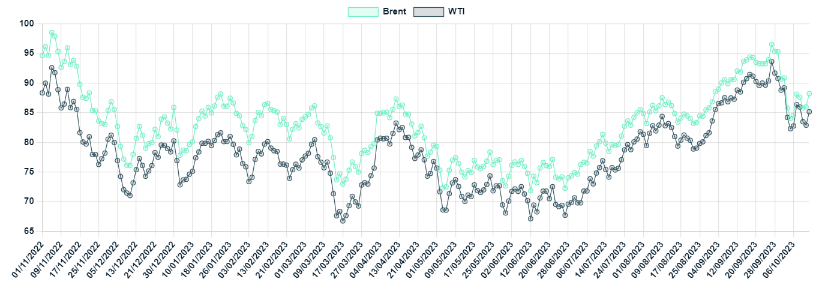

# Sideline Observer

**Date:** October 19, 2023  
**Publisher:** Breakwave Advisors | **Category:** Market Insights  
**Original URL:** [https://www.breakwaveadvisors.com/insights/2023/10/19/gibsons-tanker-market-report](https://www.breakwaveadvisors.com/insights/2023/10/19/gibsons-tanker-market-report)  

---

## Sideline Observer

Over the weekend, the world woke up to the extremely disturbing news coming out of Israel, with the conflict escalating rapidly as days went by. Oil prices initially gained on the news but retreated later in the week on the realisation that neither Israel, nor its direct neighbours (except Egypt) have any meaningful crude production. Although Egypt is a relatively big producer, with its output at 600kbd last year, there appears to be little apparent risk here as the country, a frequent mediator between Israel and the Palestinians, always insisted that the two sides resolve conflicts within their borders.

In terms of its energy needs, Israel has to rely on crude imports which are fed into 110kbd Ashdod and 197kbd Haifa refineries. The port of Ashkelon is the main receiver of crude into the country, with its intake averaging circa 230kbd last year, accounting for over 85% of total crude imports. The port, around 15 km away from Gaza, has been shut in the wake of conflict. Both Israeli refineries were operational at the start of this week, but the picture is less clear now. The Ashdod refinery is in a more vulnerable position, with NorthStandard as of Oct 11 reporting that the port of Ashdod is operating in emergency mode only, as it is “subject to attack by missiles”. If a significant part of Israeli crude import infrastructure remains offline for an extended period of time and/or domestic refineries face disruptions, the country could be forced to rely on product imports.

The wider crude tanker market at present is largely unaffected by the developments, driven by other factors; yet, additional premiums are being demanded by tanker owners for Lebanon-bound clean cargoes. Yet again, similar to Israel, Lebanon is not a major player, with its CPP imports averaging around 100kbd so far this year.

Beyond the immediate conflict zone, the current crisis also threatens to derail the recent de-escalation of tensions between the US and Iran. Iranian crude production has increased in recent months to its highest level since late 2018 amid what looks like a soft-touch approach to existing US sanctions. Last month, the US government also approved a prisoner swap with Iran in a deal, which allowed South Korea to unfreeze nearly $6 billion of Iranian assets, although these currently sit still untouched in Qatari bank, with senior US officials yesterday vowing to stop the funds’ transfer to Tehran without Washington’s consent. If Iranian crude exports are to face renewed downward pressure, this will create a vacuum for additional export volumes from other Middle East OPEC+ members, or if that vacuum is not filled, propel oil prices even higher (with negative consequences for the global economy).

However, that risk has been slowly receding in recent days. Although the close relationship between Iran and Hamas is well-known, Iranian officials have firmly rejected any suggestions of its involvement in the latest events, stating that Iran does not intervene “in the decision-making of other countries, including Palestine”. Similarly, initial US intelligence has indicated that senior Iranian government officials were caught by surprise by Saturday’s attack.

Nonetheless, with violence escalating, the concern that the war could spread beyond Gaza persists as a prolonged and difficult conflict between Israel and Hamas unfortunately appears inevitable at this stage. Yet, the oil industry remains just a sideline observer, at least for now…

## Crude Oil Prices ($/Bbl)

> **Figure 1: Data Source:gibson Shipbrokers**  
> *Data source:Gibson Shipbrokers*  
> **Interactive Data & Source:** [Gibsons Co](https://www.gibsons.co.uk) | [Local Asset](file:///C:/Users/Dell/Github/Shipping/corpus/03-breakwave/insights/2023/assets/2023-10-19_gibsons-tanker-market-report_img_ceb1cf81cf87ceb5ceafcebfcebbceaecf88_3415af93d47b.png)
