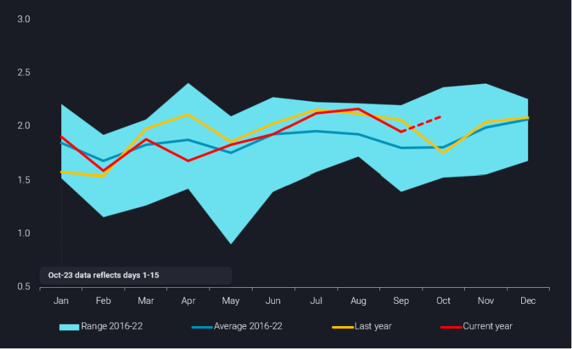
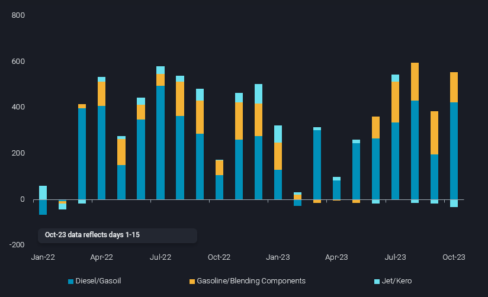
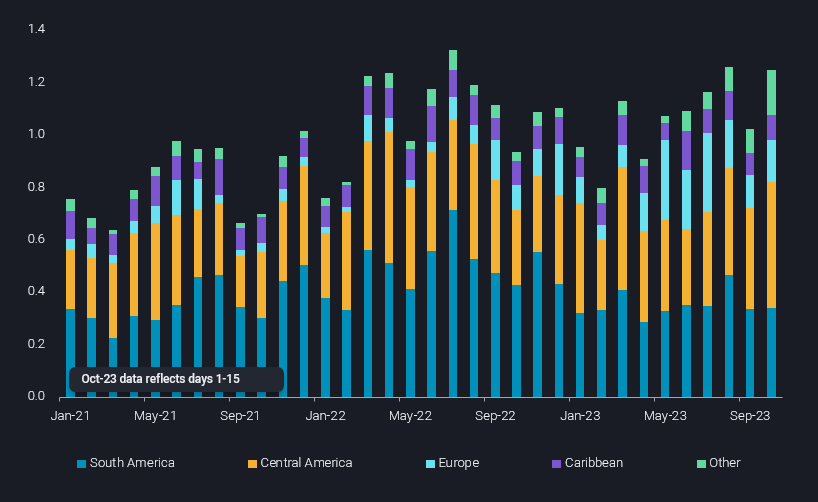

# Will US product exports continue at current levels as refining margins fall?

**Date:** October 19, 2023  
**Publisher:** Breakwave Advisors | **Category:** Market Insights  
**Original URL:** [https://www.breakwaveadvisors.com/insights/2023/10/19/will-us-product-exports-continue-at-current-levels-as-refining-margins-fall](https://www.breakwaveadvisors.com/insights/2023/10/19/will-us-product-exports-continue-at-current-levels-as-refining-margins-fall)  

---

## As Refining Margins in the Us Fall, We Explore Whether Product Exports Will Be Able to Continue Their Current Momentum

*By*[*Rohit Rathod*](https://www.linkedin.com/search/results/all/?fetchDeterministicClustersOnly=true&heroEntityKey=urn%3Ali%3Afsd_profile%3AACoAABZG0fMBtd2Qvnc2RvofUNjm-E-A7SU7VrU&keywords=rohit%20rathod&origin=RICH_QUERY_SUGGESTION&position=0&searchId=43892518-2b6e-4fe3-9506-b8e02b275cf0&sid=rOK&spellCorrectionEnabled=false)

US refined product exports, led by diesel, have performed well this year despite facing competition from Russian barrels to traditional markets. A combination of a growing European diesel short and increased gasoline demand from Mexico (refinery outages and delayed refinery start-up) have kept these waterborne flows high during 2023. As refining margins begin to narrow in the domestic market and refineries begin their fall maintenance season, will the US be able to sustain these exports?

## Product Exports Moving Counter-Seasonal

> **Figure 1: Us Ref Products Oct 1 E1697562741818**  
> **Interactive Data & Source:** [Analytics Vortexa](https://analytics.vortexa.com/?dateRange=2020-01-01T00%3A00%3A00.000Z__2023-10-15T23%3A59%3A59.999Z&filtersEnabled=%5B%22p%22%2C%22o%22%2C%22d%22%2C%22d_r%22%2C%22v%22%2C%22intra_d%22%2C%22sts_o%22%2C%22c_o%22%2C%22v_f%22%5D&from=%5B%222d92cc08f22524dba59f6a7e340f132a9da0ce9573cca968eb8e3752ef17a963%22%5D&geoBreakdownDestinationGlobal=port&geoBreakdownOriginGlobal=terminal&metric=bpd&page=Flows&products=%5B%22deda35eb9ca56b54e74f0ff370423f9a8c61cf6a3796fcb18eaeeb32a8c290bb%22%2C%229256907ba7e4ed11ff03aa297a7e62e14484ce5a85c8118c7495b9120ad0e268%22%2C%22d72edbab2b5e2e249d8c216909945922a02eb017dd200f90876fee6fa180c743%22%5D&tabId=fed0c5bb-bbe0-4f82-96d5-1e348abc8ef9&timeSeriesChartView&timeSeriesSeasonalToggle=0&v=2) | [Local Asset](file:///C:/Users/Dell/Github/Shipping/corpus/03-breakwave/insights/2023/assets/2023-10-19_will-us-product-exports-continue-at-current-levels-as-refining-margins-fall_img_us-ref-products-oct-1-e1697562741818_fc4981d749ab.png)

US transportation fuel exports have remained above seasonal averages so far in the second half of 2023. Seasonal refinery turnarounds normally peak in October in the US and exports normally drop as a result, however early indications in our data (Oct 1-15) have seen a 20% increase y-o-y in seaborne exports. This might not be surprising as product demand in Europe and LatAm remains strong, but the recent conflict in the Middle East has meant that product prices outweighed falling crude prices and in turn resulted in falling refining margins. It remains to be seen if the US product exports continue or we see a correction in flows sooner rather than later.

## Refinery Throughputs and Utilizations Keep Falling

According to weekly data released by the EIA,[crude oil inputs to refineries and utilizations](assets/2023-10-19_will-us-product-exports-continue-at-current-levels-as-refining-margins-fall_pet-pnp-wiup-dcu-nus-w_71176a83c0b4.htm)have been falling for five consecutive weeks with utilization falling below 90%. Along with seasonal maintenance, unplanned outages in PADD 3 and PADD 5 refineries could only serve to impact product exports. As discussed above, refining margins have fallen across most of the PADDs in the US apart from PADD 2 where diesel demand remains high due to the annual harvest season and supply tightness due to ongoing turnarounds.

> **Figure 2: Us Ref Products Oct 2 1**  
> **Interactive Data & Source:** [Analytics Vortexa](https://analytics.vortexa.com/?dateRange=2020-01-01T00%3A00%3A00.000Z__2023-10-15T23%3A59%3A59.999Z&filtersEnabled=%5B%22p%22%2C%22o%22%2C%22d%22%2C%22d_r%22%2C%22v%22%2C%22intra_d%22%2C%22sts_o%22%2C%22c_o%22%2C%22v_f%22%5D&from=%5B%222d92cc08f22524dba59f6a7e340f132a9da0ce9573cca968eb8e3752ef17a963%22%5D&geoBreakdownDestinationGlobal=port&geoBreakdownOriginGlobal=terminal&metric=bpd&page=Flows&products=%5B%22deda35eb9ca56b54e74f0ff370423f9a8c61cf6a3796fcb18eaeeb32a8c290bb%22%2C%229256907ba7e4ed11ff03aa297a7e62e14484ce5a85c8118c7495b9120ad0e268%22%2C%22d72edbab2b5e2e249d8c216909945922a02eb017dd200f90876fee6fa180c743%22%5D&tabId=fed0c5bb-bbe0-4f82-96d5-1e348abc8ef9&timeSeriesProperty=product_group_product&timeSeriesSeasonalToggle=0&v=2) | [Local Asset](file:///C:/Users/Dell/Github/Shipping/corpus/03-breakwave/insights/2023/assets/2023-10-19_will-us-product-exports-continue-at-current-levels-as-refining-margins-fall_img_us-ref-products-oct-2-1_354dd1ec55ad.png)

## Latam Demand for Us Products Remains Strong

LatAm, which has been the traditional destination for US products, has been pulling refined products from the US, especially diesel, where exports increased 15% y-o-y in Oct (days 1-15). After facing competition from Russian diesel arriving in Brazil earlier in the year, US diesel exports have made some recovery as well as sending increased volumes to Europe(160% increase in Q2-Q3 2023 vs Q1 2023) which is traditionally short diesel. The El Niño weather phenomenon in the southern Pacific has led to droughts in South America driving the diesel demand higher, while delayed refinery start-up in Mexico (340kbd Olmeca Refinery) and unplanned outages across the domestic refining system has meant that Mexico will continue to import significant volumes of US gasoline and diesel until the end of this year.

> **Figure 3: Us Ref Products Oct 3 2**  
> **Interactive Data & Source:** [Analytics Vortexa](https://analytics.vortexa.com/?dateRange=2021-01-01T00%3A00%3A00.000Z__2023-10-15T23%3A59%3A59.999Z&filtersEnabled=%5B%22p%22%2C%22o%22%2C%22d%22%2C%22d_r%22%2C%22v%22%2C%22intra_d%22%2C%22sts_o%22%2C%22c_o%22%2C%22v_f%22%5D&from=%5B%222d92cc08f22524dba59f6a7e340f132a9da0ce9573cca968eb8e3752ef17a963%22%5D&geoBreakdownDestinationGlobal=port&geoBreakdownOriginGlobal=terminal&metric=bpd&page=Flows&products=%5B%22deda35eb9ca56b54e74f0ff370423f9a8c61cf6a3796fcb18eaeeb32a8c290bb%22%5D&tabId=fed0c5bb-bbe0-4f82-96d5-1e348abc8ef9&timeSeriesProperty=destination_region&timeSeriesSeasonalToggle=0&v=2) | [Local Asset](file:///C:/Users/Dell/Github/Shipping/corpus/03-breakwave/insights/2023/assets/2023-10-19_will-us-product-exports-continue-at-current-levels-as-refining-margins-fall_img_us-ref-products-oct-3-2_9d26e4a97b86.png)

## Holiday Season Demand Could Outweigh Concerns on Margins

As we move into the end of the year, we also have the US holiday season which drives distillate demand in the country higher with refiners increasing their runs and utilizations. The autumnal maintenance season is timed to prepare refineries to meet this domestic demand. Given product prices remain low in the US, which seems a likely scenario given 2024 is an election year, product supply should follow demand from the domestic market while demand pull from drought and planting season in LatAm along with winter diesel demand from Europe should incentivize exports. This double demand scenario from domestic and external markets should lead to a premium on diesel, outweighing lower refining margins and leading US refiners to keep running and supply products to keep current export momentum going for the rest of the year.

Data Source:[Vortexa](https://www.vortexa.com//oil-gas-data-traders-analysts-data-scientists?gclid=Cj0KCQjw8_qRBhCXARIsAE2AtRZKOvMnbilZ_6_91d7huSFFy71pWLrnPwGwOHVzXsmsG-1a1mZnQw8aAt89EALw_wcB&hsa_acc=1782073842&hsa_ad=548425387665&hsa_cam=14746637662&hsa_grp=125038601902&hsa_kw=&hsa_mt=&hsa_net=adwords&hsa_src=g&hsa_tgt=dsa-1431852288425&hsa_ver=3&utm_campaign=%5BCD%5D%20-%20DSA%20-%20EMEA&utm_medium=cpc&utm_medium=ppc&utm_source=google&utm_source=adwords&utm_term=)
