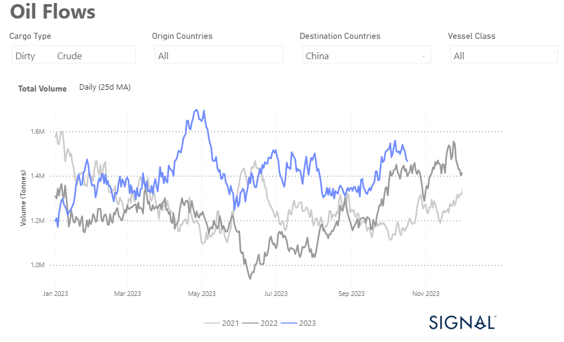
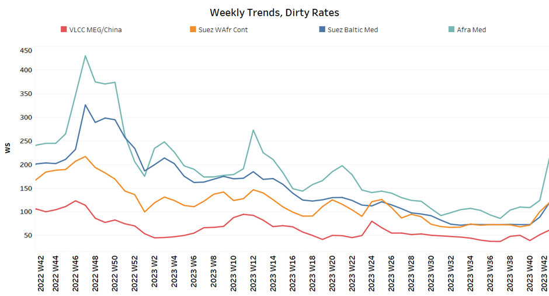
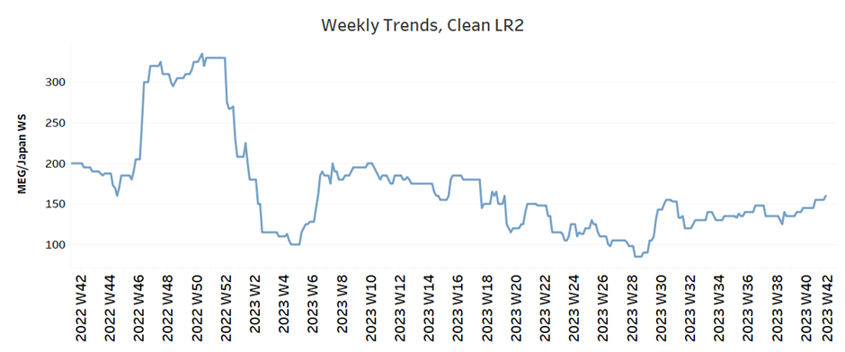
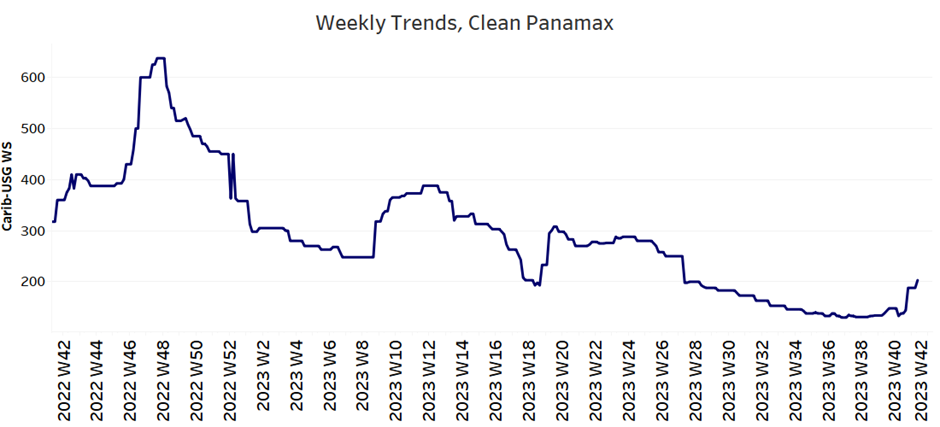
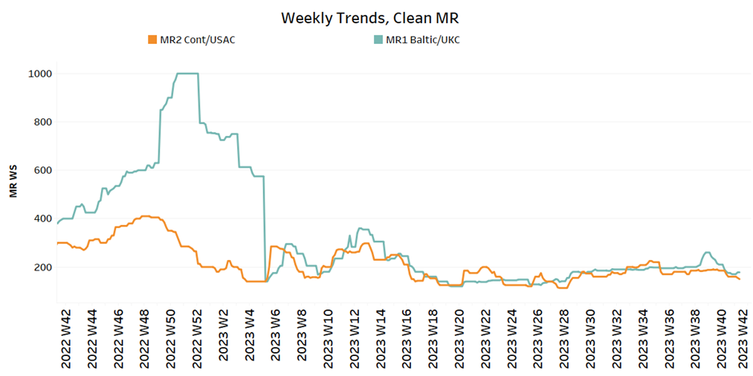
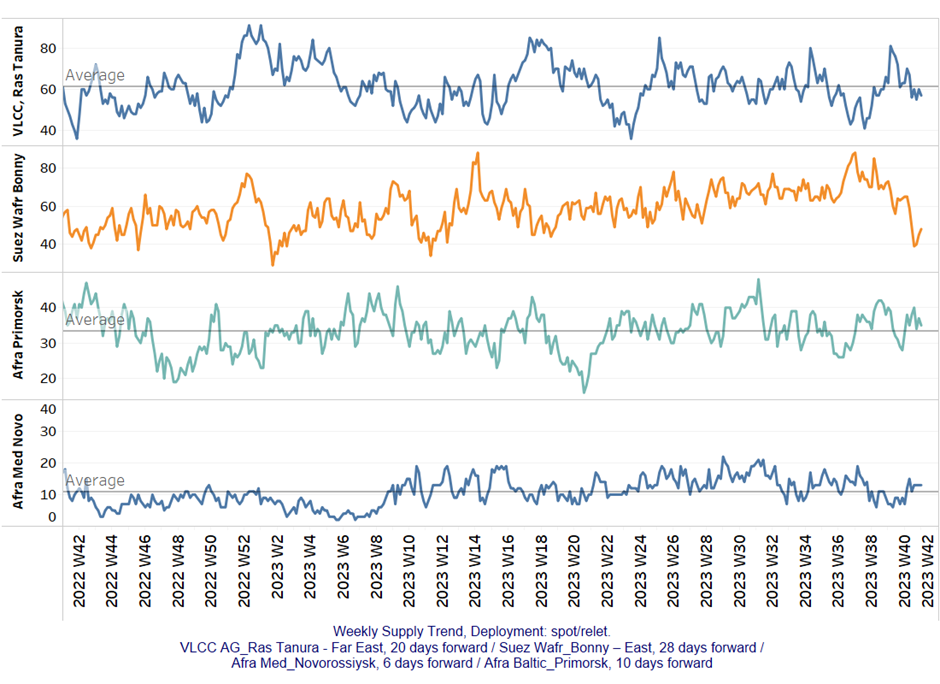
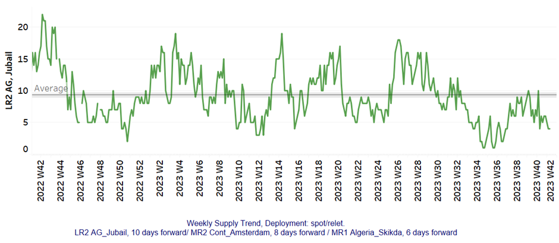
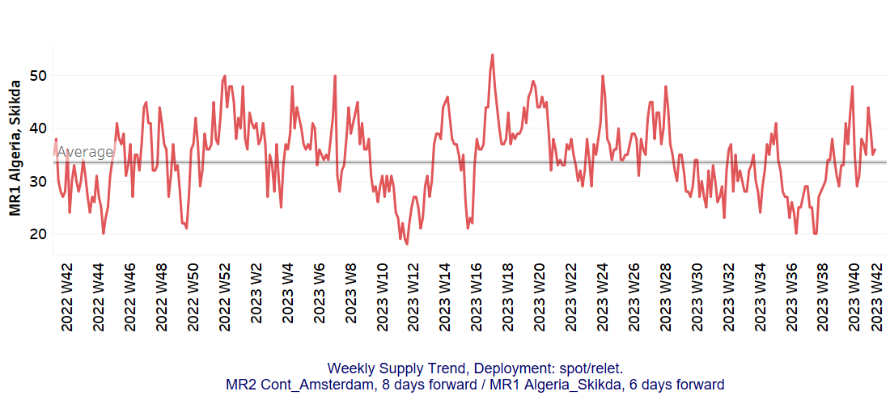
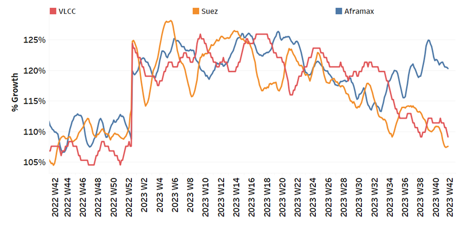
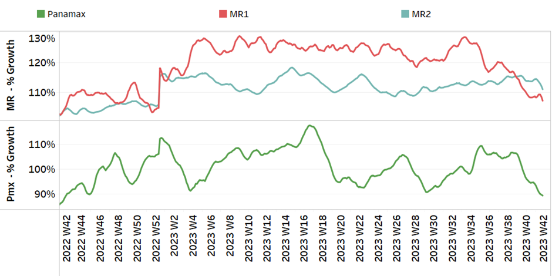

# Dirty oil flows to China

**Date:** October 20, 2023  
**Publisher:** Breakwave Advisors | **Category:** Market Insights  
**Original URL:** [https://www.breakwaveadvisors.com/insights/2023/10/20/signal-tanker-weekly-report](https://www.breakwaveadvisors.com/insights/2023/10/20/signal-tanker-weekly-report)  

---

## Chart of the Week: Dirty Oil Flows to China

***Upward revision of the monthly volume of dirty oil flows to China since the beginning of September***

> **Figure 1: Market Chart 1**  
> **Interactive Data & Source:** [Signal Ocean Platform](https://www.thesignalgroup.com/signal-ocean-platform) | [Local Asset](file:///C:/Users/Dell/Github/Shipping/corpus/03-breakwave/insights/2023/assets/2023-10-20_signal-tanker-weekly-report_img_unnamed-2023-10-20t121418840_8dc863c69409.png)

The third week of October saw a noticeable improvement in market sentiment in the crude oil freight sector. At the same time, we have observed an increase of rates in the clean tanker segment.
This upswing can be attributed to the new geopolitical crisis between Iran and Israel, which has led to a significant level of uncertainty in the oil market. As a result, oil prices have risen noticeably, affecting crude oil freight rates.

A look at the 25-day moving average (as shown in the attached chart) shows that crude flows destined for China have been on a steady upward trend since September, regardless of vessel size category. The most recent peak was reached in May, underscoring the continued upswing in this area of the market.

On Wednesday, oil prices experienced an upward surge following a devastating explosion at a Gaza hospital. This incident has ignited worries about potential disruptions in the global oil supply. The international standard, Brent crude futures, saw a robust increase of $3, representing a gain of over 2%, pushing the price per barrel to $92.90. Simultaneously, West Texas Intermediate crude (WTI) futures also climbed by $3, marking a 2.1% rise, reaching $89.66 per barrel.
These movements in both benchmarks have propelled them to their highest levels in the past two weeks.
​​​​​​

For more information on this week's trends, see the analysis sections below:

Freight Market, Supply and Demand

## Section 1/ Freight

Market Rates (WS)

> **Figure 2: ‘Dirty’ Ws​vlcc - Suezmax - Aframax Firmer**  
> **Interactive Data & Source:** [Signal Ocean Platform](https://www.thesignalgroup.com/signal-ocean-platform) | [Local Asset](file:///C:/Users/Dell/Github/Shipping/corpus/03-breakwave/insights/2023/assets/2023-10-20_signal-tanker-weekly-report_img_unnamed-2023-10-20t121655627_5bfe7461630e.png)

​​​​The crude freight market sentiment posed a significant upturn from the beginning of the third week of October with an increase that seems to hold as we are in a geopolitical spike.

- VLCC MEG-China freight rates rose above WS 60, up 40% from the previous week and up 67% from a month ago.
- Suezmax freight rates for shipments from West Africa to continental Europe reached WS160, up 60% from the previous month. Rates on the Suez-Baltic-Med route rose even more surprisingly to Ws135, up 80% from a month ago.
- Aframax Med freight rates have exceeded the WS200 level for the first time since the end of the first quarter, and current rates are now 160% higher than a month ago.

> **Figure 3: ‘Product’ Wslr2 Firmer**  
> **Interactive Data & Source:** [Signal Ocean Platform](https://www.thesignalgroup.com/signal-ocean-platform) | [Local Asset](file:///C:/Users/Dell/Github/Shipping/corpus/03-breakwave/insights/2023/assets/2023-10-20_signal-tanker-weekly-report_img_unnamed-2023-10-20t121919964_fd4bbad96e17.png)

- LR2 AG freight rates rose to 160 WS, up 9% in one month and up 90% from the record low in week 28.

> **Figure 4: PANAMAX (Sentiment: Firmer)**  
> **Interactive Data & Source:** [Signal Ocean Platform](https://www.thesignalgroup.com/signal-ocean-platform) | [Local Asset](file:///C:/Users/Dell/Github/Shipping/corpus/03-breakwave/insights/2023/assets/2023-10-20_signal-tanker-weekly-report_img_unnamed-2023-10-20t122123881_c61989a75a05.png)

- Panamax Carib-to-USG rates recorded the first increase since the end of week 27, reaching 200 WS, 56% more than a month ago.

## ‘Clean’mr Mixed

> **Figure 5: 'Dirty' (#Vessels) - Mixed**  
> *'Dirty' (#vessels) - Mixed*  
> **Interactive Data & Source:** [Signal Ocean Platform](https://www.thesignalgroup.com/signal-ocean-platform) | [Local Asset](file:///C:/Users/Dell/Github/Shipping/corpus/03-breakwave/insights/2023/assets/2023-10-20_signal-tanker-weekly-report_img_unnamed-2023-10-20t122251727_13699cd83d80.png)

- MR1 rates for the Baltic continent rose to WS 290, up 60% from a month ago.

- MR2 rates for shipments from the continent to the U.S. fell to WS150, 47% lower than a year ago in a similar week and 17% lower than a month ago.

## Section 2/ Supply

> **Figure 6: 'Dirty' (#Vessels) - Mixed**  
> **Interactive Data & Source:** [Signal Ocean Platform](https://www.thesignalgroup.com/signal-ocean-platform) | [Local Asset](file:///C:/Users/Dell/Github/Shipping/corpus/03-breakwave/insights/2023/assets/2023-10-20_signal-tanker-weekly-report_img_unnamed-2023-10-20t122547177_b06c9256566e.png)

The supply trend for the Ras Tanura VLCC showed a significant downward trend since the end of week 40, while the downward correction for the Suezmax Wafr was even stronger.

- VLCC Ras Tanura: The number of ships has fallen to 57, 4 below the annual average, with a clear downward trend at the end of week 39.
- Suezmax Wafr: The number of ships has fallen to 48, a significant drop from the peak in week 39 (~85).
- Aframax Primorsk: The current number of ships is 35, 2 above the average for the year, however, still significantly above the record low number of week 37 (~26).
- Aframax Med Novo: The number of ships seems to be holding at 13, which is 7 more than the low in week 39.

> **Figure 7: 'Clean'lr2 (#Vessels) - Decreasing**  
> **Interactive Data & Source:** [Signal Ocean Platform](https://www.thesignalgroup.com/signal-ocean-platform) | [Local Asset](file:///C:/Users/Dell/Github/Shipping/corpus/03-breakwave/insights/2023/assets/2023-10-20_signal-tanker-weekly-report_img_unnamed-2023-10-20t122939524_cb84025da925.png)

> **Figure 8: MR1 (#Vessels) - Decreasing**  
> **Interactive Data & Source:** [Signal Ocean Platform](https://www.thesignalgroup.com/signal-ocean-platform) | [Local Asset](file:///C:/Users/Dell/Github/Shipping/corpus/03-breakwave/insights/2023/assets/2023-10-20_signal-tanker-weekly-report_img_unnamed-2023-10-20t123025133_729ae16ccb82.png)

- Clean LR2 AG Jubail: The number of recorded ships has maintained the previous week's decrease of 4, which is 8 less than the average for the year.

- Clean MR1 Algeria Skikda: The current count is 36 ships, 9 more than in week 40, while the figure is 2 above the annual average.

## Section 3/ Demand (Tonne Days)

> **Figure 9: ​​‘Dirty’ Decreasing**  
> **Interactive Data & Source:** [Signal Ocean Platform](https://www.thesignalgroup.com/signal-ocean-platform) | [Local Asset](file:///C:/Users/Dell/Github/Shipping/corpus/03-breakwave/insights/2023/assets/2023-10-20_signal-tanker-weekly-report_img_unnamed-2023-10-20t123315135_9afca7d2d86d.png)

- Dirty tonne days: The picture remained negative in all crude tanker categories, with a slight increase in Suezmax vessels, but the overall demand outlook continues to weaken.

> **Figure 10: ‘Clean’ Decreasing**  
> **Interactive Data & Source:** [Signal Ocean Platform](https://www.thesignalgroup.com/signal-ocean-platform) | [Local Asset](file:///C:/Users/Dell/Github/Shipping/corpus/03-breakwave/insights/2023/assets/2023-10-20_signal-tanker-weekly-report_img_unnamed-2023-10-20t123413813_afd0797dbad0.png)

- Panamax tonne days: The growth rate has continued to decline since the end of the 39th week, reaching one of the lowest levels since the beginning of this year.

- Clean MR tonne days: The picture has not changed from the downward correction of the last weeks, while the last peak for the MR1 size was reached almost ten weeks ago.

Data Source:[Signal Ocean Platform](https://www.thesignalgroup.com/signal-ocean-platform)
