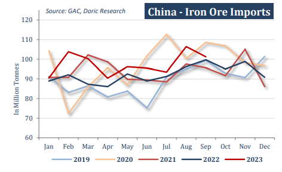
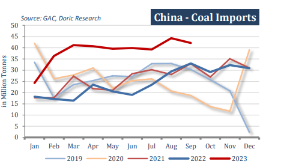
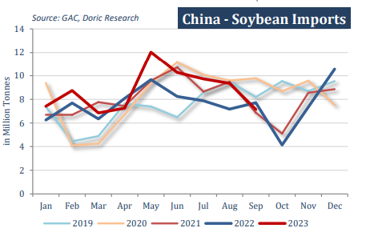

# China's consumption and industrial activity

**Date:** October 23, 2023  
**Publisher:** Breakwave Advisors | **Category:** Market Insights  
**Original URL:** [https://www.breakwaveadvisors.com/insights/2023/10/23/doric-weekly-market-insight](https://www.breakwaveadvisors.com/insights/2023/10/23/doric-weekly-market-insight)  

---

## “Drybulk Bulk Shipping Opted to Side with the Suprising Upside in China's Consumption and Industrial Activity and Turn a Blind Eye in the Feeble Real Estate Market, at Least for Now.”

*By*[*Michalis Voutsinas*](https://www.linkedin.com/in/michalis-voutsinas-587544163/)

In another positive week for the spot market, the most China-centric among the segments, Capesizes, broke into the thirty-thousand-plus territory on Tuesday, last seen in May 2022. Back then, the other trailing segments were balancing at very similar levels, with BPI, BSI and BHSI laying at $28,965, $31,168 and $29,799 daily respectively. Ultra-expansionary monetary and fiscal policies along with a plethora of inefficiencies across supply chains verified in practice the well know aphorism that "a rising tide lifts all boats". Since then, the economic juncture is anything but similar. The colossal liquidity injections and the heavy congestion were succeeded by restrictive policies and a sizeable easing of congestion. Pent-up demand thrust kept spot market afloat for a good part of the last two trading years.

However, after a certain period of time, pent-up demand fades away, deflating daily rates especially of the two segments with the highest sensitive to the course of the global economy, supramax and Handysize.Capesize sub-market, on the other hand, has its eyes on China's iron ore port stocks. In fact, portside inventories slid to 105.2 million tonnes as of October 13, down nearly 20 percent year-onyear, and the lowest level since October 2016, data from consultancy Steelhome showed. China has not allowed its steel output to further expand in the past two years in order to curb carbon emissions, but this year Beijing has not yet issued a similar nationwide mandate. The low stocks have encouraged imports, with total volume for January to September period being up 6.7 percent on the year to a record 876.65 million tonnes, customs data shows. However, China's iron ore imports in September fell 4.9 percent from August, as declining steel margins and rising domestic supply curbed buying. The world's largest iron ore imported brought in 101.18 million metric tonnes of the steelmaking ingredient last month, down from 106.42 million tonnes imported in August.

> **Figure 1: 1**  
> **Interactive Data & Source:** [Doric](https://www.doric.gr/) | [Local Asset](file:///C:/Users/Dell/Github/Shipping/corpus/03-breakwave/insights/2023/assets/2023-10-23_doric-weekly-market-insight_img_1_bc277c2cd23a.png)

On the contrary, China's September coal imports surged by 27.5 percent year-on- year, with buyers showing a preference for cheaper supplies from abroad ahead of the winter peak season. Higher industrial usage and seasonal restocking activity also contributed to strong demand for thermal coal. From January up to September, Chinese customs cleared some 347.65 million tonnes of coal, materially higher by 73.1 percent year-on-year. With demand remaining robust, the aforementioned trend is expected to continue in the current and the following month.

> **Figure 2: 1**  
> **Interactive Data & Source:** [Doric](https://www.doric.gr/) | [Local Asset](file:///C:/Users/Dell/Github/Shipping/corpus/03-breakwave/insights/2023/assets/2023-10-23_doric-weekly-market-insight_img_1_d326258e70de.png)

In reference to the staple grains, China imported 7.15 million tonnes of soybeans in September, considerably lower in both month-onmonth and on year-on year basis. In the first nine months of the year, soybean imports were standing 14.4 higher year-on-year at 77.8 million tonnes, with Brazil having the lion's share of this trade. Given that the world's largest consumer has imported an all-time high amount of soybeans in the first nine months of the year, China's demand outlook is less favorable for the rest of the year.

> **Figure 3: 1**  
> **Interactive Data & Source:** [Doric](https://www.doric.gr/) | [Local Asset](file:///C:/Users/Dell/Github/Shipping/corpus/03-breakwave/insights/2023/assets/2023-10-23_doric-weekly-market-insight_img_1_5802bb9319e4.png)

Whilst Chinese customs kept being busy, the world's second largest economy grew at a faster-than-expected pace in the third quarter. According to the preliminary estimates of China's National Bureau of Statistics, the gross domestic product in the first three quarters reached 91,302.7 billion yuan, a year-on-year increase of 5.2 percent at constant price. By quarter, the GDP for the first quarter increased by 4.5 percent year-on-year, for the second quarter 6.3 percent, and for the third quarter 4.9 percent. Economists polled by Reuters had expected third-quarter year-on-year growth of 4.5 percent. In the first three quarters, the total retail sales of consumer goods reached 34,210.7 billion yuan, up by 6.8 percent year-on-year. During the same period, the total value added of industrial enterprises above the designated size grew by 4.0 percent year-on-year, 0.2 percentage points higher than that of the first half year. In sync, the value added of services went up by 6.0 percent year-on-year. With both consumption and industrial activity surprising on the upside, dry bulk shipping can leave the real estate market discussion on the sidelines for now. Drybulk bulk shipping opted to side with the suprising upside in China's consumption and industrial activity and turn a blind eye in the feeble real estate market, at least for now.

Data source:[Doric](https://www.doric.gr/)
