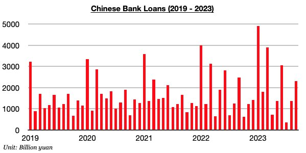
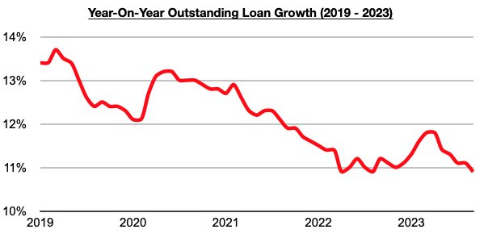

# Outstanding Loan Growth in China at Lowest Level Since August 2022

**Date:** October 23, 2023  
**Publisher:** Breakwave Advisors | **Category:** Market Insights  
**Original URL:** [https://www.breakwaveadvisors.com/insights/2023/10/23/outstanding-loan-growth-in-china-at-lowest-level-since-august-2022](https://www.breakwaveadvisors.com/insights/2023/10/23/outstanding-loan-growth-in-china-at-lowest-level-since-august-2022)  

---

*By*[*Jeffrey Landsberg*](https://www.linkedin.com/in/jeffrey-landsberg-70ab957/)

As we discussed in our most recent Weekly China Report, Chinese banks issued 2.31 trillion yuan in new loans in September. This has marked a month-on-month increase of 950 billion yuan (70%) but a year-on-year decline of 160 billion yuan (-7%). Overall, it is very normal for lending to increase on a month-on-month basis in September. More noteworthy to us is that September’s lending was down on a year-on-year basis. New lending has now declined on a year-on-year basis during three of the last five months. Prior to these last five months, lending had grown a year-on-year basis for five consecutive months.

> **Figure 1: Chart 1 (87)**  
> [Local Asset](file:///C:/Users/Dell/Github/Shipping/corpus/03-breakwave/insights/2023/assets/2023-10-23_outstanding-loan-growth-in-china-at-lowest-level-since-august-2022_img_chart1288729_a834ee9e7ee3.jpg)

With new lending growth staying relatively low recently, outstanding loan growth last month came in at only 10.9%. This has marked the lowest growth seen since August 2022. Overall, the actions being taken by China’s government remain much different than the actions being carried out by governments in much of the rest of the world (as China shifted into an easing cycle in 2022 while much of the rest of the world was and still is tightening), but it is still very clear that much more can still be done in China. New loans need to rise to a point where outstanding loan growth is also rising again. We anticipate that lending will become even stronger in the near term and that outstanding loan growth will rebound soon.

> **Figure 2: Chart 2 (74)**  
> [Local Asset](file:///C:/Users/Dell/Github/Shipping/corpus/03-breakwave/insights/2023/assets/2023-10-23_outstanding-loan-growth-in-china-at-lowest-level-since-august-2022_img_chart2287429_e209f6d776ed.jpg)
