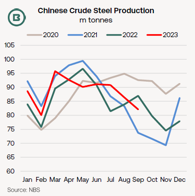
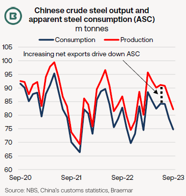
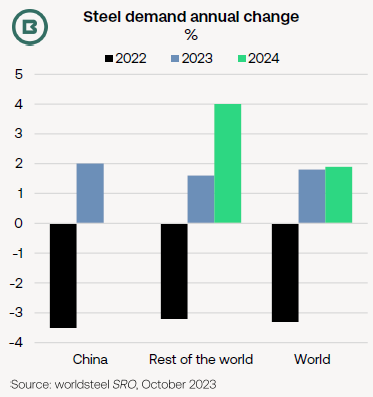
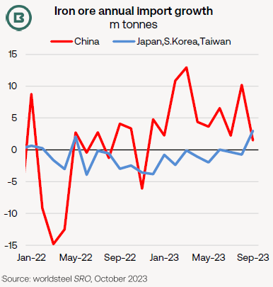

# The Big Picture: Steel sector outlook

**Date:** October 23, 2023  
**Publisher:** Breakwave Advisors | **Category:** Market Insights  
**Original URL:** [https://www.breakwaveadvisors.com/insights/2023/10/23/the-big-picture-steel-sector-outlook](https://www.breakwaveadvisors.com/insights/2023/10/23/the-big-picture-steel-sector-outlook)  

---

## The Big Picture: Steel Sector Outlook

- *The lowest daily rates of crude steel production in China of 2023 were implied by September’s data—moreover—this year’s production growth largely driven by exports, not domestic consumption.*
- *Positively for ship demand, iron ore imports into China have found support from higher output growth of blast furnace iron this year (as opposed to scrap steel-fed furnaces) than for steel overall.*
- *In terms of steel demand in 2024, worldsteel’s “Short Range Outlook” anticipates flat growth in China (which has frequently been worldsteel’s default forward view in recent years), but expansion of 4.0% in the rest of the world.*

While confirming year-to-date annual growth of 1.7%, September’s Chinese crude steel production total also represented the lowest daily output rate of 2023. The seasonal comparison, below, shows monthly production following the trajectory of the last two years.

There had been reports in industry media of some mills cutting back on production in September/October, as margins turned negative. Raw material costs are higher than in July, with the McCloskey Australian prime hard coking coal fob price the highest since March, while low levels of iron ore port stocks have supported delivered iron ore prices into North China.

> **Figure 1: Market Chart 1**  
> [Local Asset](file:///C:/Users/Dell/Github/Shipping/corpus/03-breakwave/insights/2023/assets/2023-10-23_the-big-picture-steel-sector-outlook_img_image0281429_df6d7b1be941.png)

> **Figure 2: Market Chart 2**  
> [Local Asset](file:///C:/Users/Dell/Github/Shipping/corpus/03-breakwave/insights/2023/assets/2023-10-23_the-big-picture-steel-sector-outlook_img_image1281429_0d67db20c724.png)

Unlike the case in the Q2, however, there seems little mention of a government-mandated limits on steel production.

The demand picture in China is even less positive, if we consider that steel production rose by around 16m tonnes annually in January-September, whereas net exports climbed by almost 19m tonnes.

As a result, Chinese apparent steel consumption (that is, production plus imports minus exports) has fallen.

Apparent steel consumption (ASC) is an imperfect method for gauging actual consumption, as it makes no allowance for any change in steel inventories, but it does at least provide a timely picture of overall trends.

The chart above compares steel output with ASC. This year’s widening spread between the two (the black dotted line) shows the underperformance of ASC in 2023 (in blue) against both last year and production (in red) has been supported by rising exports.

### What Then of the Outlook?

In its Short Range Outlook (SRO) released this week, the World Steel Association (worldsteel) estimated Chinese steel demand growth at 2.0% this year, a partial recovery from last year and unchanged from the previous worldsteel estimate in April.

In addition to comments on China’s real estate difficulties, worldsteel highlights growth momentum of infrastructure investment in 2023, noting that spend in this sector will remain “moderately positive” this year and next.

> **Figure 3: Market Chart 3**  
> [Local Asset](file:///C:/Users/Dell/Github/Shipping/corpus/03-breakwave/insights/2023/assets/2023-10-23_the-big-picture-steel-sector-outlook_img_image2281329_e36eeaae970b.png)

Although worldsteel simply reiterated its forecast of zero growth for China next year, it raised its growth estimates and projections for Indian steel demand to 9.3% in 2022, 8.6% this year and 7.7% in 2024.

In connection with India’s positive outlook, government spending on infrastructure, automotive demand and recovering private investment were all referenced in the SRO.

For many of the other steelmaking centres, such as Europe, Japan and the US, next year is expected to see recovery from contraction in 2023, so pushing steel demand in the world excluding China up to 4.0% in 2024 following an estimated 1.6% gain this year.

Worldsteel adds that South Korean steel demand is projected to rise this year only thanks to (1) flood damages in 2022 and (2) small growth in construction activity after years of contraction.

The final chart outlines this year’s China-centric iron ore import growth.

> **Figure 4: Market Chart 4**  
> [Local Asset](file:///C:/Users/Dell/Github/Shipping/corpus/03-breakwave/insights/2023/assets/2023-10-23_the-big-picture-steel-sector-outlook_img_image3281229_535fd00e9adf.png)

Viewed this way, part of the iron ore import growth into China in the first half of 2023 (in red) was generated by comparisons with the poor performance a year earlier, when an anticipated demand push associated with a post-lockdown recovery failed to materialise.

The remainder of China’s iron ore import growth this year owes largely to export-driven expansion in steel production

In contrast, the series for combined iron ore imports into Japan, South Korea and Taiwan (in blue) lacks the wild swings of China. Instead, the trajectory has been sub-zero for the past 18 months. Last month’s improvement must be set against contraction of similar size in September 2022.
