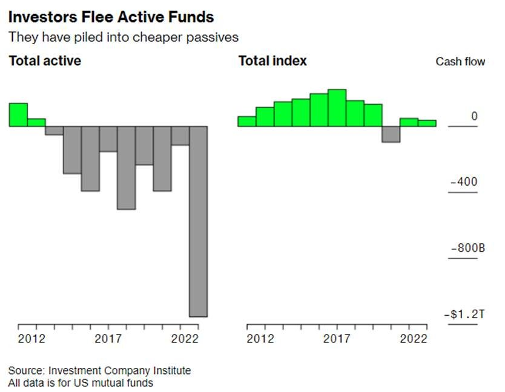

# Beyond the Middle East and Yields: How the Wealth Management Industry navigates turmoil

**Date:** October 24, 2023  
**Publisher:** Breakwave Advisors | **Category:** Market Insights  
**Original URL:** [https://www.breakwaveadvisors.com/insights/2023/10/24/beyond-the-middle-east-and-yields-how-the-wealth-management-industry-navigates-turmoil](https://www.breakwaveadvisors.com/insights/2023/10/24/beyond-the-middle-east-and-yields-how-the-wealth-management-industry-navigates-turmoil)  

---

*By*[*George Lagarias*](https://www.linkedin.com/in/george-lagarias-mba-3baa769/)

Since September, there have been two issues dominating markets: high yields and geopolitics. In the past few weeks, both have been exhausted. As far as the Middle East is concerned, we acknowledge that all outcomes are possible at this stage, from further escalation to de-escalation. It stands to reason that, while markets haven’t sold off, traders are nervous about the possibility of the former, while the latter could catalyse a Santa rally. The fact that markets haven’t reacted, to me it signals that they recognize risk is parabolic: either the conflict escalates (with obvious repercussions for risk assets) or it doesn’t. And since we haven’t seen a selloff, it means that markets are calculating that the status quo is still the most likely event.

With everyone in the world now being a Gaza expert, there is little any note can add to the discussion, other than a gentle reminder that while there’s rarely any good reason to go to war (especially in the nuclear era), wars nonetheless happen. Not much more to see there. Markets are already beginning to price in geopolitical entropy and requiring higher risk premia. Not a great time either for stocks with high valuations or for those waiting for markets to notice their value. Predictable quality is the name of the game these days.

The subject of yields has also been exhausted. The US 10y is at a 21-year high, crossing the 5% mark briefly last week. Inflation remains stubbornly above central bank targets. However, global debt levels (standing at 340% debt to GDP) don’t allow for much higher rates. Growth is receding already. There isn’t much central banks can do from now on, other than to keep rates high and wait for sluggish consumption to bring wage growth and demand down. Last week’s UK retail figures (down 0.9%) are an indicator of what lies ahead. It’s good to remember that short-term mortgages in the UK make the rate transmission mechanism faster than the US and most of Europe.

Instead, this week we should turn our attention to the wealth management industry.

But before we do that, we need to understand that the asset management industry (which is different), is clearly suffering due to three factors:

- The end of the 14-year bull market
- Competition from savings and high yields
- The march of passive investments

As returns are no longer as easy to come by, and 2023 hasn’t been the big rebound year (yet), investors are getting nervous. Getting 4.9% for an investment on the long end, or 5.1% on the short end is reasonable. Meanwhile, asset managers who have not invested in passive funds (ETFs) are clearly having profitability issues.

The wealth management industry, though, is different. Asset managers are companies managing funds. Wealth managers manage wealth.

Typically, asset managers create a range of mutual funds, build research and management teams, infuse a philosophy and charge a management fee. The end of the bull market and low returns over the past two years have caused an unprecedented retreat from mutual funds and into passive funds in 2022, according to a must-read weekend[article](https://www.bloomberg.com/news/features/2023-10-22/active-vs-passive-investing-money-managers-confront-end-of-bull-market?sref=EiJDOcNbhttps://www.bloomberg.com/news/features/2023-10-22/active-vs-passive-investing-money-managers-confront-end-of-bull-market?sref=EiJDOcNb)by Bloomberg.

> **Figure 1: Market Chart 1**  
> **Interactive Data & Source:** [Ft](https://www.ft.com/content/24ca8149-816e-4263-816b-30be7ea52c0c) | [Local Asset](file:///C:/Users/Dell/Github/Shipping/corpus/03-breakwave/insights/2023/assets/2023-10-24_beyond-the-middle-east-and-yields-how-the-wealth-management-industry-navigates-t_img_image00228629_0e16db25ca7f.jpg)

For the past few years, after the 2009 crisis and the imposition of the MiFID II standards, expense ratios for actively managed equity funds have gone from 1% to 0.65%, and for bond funds from 0.65% to nearly 0.4%. Even index funds are now squeezed, charging a quarter of what they did in 2007. Fund managers are reportedly quitting, where the industry is shifting from one trend to another to find some profitability.

Let’s not mince words. ETFs have commoditised the asset management industry, and clients are acknowledging that. A PwC[report](https://www.ft.com/content/24ca8149-816e-4263-816b-30be7ea52c0c)in July suggested that one in six asset managers will disappear by 2027.

However, not all is lost. Asset Managers provide the building blocks of portfolios. And despite the attrition, there are good long-term managers out there. In fact, it is probably because of the attrition that it will become easier to spot those who provide the more stable Alpha (returns above the benchmark, and cheap ETFs).

This is where wealth managers come in. Typically, wealth managers don’t manage their own funds, or they have a separate line. Wealth managers, like everyone else, suffer of course from sub-par returns over the past few years.

But the value they add is much more visible:

- Asset Allocation: Since the end of 2019, global equity markets have diverged. In common currency terms (GBP) Global Stocks have made 36%, whereas global bonds have lost 16%. US Equities gained 50%, whereas all other equity markets have gained between 12% and 18%, except for Emerging Markets, which have lost 2%. Sterling has lost 7% against the Dollar, has been at par vs the Euro and gained a massive 27% vs the Yen. Right decisions on these, not offered by simple ETFs most of which track one index, can make a difference. The weakening of traditional asset managers, most of whom also offer asset allocation funds, is actually good news for wealth management.
- Tax advice: In a rapidly shifting geopolitical environment, governments change quickly. In the Western world, most of these governments have high debt levels and are facing a high-yield environment. Most of the output growth is lost on interest payments. Healthcare and pension systems are pressured by ageing demographics. To finance themselves, governments may increasingly seek higher taxation, especially on businesses and high-net-worth individuals. Wealth managers with sage tax advice will quickly find themselves in demand.
- Financial planning: As a discipline, financial planning is superior to what private banks generally offer. Apart from the obvious synergies with tax planning, financial planners are active managers of a client’s total wealth. Asset managers ask “Which product do you want?” and try to provide it. But the view is the client’s. Private banks make suggestions, based solely on risk profiles, but they rarely see the client as a whole. Wealth managers and financial planners make suggestions as to “which product is right for you”. In a world with such powerful centrifugal forces, total wealth management, which comes in the guise of financial planning, can significantly add value to portfolio holders and non-institutional investors.
- Discipline: Having a dedicated planner, or private banker for that matter, helps keep portfolio holders focused on the longer term and allows clients to benefit from the best gift capitalism has to offer: long-term returns and compounding. Markets, especially in the past three years, are very volatile. The financial sector is still innovating. The best portfolios are the ones that manage to harvest long-term returns, for it is in short-term opportunism that most value is lost. When investing for the long term, portfolio holders should expect roughly 8% returns per annum for equities and 5% for bonds (even if investors just take the yield from where we are today).
