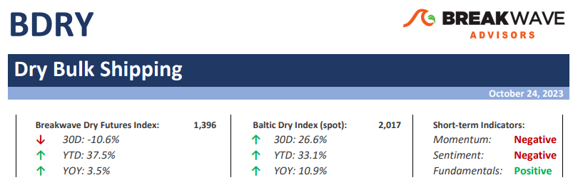
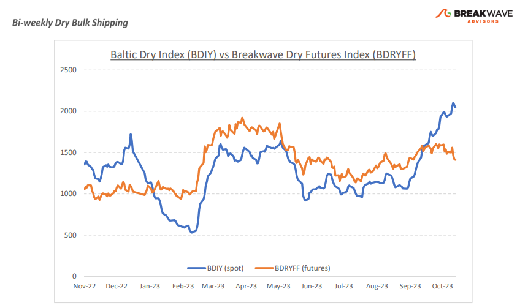
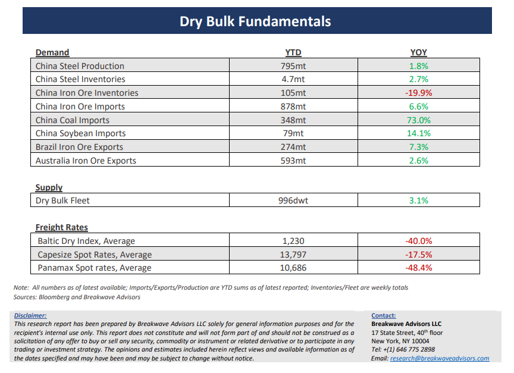

# Breakwave Bi-Weekly Dry Bulk Report - October 24, 2023

**Date:** October 24, 2023  
**Publisher:** Breakwave Advisors | **Category:** Market Insights  
**Original URL:** [https://www.breakwaveadvisors.com/insights/2023/10/breakwave-bi-weekly-tanker-report-oct-24-2023-3nsp424](https://www.breakwaveadvisors.com/insights/2023/10/breakwave-bi-weekly-tanker-report-oct-24-2023-3nsp424)  

---

> **Figure 1: Dbreporttop**  
> [Local Asset](file:///C:/Users/Dell/Github/Shipping/corpus/03-breakwave/insights/2023/assets/2023-10-24_breakwave-bi-weekly-tanker-report-oct-24-2023-3nsp424_img_dbreporttop_cbcfc73f5f24.png)

**• What goes up, must come down. But how fast? –**Capesize rates probably have peaked for the year. Following considerable tightness in the Atlantic, Capesize spot rates touched 31,000 last week, a level that was unthinkable just a month ago. Although our view has always been for a Capesize winter spike towards the 30s, the intensity of the rise was surprising. High volatility also means steep drops after strong rallies, and we are about to experience such an environment. However, freight futures never bought into the spot rally, other than the October contract, so the impact on the futures curve will be muted. One actually could argue that the risk/reward is tilted towards higher futures prices, as the speed of the decline and the intermediate bottom is up for debate. As we look at the Capesize futures curve, a lot of bearishness is already priced in, and although there is no crystal ball on such short-term fluctuations, rates must go straight down to the single digits in the next 60 days just to match the futures curve. Even for freight, that is a significant decline and assumes a very weak demand environment. We are not ready to make a call neither on the intensity of the decline nor on the short-term bottom, but at first look, freight futures pricing seems too aggressive on the negative side. The sub-Cape segments have been more stable and should maintain the current 13,000-14,000 range for the near future as demand for minerals and grains remains supportive.

**• China bottom is in. But what is the trajectory of any improvement?**– We believe the worst is behind us when it comes to China’s economic woes, at least in terms of decelerating growth. However, the question now turns to the trajectory of any improvement, and there uncertainty remains high. On the positive side, a lot of stimulus has already been pumped into the system, which should lead to significant improvements in infrastructure spending, and partly, to real estate investment. On the negative side, a considerable part of the recent economic troubles is driven by consumer psychology, and turning this around requires both time as well as confidence-driven measures. How such a balance can be achieved is anybody’s guess, but the ingredients are in place for such a shift to happen in the next six-to-nine months. GDP estimates were recently upgraded and now expectations are that China will at least meet its 5% growth goal. Obviously, a lot of China’s troubles have to do with leverage and a debt structure that is clearly unsustainable, given that infrastructure investment cannot grow at the high rates of the past, due to the unproductive nature of such investments. Whether another year or two of such a strategy might be attenable, the incremental damage could be disproportional if discipline is once again lost in the process.

**• Dry bulk focus shifts back to fundamentals**– Following a period of high uncertainty and significant disruptions across the commodity spectrum, the gradual normalization of trade is shifting the market’s attention back to the traditional demand and supply dynamics that have shaped dry bulk profitability for decades. As effective fleet supply growth for the next few years looks marginal, demand will be the main determinant of spot freight rates with China returning back to the driver’s seat as the dominant force of bulk imports and thus shipping demand.

> **Figure 2: Dbreportchart**  
> [Local Asset](file:///C:/Users/Dell/Github/Shipping/corpus/03-breakwave/insights/2023/assets/2023-10-24_breakwave-bi-weekly-tanker-report-oct-24-2023-3nsp424_img_dbreportchart_5adb5e11d147.png)

> **Figure 3: Dbreportbottom**  
> [Local Asset](file:///C:/Users/Dell/Github/Shipping/corpus/03-breakwave/insights/2023/assets/2023-10-24_breakwave-bi-weekly-tanker-report-oct-24-2023-3nsp424_img_dbreportbottom_2519b9fa9d1e.png)

### Subscribe:
