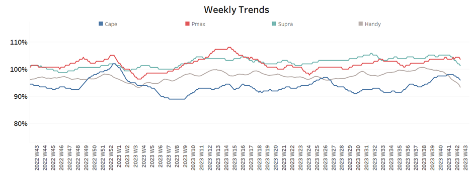
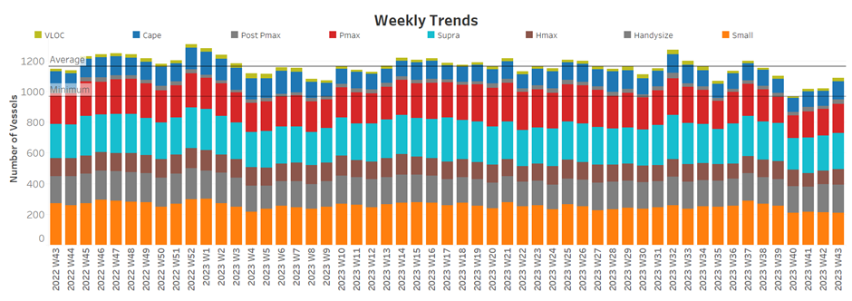

# Signal Dry Bulk Weekly Report

**Date:** October 25, 2023  
**Publisher:** Breakwave Advisors | **Category:** Market Insights  
**Original URL:** [https://www.breakwaveadvisors.com/insights/2023/10/25/signal-dry-bulk-weekly-report](https://www.breakwaveadvisors.com/insights/2023/10/25/signal-dry-bulk-weekly-report)  

---

## Chart of the Week : Dry Bulk Grain Flows From Brazil to China​​​​​

*Monthly tonnes of grain from Brazil to China with Panamax vessel class surpassed volumes of the**previous years*

> **Figure 1: Market Chart 1**  
> **Interactive Data & Source:** [Signal Ocean Platform](https://www.thesignalgroup.com/signal-ocean-platform) | [Local Asset](file:///C:/Users/Dell/Github/Shipping/corpus/03-breakwave/insights/2023/assets/2023-10-25_signal-dry-bulk-weekly-report_img_unnamed-2023-10-25t135854159_c70997c2a0c2.png)

The last week of October witnessed a downward trend in the Capesize freight market momentum, while the smaller vessel segments experienced a relative flat momentum. Meanwhile, the grain flows from Brazil to China with the Panamax vessel class recorded a significant surge in October that supported a firmer momentum for Panamax vessel freight rates (as envisaged in the image above).

Amid the weaker picture of the Capesize vessel freight rates, there is a positive side on the Chinese economy. In the July-September period, the globe's second-largest economic powerhouse recorded a growth rate of 4.9%, surpassing the approximately 4.5% predicted by analysts, as per official data. However, this rate falls significantly short of the 6.3% annual growth seen in the previous quarter.

The Chinese authorities have taken a series of measures to bolster their economy, including increased investments in infrastructure like ports, reductions in interest rates, and the relaxation of restrictions on home purchases. Nevertheless, economists argue that more comprehensive reforms are essential to tackle underlying, persistent issues that are impeding sustainable growth.

​​​For more information on this week's trends, see the analysis sections below:

Freight Market, Supply, Demand and Port Congestion

## Section 1/ Freight

‘The Big Picture’ - Capesize and Panamax Bulkers and Smaller Ship Sizes

Market Rates ($/t) Weaker

> **Figure 2: Market Chart 2**  
> **Interactive Data & Source:** [Signal Ocean Platform](https://www.thesignalgroup.com/signal-ocean-platform) | [Local Asset](file:///C:/Users/Dell/Github/Shipping/corpus/03-breakwave/insights/2023/assets/2023-10-25_signal-dry-bulk-weekly-report_img_unnamed-2023-10-25t140018973_c70997c2a0c2.png)

The last week of October saw a weaker momentum following the notable increase in Capesize rates for the Brazil to North China route, while there seemed to be a flat momentum for the other vessel size segments.

- Capesize vessel freight rates from Brazil to North China fell to $23/tonne, a 26% monthly increase.
- Panamax vessel freight rates from the Continent to the Far East remain below the $39 per tonne mark for the last two weeks, registering a monthly decline of 5%.
- Supramax vessel freight rates on the Indo-ECI route remained steady at $12 per tonne on a weekly basis, representing an 8% drop compared to the same week in October of the previous year.
- Handysize freight rates for the NOPAC Far East route held steady at $31/tonne, similar to the rates from a month ago.

## Section 2/ Supply

> **Figure 3: Supply Trend Lines for Key Load Areasballasters (#Vessels) Mixed**  
> **Interactive Data & Source:** [Signal Ocean Platform](https://www.thesignalgroup.com/signal-ocean-platform) | [Local Asset](file:///C:/Users/Dell/Github/Shipping/corpus/03-breakwave/insights/2023/assets/2023-10-25_signal-dry-bulk-weekly-report_img_unnamed-2023-10-25t140018973_c70997c2a0c2.png)

In terms of the number of ballast vessels, the last week of October saw an upward trend in the Capesize and Handysize ship size segments.

- Capesize SE Africa: The number of ballasters rose to 97, 22 higher than the low of week 40, and 4 above the annual average.
- Panamax SE Africa: The number of ballasters dropped below 120 for the first time since week 12, and the downward trend has persisted since week 38.
- Supramax SE Asia: The number of ballast ships decreased to 114 from the previous week's count of 135, with high volatility observed during the final days of October.
- Handysize NOPAC: The number of ballast ships increased to 90, up by almost 20 from the previous week's low of 70. This followed previous signs of levels around 100.

## Section 3/ Demand

> **Figure 4: Summary of Dry Bulk Demand, per Ship Sizetonne Days Decreasing**  
> **Interactive Data & Source:** [Signal Ocean Platform](https://www.thesignalgroup.com/signal-ocean-platform) | [Local Asset](file:///C:/Users/Dell/Github/Shipping/corpus/03-breakwave/insights/2023/assets/2023-10-25_signal-dry-bulk-weekly-report_img_unnamed-2023-10-25t140656536_09e27718a718.png)

Demand growth began to taper off in late October, with the exception of the Panamax segment.​​​​

- Capesize: After the peaks of the last three weeks, there is a downward trend in the last few days, but the growth rates are still significantly higher than at the end of week 37.
- Panamax: The growth rates persisted with a relatively steady sentiment, showing no indications of sudden spikes.
- Supramax: Towards the end of the month, downward pressure intensified, causing the growth rate to fall to its lowest level of the entire year.
- Handysize: Demand followed a similar weak trend as in the previous days and fell to an even lower level than the low of the previous week.

## Section 4/ Port Congestion

> **Figure 5: Dry Bulk Ships Congested at Chinese Portsno of Vessels Increasing**  
> **Interactive Data & Source:** [Signal Ocean Platform](https://www.thesignalgroup.com/signal-ocean-platform) | [Local Asset](file:///C:/Users/Dell/Github/Shipping/corpus/03-breakwave/insights/2023/assets/2023-10-25_signal-dry-bulk-weekly-report_img_unnamed-2023-10-25t140822250_57898dea339e.png)

After two weeks of stagnant activity, the level of ship congestion began to exhibit signs of increase.

- Capesize: The number of congested vessels increased again above 100, almost 20 vessels higher than the previous week.
- Panamax: The number of congested ships is currently 189 and has remained below 200 since week 35. This figure represents an increase of 17 vessels compared to the third week of October.
- Supramax: The number of ships is now below 240, but 9 vessels more than the previous week. ​​​
- Handysize: The number of congested ships increased to 185, from a low of 160 in week 40.

Data Source:[Signal Ocean Platform](https://www.thesignalgroup.com/signal-ocean-platform)
