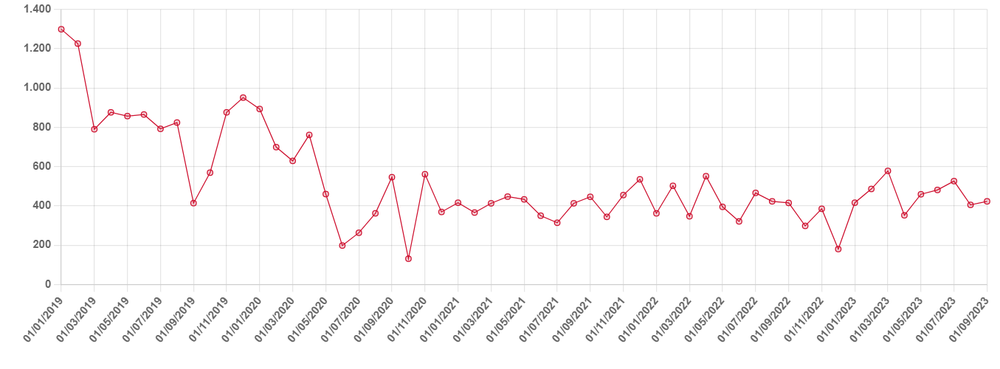

# Back in Black?

**Date:** October 26, 2023  
**Publisher:** Breakwave Advisors | **Category:** Market Insights  
**Original URL:** [https://www.breakwaveadvisors.com/insights/2023/10/25/back-in-black](https://www.breakwaveadvisors.com/insights/2023/10/25/back-in-black)  

---

> **Figure 1: Rig 2 1**  
> **Interactive Data & Source:** [Gibsons Co](https://www.gibsons.co.uk/market-reports) | [Local Asset](file:///C:/Users/Dell/Github/Shipping/corpus/03-breakwave/insights/2023/assets/2023-10-26_back-in-black_img_rig-2-1_4de3b0d41b25.jpg)

Earlier this week, the United States announced that it has temporarily lifted sanctions on Venezuela’s oil and gas sector through the issuance of a six-month general license allowing the production, sale and export of Venezuela’s crude oil and gas, without limitations on buyers or markets. The U.S. Treasury Department said in a statement, however, that it was prepared to revoke those authorizations at any time if representatives of Maduro fail to follow through on their commitments in the deal with the opposition and that the sanctions waiver will only be renewed if Venezuela meets its commitment to hold free and fair elections.

For the tanker market, the news is a positive development. Venezuela currently exports between 400kbd and 600kbd according to tracking data, although the true numbers may be higher, given the efforts made to conceal involvement in the country’s oil trade. Flows to the US has risen from zero to around 130kbd this year, owing to Chevron holding an export license, whilst several European oil majors have also imported limited volumes also under license. The remaining volumes are generally thought to end up in China, or blended in Asian waters before being re-exported.

Industry analysts have suggested that it will be difficult for Venezuela to significantly boost exports despite sanctions relief. Additional investment in oil production and upgrading of export facilities will be required, with the short sanctions window making any large investment in the country increasingly risky, whilst the country’s ties with Iran and Russia may further complicate matters. Nevertheless, the development is undoubtedly positive for the tanker market, as it is expected to shift export volumes from the dark fleet to mainstream tankers.

Gibson’s proprietary vessel database tracks at least 169 tankers over 25kdwt involved in Venezuelan trade since sanctions were enacted, comprised of over 50 VLCCs, 80 Suez/Aframaxes and more than 30 LR1/MR/Handies. Whilst these vessels are unlikely to disappear overnight, they may soon be marginalized as new buyers emerge for Venezuelan cargoes.

Demand for the country’s heavy crude is likely to come from the US, India, major Chinese buyers as well as complex European refiners, given the tightness in the heavy sour crude market. Venezuela will be keen to sell crude to cash buyers, opposed to companies to which it owes debt. Chinese majors holding oil for debt contracts will be keen to restart flows, but will do little to improve Venezuela’s financial situation, hence buyers in the US, India and Europe will most likely be preferred.

Overall the development is a positive step for our sector. The scale of the impact will depend on whether Venezuela holds up its end of the deal, enabling the US to keep sanctions off the table. The longer sanctions remain off the table, the more vessels previously engaged in that trade will be marginalized and forced out of the market, shifting increased oil volumes for the dark fleet onto non sanctioned tonnage. Only time will tell.

## Estimated Venezuelan Exports (Kbd)

> **Figure 2: Data Source:gibson Shipbrokers**  
> *Data source:Gibson Shipbrokers*  
> **Interactive Data & Source:** [Gibsons Co](https://www.gibsons.co.uk/market-reports) | [Local Asset](file:///C:/Users/Dell/Github/Shipping/corpus/03-breakwave/insights/2023/assets/2023-10-26_back-in-black_img_ceb1cf81cf87ceb5ceafcebfcebbceaecf88_d1834ec42e13.png)
