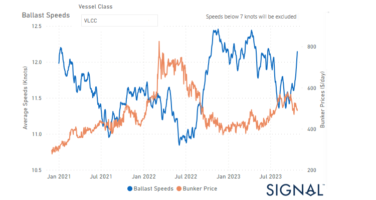
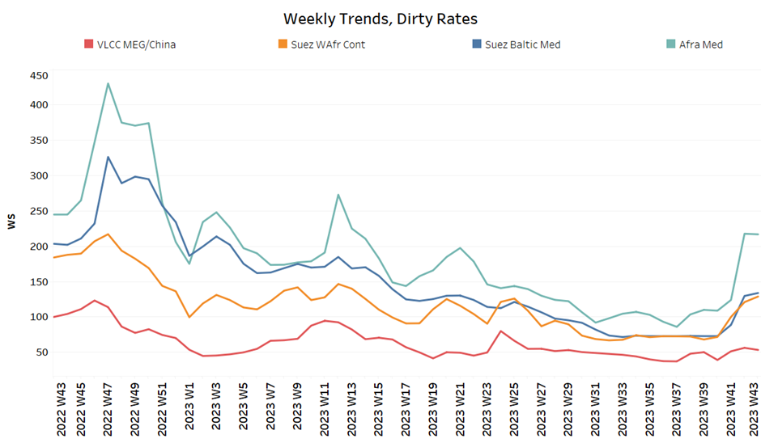
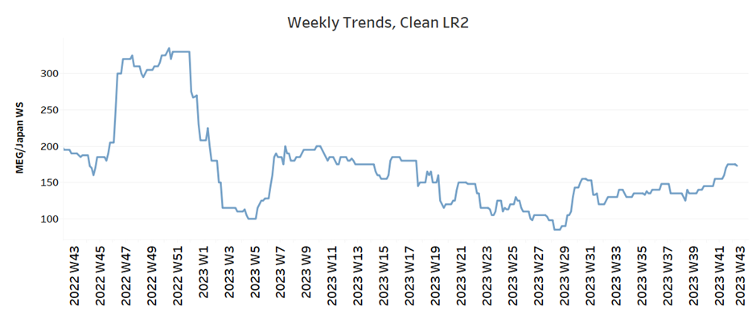
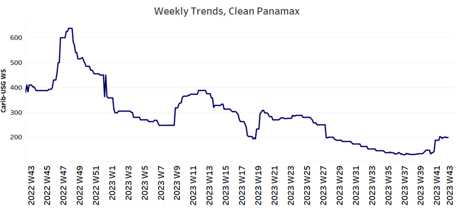
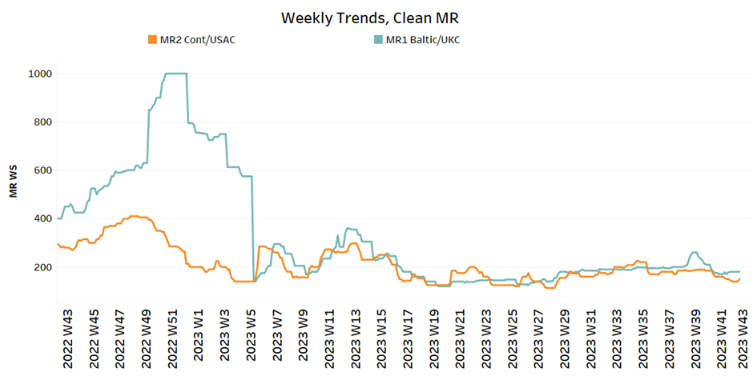
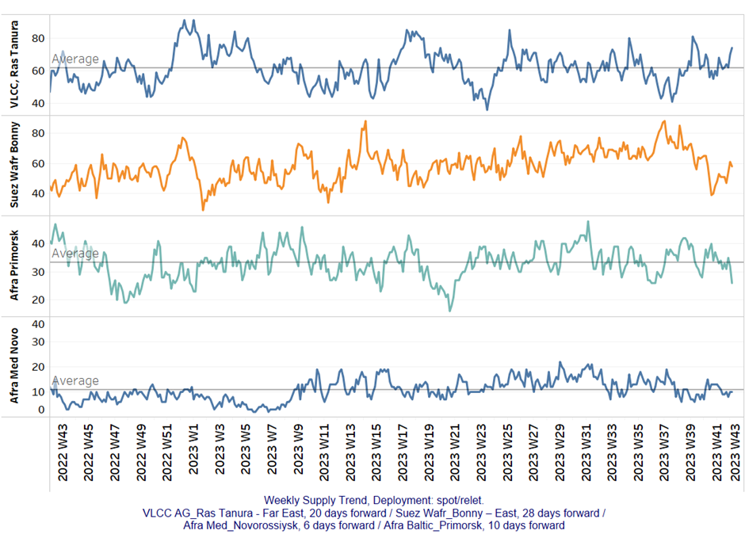
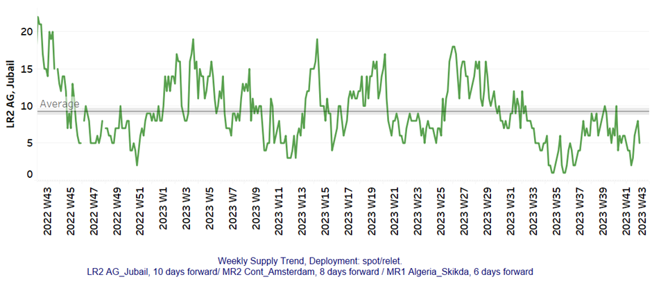
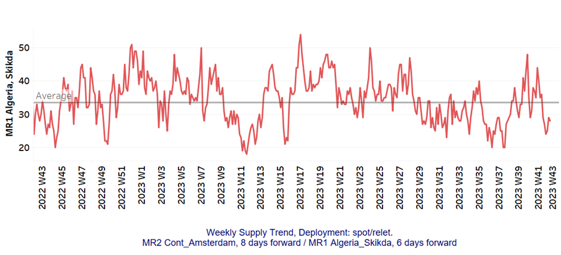
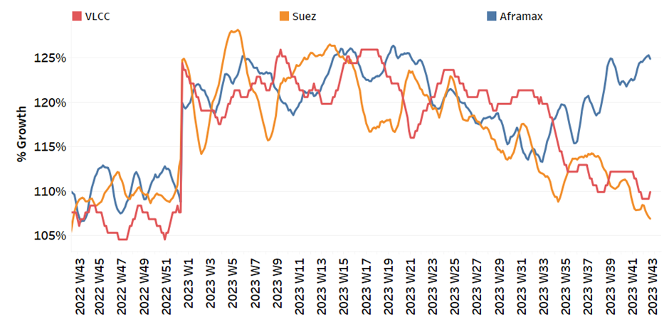
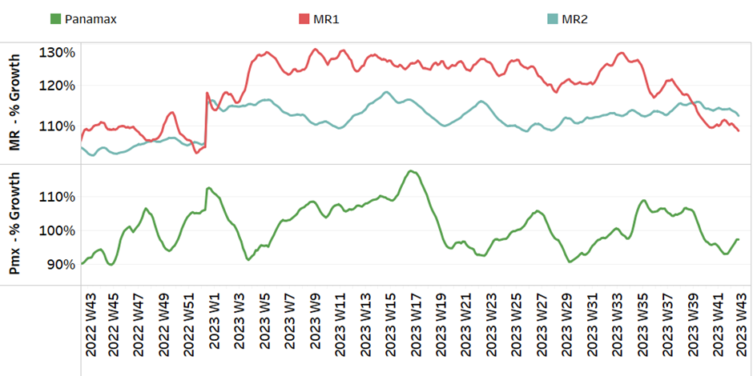

# Signal Tanker Weekly Report

**Date:** October 27, 2023  
**Publisher:** Breakwave Advisors | **Category:** Market Insights  
**Original URL:** [https://www.breakwaveadvisors.com/insights/2023/10/27/signal-tanker-weekly-report](https://www.breakwaveadvisors.com/insights/2023/10/27/signal-tanker-weekly-report)  

---

## Chart of the Week: VLCC Ballast Speeds - Bunker Prices ($/D)

***Upward revision in VLCCs sailing ballast speed from the end of September, which coincides with a decrease in bunker prices***

> **Figure 1: Market Chart 1**  
> **Interactive Data & Source:** [Signal Ocean Platform](https://www.thesignalgroup.com/signal-ocean-platform) | [Local Asset](file:///C:/Users/Dell/Github/Shipping/corpus/03-breakwave/insights/2023/assets/2023-10-27_signal-tanker-weekly-report_img_unnamed-2023-10-27t120944404_96d209e80e28.png)

In the final week of October, crude freight rates on the VLCC MEG-China route witnessed a decline, accompanied by a noticeable uptick in the number of vessels at the VLCC Ras Tanura port.

This occurred amidst persistent challenges in the oil industry, marked by ongoing crises that exert downward pressure on oil prices and production levels. However, it is interesting to note that the average ballast speed of VLCC tankers (see image above) increased to levels more than 12knots as the bunker prices cost ($/d) started to fall before the end of the month.

On a heightened geopolitical risk, Brent crude futures settled at $90 a barrel. U.S on Wednesday and U.S. West Texas Intermediate (WTI) crude futures at $85.39 a barrel. Meanwhile, CNBC news reported that U.S. President Joe Biden’s administration is likely to tighten crude oil sanctions against OPEC member Iran in response to the Islamic Republic’s backing of Palestinian militant group Hamas.

For more information on this week's trends, see the analysis sections below:

Freight Market, Supply and Demand

## Section 1/ Freight

Market Rates (WS)

‘Dirty’ WS​
VLCC - Suezmax - Aframax Mixed

> **Figure 2: ​​​​The VLCC MEG-China Route Saw a Decrease in Sentiment While**  
> *​​​​The VLCC MEG-China route saw a decrease in sentiment while Suezmax and Aframax routes remained strong.*  
> **Interactive Data & Source:** [Signal Ocean Platform](https://www.thesignalgroup.com/signal-ocean-platform) | [Local Asset](file:///C:/Users/Dell/Github/Shipping/corpus/03-breakwave/insights/2023/assets/2023-10-27_signal-tanker-weekly-report_img_unnamed-2023-10-27t121050971_acf491893776.png)

- VLCC MEG-China freight rates fell to WS 50, a 15% drop from the previous week, but still similar to a month ago.
- Suezmax freight rates for shipments from West Africa to continental Europe reached WS135, up 100% from the previous month. Rates on the Suez-Baltic-Med route held similar sentiment with the beginning of the previous week at around WS130, up 80% from a month ago.
- Aframax Med freight rates held levels of WS200 from the end of the previous week and current rates are now 90% higher than a month ago.

> **Figure 3: ‘Product’ Wslr2 Firmer**  
> **Interactive Data & Source:** [Signal Ocean Platform](https://www.thesignalgroup.com/signal-ocean-platform) | [Local Asset](file:///C:/Users/Dell/Github/Shipping/corpus/03-breakwave/insights/2023/assets/2023-10-27_signal-tanker-weekly-report_img_unnamed-2023-10-27t121419572_19a7ba570cf7.png)

- LR2 AG freight rates increased to 173 WS, a 28% rise in one month. Recent levels are now at their highest point since the end of week 31.

> **Figure 4: PANAMAX (Sentiment: Firmer)**  
> **Interactive Data & Source:** [Signal Ocean Platform](https://www.thesignalgroup.com/signal-ocean-platform) | [Local Asset](file:///C:/Users/Dell/Github/Shipping/corpus/03-breakwave/insights/2023/assets/2023-10-27_signal-tanker-weekly-report_img_unnamed-2023-10-27t121534860_eaac58af7391.png)

- Panamax Carib-to-USG rates sustained the firmer momentum of the previous week at levels WS 199, 50% more than a month ago.

> **Figure 5: ‘Clean’mr Mixed**  
> **Interactive Data & Source:** [Signal Ocean Platform](https://www.thesignalgroup.com/signal-ocean-platform) | [Local Asset](file:///C:/Users/Dell/Github/Shipping/corpus/03-breakwave/insights/2023/assets/2023-10-27_signal-tanker-weekly-report_img_unnamed-2023-10-27t121624687_fe96f619db8b.png)

- MR1 rates for the Baltic continent rose to WS 300, up 65% from a month ago.

- MR2 rates for shipments from the continent to the U.S. held flat momentum around WS150 since the end of the previous week, 19% lower than a month ago.

## Section 2/ Supply

> **Figure 6: 'Dirty' (#Vessels) - Mixed**  
> **Interactive Data & Source:** [Signal Ocean Platform](https://www.thesignalgroup.com/signal-ocean-platform) | [Local Asset](file:///C:/Users/Dell/Github/Shipping/corpus/03-breakwave/insights/2023/assets/2023-10-27_signal-tanker-weekly-report_img_unnamed-2023-10-27t121757078_570477956c7f.png)

The supply trend for the Ras Tanura VLCC has started to show signs of increase, while the Aframax trend remains downward.

- VLCC Ras Tanura: The number of ships has increased to 74, 12 above the annual average, with an upward trend for the ending of the month.
- Suezmax Wafr: The number of ships reached 58, a significant rise since the end of week 39, while the last peak recorded at week 37 (~87).
- Aframax Primorsk: The current number of ships is 26, which is almost 10 below the yearly average. The trend for the next few days is expected to decrease further, while the volatility continues to be high.
- Aframax Med Novo: The number of ships is holding a downward pressure below the average of the year, with the recent figure floating around 10.

> **Figure 7: 'Clean'lr2 (#Vessels) - Decreasing**  
> **Interactive Data & Source:** [Signal Ocean Platform](https://www.thesignalgroup.com/signal-ocean-platform) | [Local Asset](file:///C:/Users/Dell/Github/Shipping/corpus/03-breakwave/insights/2023/assets/2023-10-27_signal-tanker-weekly-report_img_unnamed-2023-10-27t121833824_2fc481178e5c.png)

> **Figure 8: MR1 (#Vessels) - Decreasing**  
> **Interactive Data & Source:** [Signal Ocean Platform](https://www.thesignalgroup.com/signal-ocean-platform) | [Local Asset](file:///C:/Users/Dell/Github/Shipping/corpus/03-breakwave/insights/2023/assets/2023-10-27_signal-tanker-weekly-report_img_unnamed-2023-10-27t121905122_44944148a929.png)

- Clean LR2 AG Jubail: The number of recorded ships has remained below the average of the year, around 5. However, there are signs that this may increase in the coming days.

- Clean MR1 Algeria Skikda: The count of ships has fallen to 29, which is 16 less than the peak in week 41 and 3 below the annual average.

## Section 3/ Demand (Tonne Days)

> **Figure 9: ​​‘Dirty’ Mixed**  
> **Interactive Data & Source:** [Signal Ocean Platform](https://www.thesignalgroup.com/signal-ocean-platform) | [Local Asset](file:///C:/Users/Dell/Github/Shipping/corpus/03-breakwave/insights/2023/assets/2023-10-27_signal-tanker-weekly-report_img_unnamed-2023-10-27t122005504_dbb675031d99.png)

- Dirty tonne days: The outlook remained in decreasing trend for the VLCC and Suezmax segments, but there was a surprising upward trend in the Aframax segment, which had hit lows during week 39. Overall, uncertainties persist as geopolitical tensions worldwide continue to reshape the oil industry.

> **Figure 10: ‘Clean’ Mixed**  
> **Interactive Data & Source:** [Signal Ocean Platform](https://www.thesignalgroup.com/signal-ocean-platform) | [Local Asset](file:///C:/Users/Dell/Github/Shipping/corpus/03-breakwave/insights/2023/assets/2023-10-27_signal-tanker-weekly-report_img_unnamed-2023-10-27t122052888_40a24cdf50e6.png)

- Panamax tonne days: The growth rate has shown signs of improvement after hitting lows in weeks 39 and 41.

- Clean MR tonne days: The demand growth outlook for MR1 size has reached new lows, while for MR2 appears stagnant over the past four weeks.

Data Source:[Signal Ocean Platform](https://www.thesignalgroup.com/signal-ocean-platform)
