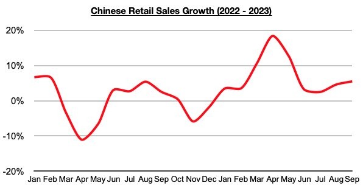
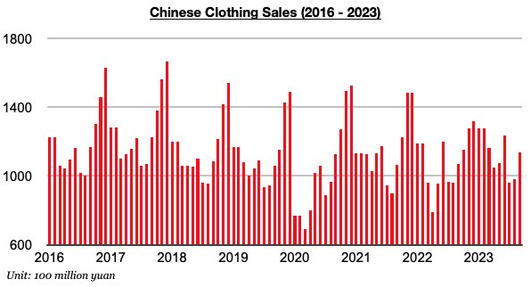

# Further Improvement in Chinese Consumer Spending

**Date:** October 30, 2023  
**Publisher:** Breakwave Advisors | **Category:** Market Insights  
**Original URL:** [https://www.breakwaveadvisors.com/insights/2023/10/30/further-improvement-in-chinese-consumer-spending](https://www.breakwaveadvisors.com/insights/2023/10/30/further-improvement-in-chinese-consumer-spending)  

---

*By*[*Jeffrey Landsberg*](https://www.linkedin.com/in/jeffrey-landsberg-70ab957/)

China's September retail sales data was recently released and showed year-on-year growth of 5.5%. This has marked the largest growth seen since May and is well above September’s 0.1% inflation.

> **Figure 1: Chart 1 (88)**  
> [Local Asset](file:///C:/Users/Dell/Github/Shipping/corpus/03-breakwave/insights/2023/assets/2023-10-30_further-improvement-in-chinese-consumer-spending_img_chart1288829_3044eb3de725.jpg)

Remaining very significant is that Chinese consumers continue to buy more goods than they did a year ago. In comparison, consumers in many other nations continue to purchase less goods than they did a year ago. As we have been stressing in Commodore's weekly reports, conditions remain weakest in Europe. Inflation has now exceeded retail sales growth in Europe for eighteen straight months. While conditions also remain quite weak in the United States, US retail sales growth last month did finally come in above inflation. US retail sales grew year-on-year by 3.8% while inflation grew year-on-year by 3.7%. Previously, inflation had exceeded retail sales growth in the United States for seven straight months.

Among the specific categories that Commodore monitors, of note is that only China’s clothing sales grew on a year-on-year basis last month. Both furniture sales and household appliance (including electronics) sales again contracted on a year-on-year basis. Clothing sales in China (which includes garments, footwear, hats, and knitwear) increased year-on-year last month by 6%. Clothing sales have now increased on a year-on-year basis during seven of the last nine months.

> **Figure 2: Chart 2 (75)**  
> [Local Asset](file:///C:/Users/Dell/Github/Shipping/corpus/03-breakwave/insights/2023/assets/2023-10-30_further-improvement-in-chinese-consumer-spending_img_chart2287529_59e87a5aec1c.jpg)
