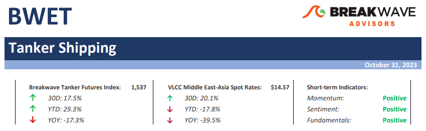
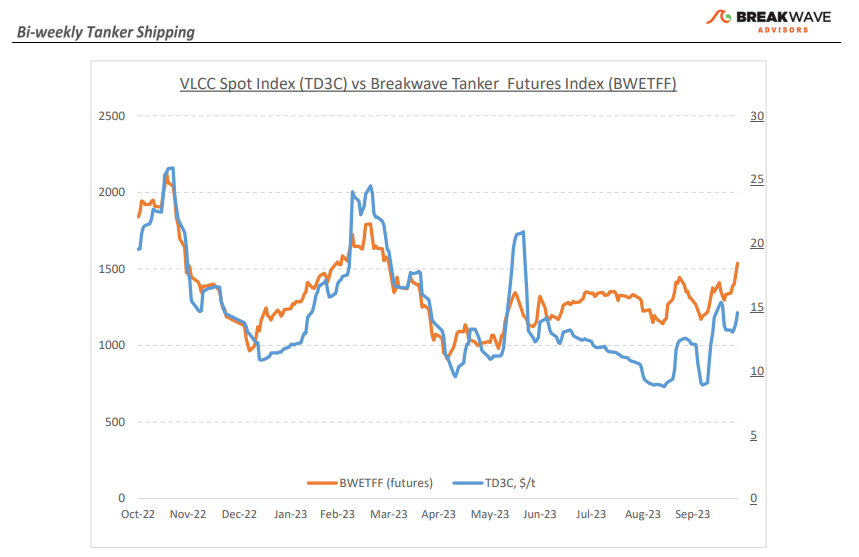
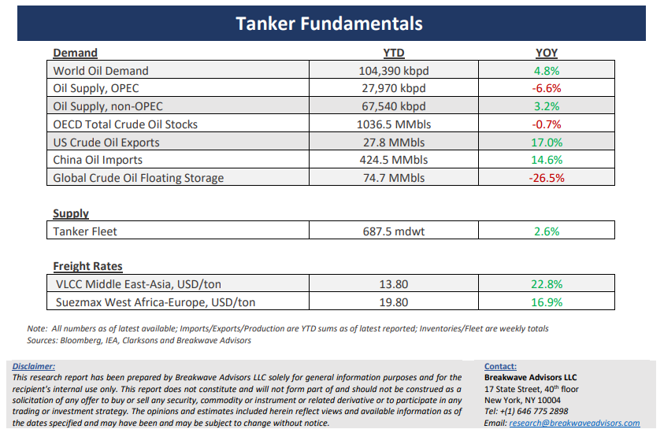

# Breakwave Bi-Weekly Tanker Report - October 31, 2023

**Date:** October 31, 2023  
**Publisher:** Breakwave Advisors | **Category:** Market Insights  
**Original URL:** [https://www.breakwaveadvisors.com/insights/2023/10/31/breakwave-bi-weekly-tanker-report-oct-31-2023-5bn4g](https://www.breakwaveadvisors.com/insights/2023/10/31/breakwave-bi-weekly-tanker-report-oct-31-2023-5bn4g)  

---

> **Figure 1: Tankerreporttop**  
> [Local Asset](file:///C:/Users/Dell/Github/Shipping/corpus/03-breakwave/insights/2023/assets/2023-10-31_breakwave-bi-weekly-tanker-report-oct-31-2023-5bn4g_img_tankerreporttop_d8a12190f7dc.png)

**• Ongoing Middle East turmoil continues to push VLCC rates higher –**When it comes to energy security and geopolitical turmoil, tanker rates tend to react swiftly, and this time around has been no exception. VLCC spot rates have shown increased strength compared to the previous month's levels, with the Baltic Exchange benchmark time charter equivalent earnings ($/day) surging by more than 100%, while the rates for the Middle East Gulf to the US Gulf route have also increased by an impressive 180%. Internals for the tanker market also look favorable: Suezmaxes, tankers that have a carrying capacity of half that of a VLCC, have surged and are now priced at about double the level of a VLCC (measured in $/ton), an unusual circumstance that should support VLCC rates going forward. The Atlantic market is also strong, with the West Africa-to-China route jumping to multi-month highs. The tanker market is not only reacting to strong demand and the rush to secure tonnage, but the rate increases also reflect relatively tight supply that should prevail for the years to come given the nonexistent orderbook for large tanker vessels. As the winter progresses, the risk lies on higher rates and possibly sharper spikes, especially given that the likelihood of further escalation in the Middle East increasingly looks real. VLCC rates remain well below last year’s levels, despite all the above favorable dynamics affecting the market. With most of the potential adverse winter weather ahead of us, we continue to see higher spot VLCC rates for the months to come.

**• Oil refocuses back on the demand side despite ongoing Middle East conflict –**Once again and following the sharp move upwards as a result of the OPEC+ cuts, the attention of oil traders has shifted back on the demand side, where fundamentals do not look particularly favorable. Oil demand figures have been steadily revised lower, with US gasoline demand for September hitting multi-year lows, Germany oil demand seeing the sharpest decline this year compared to any other economy, and Chinese 2024 demand growth estimates now sitting just below the 1 million barrels per day mark. The global economy is slowing down, and China continues to greatly affect such outcome, especially when it comes to commodity demand growth. Despite all the recent production cuts by OPEC+, the market balance remains unfavorable for higher prices, absent a major disruption because of the Middle East conflict. It is always important to remember that the Middle East region plays a crucial role in the global energy landscape, contributing about 31% of global oil production and 18% of global gas production and accounting for 48% of the world's proven oil reserves and 40% of proven gas reserves.

**• Tanker cycle driven by tight supply, recovering demand –**The tanker market is recovering from a long period of staggered rates as the growth in new vessel supply shrinks while oil demand is recovering in line with the global economy. A historically low orderbook combined with favorable demand fundamentals should continue to support increased spot rate volatility, which combined with the ongoing geopolitical turmoil, should support freight rates in the medium term.

> **Figure 2: Tankerreportchart**  
> [Local Asset](file:///C:/Users/Dell/Github/Shipping/corpus/03-breakwave/insights/2023/assets/2023-10-31_breakwave-bi-weekly-tanker-report-oct-31-2023-5bn4g_img_tankerreportchart_b333dfffd581.png)

> **Figure 3: Tankerreportbottom**  
> [Local Asset](file:///C:/Users/Dell/Github/Shipping/corpus/03-breakwave/insights/2023/assets/2023-10-31_breakwave-bi-weekly-tanker-report-oct-31-2023-5bn4g_img_tankerreportbottom_0746c8bc0e3c.png)

### Subscribe:
