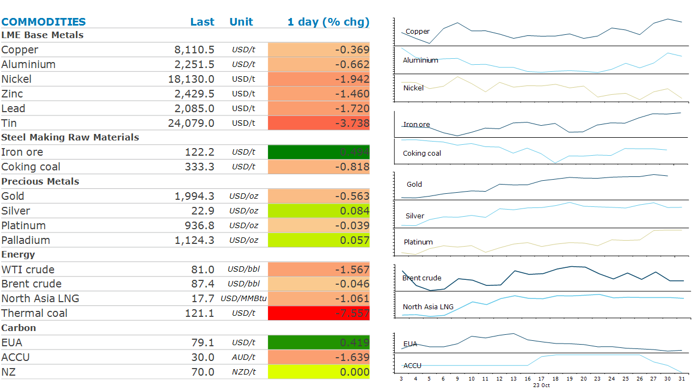

# Weak economic data weighs on sentiment

**Date:** November 01, 2023  
**Publisher:** Breakwave Advisors | **Category:** Market Insights  
**Original URL:** [https://www.breakwaveadvisors.com/insights/2023/11/1/weak-economic-data-weighs-on-sentiment](https://www.breakwaveadvisors.com/insights/2023/11/1/weak-economic-data-weighs-on-sentiment)  

---

*By*[*Daniel Hynes*](https://www.linkedin.com/in/dahynes/)

Weak economic data in China weighed on sentiment across the industrial metals sectors. Energy markets remained on edge amid elevated geopolitical risks.

> **Figure 1: 1698787843415**  
> **Interactive Data & Source:** [Linkedin](https://www.linkedin.com/newsletters/commodities-wrap-6692196755876012032/?fbclid=IwAR3kiXJqZdxmp9ZcRwBNI7FsBySI-XSC0pfPur1qzjt7OZp7PTE59Tsl1QI) | [Local Asset](file:///C:/Users/Dell/Github/Shipping/corpus/03-breakwave/insights/2023/assets/2023-11-01_weak-economic-data-weighs-on-sentiment_img_1698787843415_7dd2c07f0eb7.png)

**Base metals**fell after weaker than expected manufacturing data in China raised concerns about the economic recovery. The official manufacturing purchasing managers index came in below expectations at 49.5. Below 50 suggests activity is contracting. This suggests there is more work required to boost economic growth, despite recent support measures. These include raising the fiscal deficit ratio for 2023 to about 3.8% of GDP, as well as an additional CNY1tn of debt to support construction activity. Sentiment in the**copper**market wasn’t helped by signs of higher supply. September output in Chile rose 4.1% y/y, following similar gains in July and August. State-owned mining giant Codelco shrugged off project delays to increase production in Q3 after a series of disappointing results. Losses in**aluminium**were limited amid reports that smelters in Yunnan are now subject to renewed output cuts. Officials are becoming increasingly worried about power consumption ahead of the peak demand period.

**Iron ore**futures edge lower amid signs of weaker demand. China’s steel industry PMI came in at 45.6 for October, slightly worse than in September. More worrying for iron ore was the sharpy fall in the output component of the index, which dropped to 43.4.

**Crude oil**struggled to hold early gains to end the session lower amid signs the Israel-Hamas war will remain contained. While fighting escalates within Gaza, Hamas said it will release several foreign captives within days. Israel is also taking a more long-term approach that is aimed at limiting its own casualties while acknowledging international concerns of the humanitarian crisis. Sentiment was also weighed down by weakening supply and demand dynamics. Data from China highlighted the risks as manufacturing in China fell back into contraction, while oil major BP said that retail margins are challenging because gasoline and diesel markets are oversupplied. Data from the Energy Information Administration showed that US crude production rose to a record high of 13.05mb/d in August.

**Global gas**markets were weaker as supply risk diminished. European benchmark prices eased lower as traders weighed a mild weather outlook and high inventories against the potential impact of the Israel-Hamas war. Unseasonal warm weather is expected to extend across much of the continent into December, according to Maxar. The CEO of European Energy Exchange said that winter shouldn’t be a challenge for the region, noting that storage is full and demand behaviour has changed.**North Asian LNG**prices followed European markets lower.

**Gold**fluctuated as elevated geopolitical risks were offset by strong US economic data. Central banks continued their strong buying, with reserves expanding by 337t in Q3, according to WGC data. This is likely to under-price prices that recently hit USD2000/oz amid haven buying.

Data source:[Commodities Wrap](https://www.linkedin.com/newsletters/commodities-wrap-6692196755876012032/?fbclid=IwAR3kiXJqZdxmp9ZcRwBNI7FsBySI-XSC0pfPur1qzjt7OZp7PTE59Tsl1QI)
