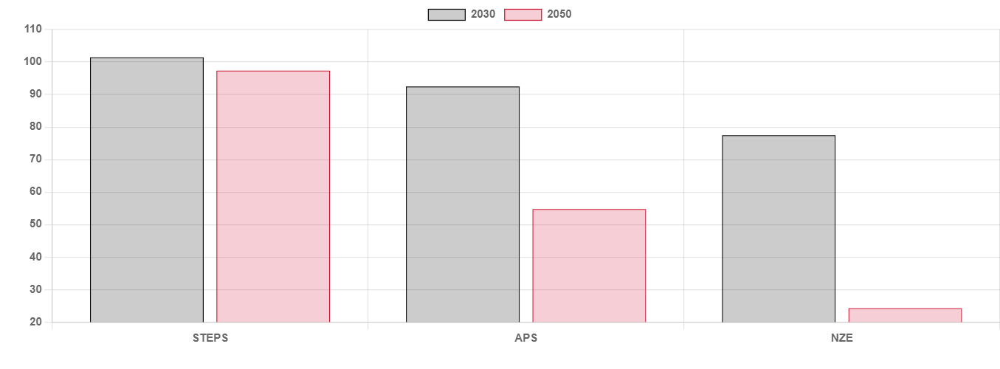

# Peak a boo

**Date:** November 02, 2023  
**Publisher:** Breakwave Advisors | **Category:** Market Insights  
**Original URL:** [https://www.breakwaveadvisors.com/insights/2023/11/2/peak-a-boo](https://www.breakwaveadvisors.com/insights/2023/11/2/peak-a-boo)  

---

> **Figure 1: Oilbarrellgreenyellow 1024x683 1**  
> **Interactive Data & Source:** [Gibsons Co](https://www.gibsons.co.uk/market-reports) | [Local Asset](file:///C:/Users/Dell/Github/Shipping/corpus/03-breakwave/insights/2023/assets/2023-11-02_peak-a-boo_img_oilbarrellgreenyellow-1024x683-1_3a50336ba797.jpeg)

Following on from last month’s release of the IEA Net Zero (NZE) 2050 report, the publishing of its World Energy Outlook (WEO) 2023 provides a glimpse into when oil demand may peak based on the Stated Policy Scenario (STEPS) framework, which is based on the current trajectory of global decarbonisation polices and is less pessimistic in its demand outlook.

However, it is important to note that it is just one of three alternative forecast scenarios and contrasts with the conclusions of the NZE scenario which assumes net zero by 2050 and the Announced Pledges Scenario (APS) which explores the full and timely implementation of national energy and climate goals. However, we have already started to see some countries back away from their climate commitment, which adds further ambiguity to long term forecasts. In the STEPS, the IEA has cut its demand forecast for fossil fuels across the board, relative to last year’s report, driven by their losing of market share to clean energy technologies and renewables. This has important implications for the tanker market and the longer-term outlook for the sector in terms of demand.

The report forecasts that oil demand will peak at 104.5 mbd in 2030 before easing to 102.1 mbd in 2050. This is five years earlier than previously thought and overall, 2050 demand is projected to be 5 mbd less. This is driven by an anticipated faster uptake of electric vehicles, reducing transport fuel demand. It is worth noting that, although lower demand levels are unwelcome news for the tanker market, in relative terms, such levels are not necessarily too bearish. Likewise, despite falling demand for gasoline and diesel, this will be partially offset by rising oil demand from the aviation and petrochemical sectors into the mid-2030s, with only limited reductions in absolute demand expected until 2050, when the forecast period ends.

Meanwhile, on the supply side, global production is expected to be 101.5 mbd in 2030 and then decline to 97.4 mbd in 2050. During this period, emerging producers and unconventional sources will increase their share of the market. In terms of refining, and in line with the expectation of lower road fuel demand, there is expected to be limited capacity increases after 2030. Again, as on the demand side, when these reductions are considered in relative terms, such forecasts are not necessarily as alarming as some may have expected.

All of this raises an important question about the future of the tanker market. While it is inevitable that the energy transition will reduce demand for oil shipping, it will not be a cliff edge scenario. In reality, the transition away from fossil fuels will be a long, drawn-out process of gradual reductions in demand and inevitably, new opportunities will likely arise along the way. At the same time, if we see a prolonged period of low tanker ordering, the effects of this could help to naturally offset lower future demand levels and help to keep the tonnage balanced going forward.

Furthermore, oil demand peak will vary by the region, with Europe and North America further along in their energy transitions. Whilst Asian consumers, particularly China are accelerating their transition efforts and uptake of EVs, their extensive petrochemical industry should continue to see strong base demand well into the next decade. Therefore, while current forecasts are starting to put a date on peak oil demand, there is still reason to be optimistic about the tanker market for the foreseeable future.

## IEA Oil Demand Scenarios (Mbd)

> **Figure 2: Data Source:gibson Shipbrokers**  
> *Data source:Gibson Shipbrokers*  
> **Interactive Data & Source:** [Gibsons Co](https://www.gibsons.co.uk/market-reports) | [Local Asset](file:///C:/Users/Dell/Github/Shipping/corpus/03-breakwave/insights/2023/assets/2023-11-02_peak-a-boo_img_ceb1cf81cf87ceb5ceafcebfcebbceaecf88_32f6056b2830.png)
