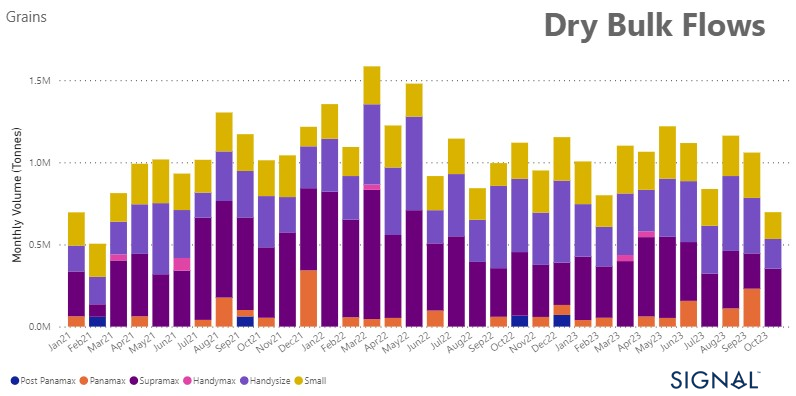
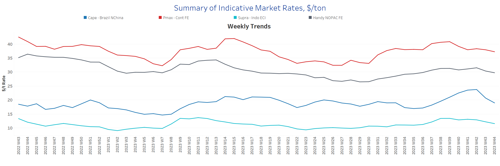
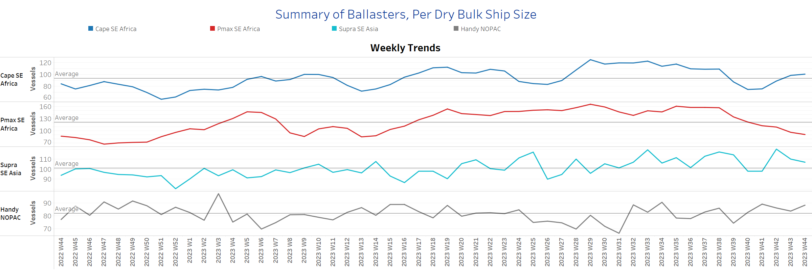
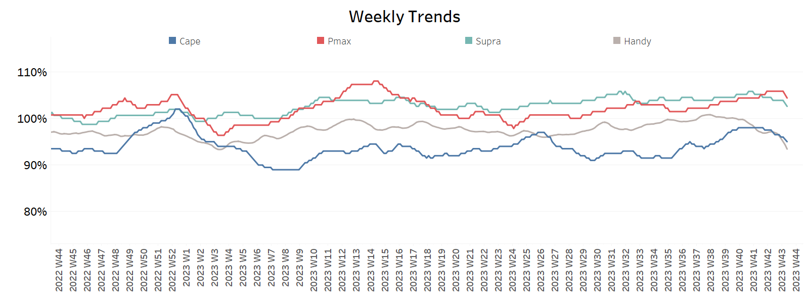
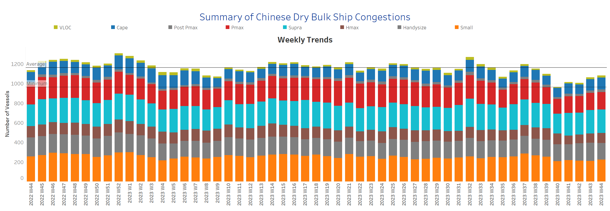

# Signal Dry Bulk Weekly Report

**Date:** November 02, 2023  
**Publisher:** Breakwave Advisors | **Category:** Market Insights  
**Original URL:** [https://www.breakwaveadvisors.com/insights/2023/11/2/signal-dry-bulk-weekly-report](https://www.breakwaveadvisors.com/insights/2023/11/2/signal-dry-bulk-weekly-report)  

---

## Chart of the Week : Dry Bulk Grain Flows From Middle East​​​​​

> **Figure 1: Increase in the Percentage Share of Supramax Vessel Size for October**  
> **Interactive Data & Source:** [Signal Ocean Platform](https://www.thesignalgroup.com/signal-ocean-platform) | [Local Asset](file:///C:/Users/Dell/Github/Shipping/corpus/03-breakwave/insights/2023/assets/2023-11-02_signal-dry-bulk-weekly-report_img_unnamed-2023-11-02t112342901_feadf775171b.png)

As November starts, there is uncertainty about how dry bulk freight rates will perform in the future. Optimism in earlier days has faded due to recent weekly declines, and the market's strength in the final quarter of the year is now in question. On the supply side, there has been an increase in the number of ballasters for Capesize vessels, while in the Panamax category, there is still a decrease, indicating the possibility of a more robust rate environment.

In the grain sector, it is worth noting that the percentage share of Supramax vessels in Middle East grain exports to various destinations has been increasing. Although there was a significant downward revision in the total monthly volume of Middle East grain exports in October, the Supramax vessel size has shown increased activity compared to previous months.

​​​For more information on this week's trends, see the analysis sections below:

Freight Market, Supply, Demand and Port Congestion

## Section 1/ Freight

‘The Big Picture’ - Capesize and Panamax Bulkers and Smaller Ship Sizes

Market Rates ($/t) Weaker

> **Figure 2: Market Chart 2**  
> **Interactive Data & Source:** [Signal Ocean Platform](https://www.thesignalgroup.com/signal-ocean-platform) | [Local Asset](file:///C:/Users/Dell/Github/Shipping/corpus/03-breakwave/insights/2023/assets/2023-11-02_signal-dry-bulk-weekly-report_img_unnamed-2023-11-02t112559757_77e402400377.png)

The freight market momentum weakened at the beginning of November. Capesize Brazil to North China freight rates hit new lows compared to the peak two weeks ago.

- Capesize vessel freight rates from Brazil to North China fell below $19/tonne, a 16% weekly decrease.
- Panamax vessel freight rates from the Continent to the Far East stood $38 per tonne, registering a monthly decline of 9%.
- Supramax vessel freight rates on the Indo-ECI route fell below $12 per tonne, representing an 8% weekly drop.
- Handysize freight rates for the NOPAC Far East route dropped to under $30/tonne, with rates averaging $29/tonne, a 4% decrease from the previous week.

## Section 2/ Supply

> **Figure 3: Supply Trend Lines for Key Load Areasballasters (#Vessels) Mixed**  
> **Interactive Data & Source:** [Signal Ocean Platform](https://www.thesignalgroup.com/signal-ocean-platform) | [Local Asset](file:///C:/Users/Dell/Github/Shipping/corpus/03-breakwave/insights/2023/assets/2023-11-02_signal-dry-bulk-weekly-report_img_unnamed-2023-11-02t112715789_8b4838a4a000.png)

In November, the Capesize segment experiences a significant increase in the number of ballast vessels, while the Panamax segment sees a steep downward trend.

- Capesize SE Africa: The number of ballasters rose to 100, 25 higher than the low of week 40, and 7 above the annual average.
- Panamax SE Africa: The number of ballasters dropped below 100 reaching one of the lowest levels since week 13.​​​​​​
- Supramax SE Asia: The number of ballast ships decreased to 107, which is 7 lower than the previous week. There is a trend of decreasing numbers following the peak recorded two weeks earlier.
- Handysize NOPAC: The number of ballast ships remained at around 90, which is a 20% increase from week 39.

## Section 3/ Demand

> **Figure 4: Summary of Dry Bulk Demand, per Ship Sizetonne Days Decreasing**  
> **Interactive Data & Source:** [Signal Ocean Platform](https://www.thesignalgroup.com/signal-ocean-platform) | [Local Asset](file:///C:/Users/Dell/Github/Shipping/corpus/03-breakwave/insights/2023/assets/2023-11-02_signal-dry-bulk-weekly-report_img_unnamed-2023-11-02t112829802_51c8955dc967.png)

Demand growth exhibited a pronounced decline across all vessel size categories, with the Handysize category experiencing a more pronounced reduction than the other segments.

- Capesize: The declining trend has now reached its lowest growth rate since the end of week 39, and it appears that November will introduce further downward pressure.
- Panamax: It's worth noting that recent sentiment has improved compared to the lows observed during week 35, despite the lack of sudden growth spikes.
- Supramax: The growth rate remained at its lowest level of the year, and fears of a rise in commodity prices due to the Middle East crisis have not yet affected demand for grains.
- Handysize:Demand growth has sharply declined in the past month, and early signs suggest weak momentum will continue.​​​​​​

## Section 4/ Port Congestion

> **Figure 5: Dry Bulk Ships Congested at Chinese Portsno of Vessels Steady**  
> **Interactive Data & Source:** [Signal Ocean Platform](https://www.thesignalgroup.com/signal-ocean-platform) | [Local Asset](file:///C:/Users/Dell/Github/Shipping/corpus/03-breakwave/insights/2023/assets/2023-11-02_signal-dry-bulk-weekly-report_img_unnamed-2023-11-02t112928509_2e4c6af0cba5.png)

The level of ship congestion remained steady from the previous week but was still higher than levels four weeks ago.

- Capesize: The number of congested vessels rose to 120, exceeding week 40 levels by over 20 vessels.
- Panamax: The number of congested ships has been below 200 since week 35 and currently stands at 179. However, the recent figure is a 30-vessel increase from week 40.
- Supramax: The number of ships is below 240 over the last two weeks, with a tendency of a further increase, as early October levels were not above 220.
- Handysize: The number of congested ships dropped to 170, 15 vessels lower than the previous week.

Data Source:[Signal Ocean Platform](https://www.thesignalgroup.com/signal-ocean-platform)
