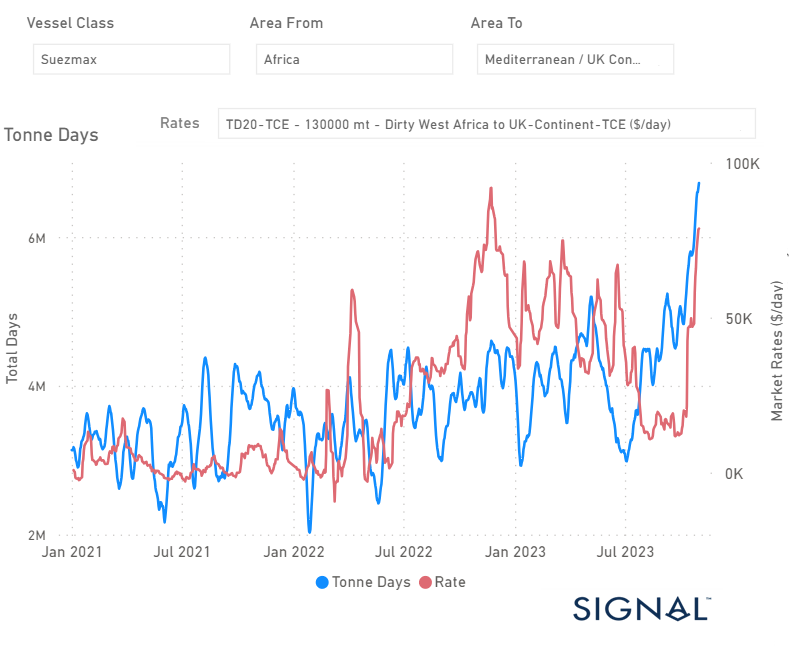
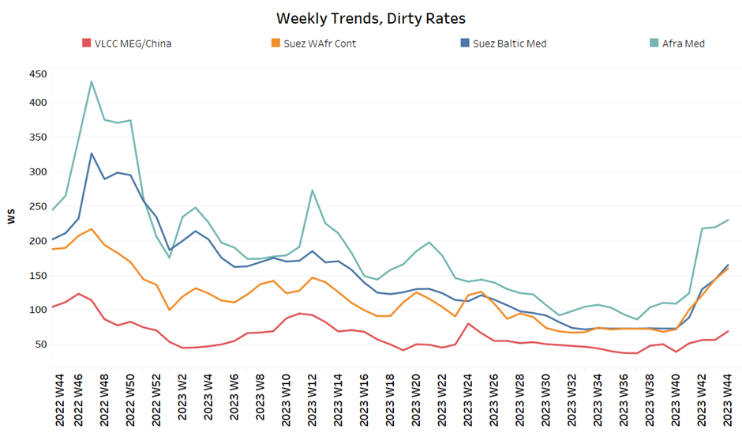
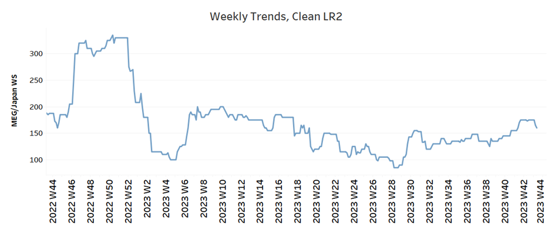
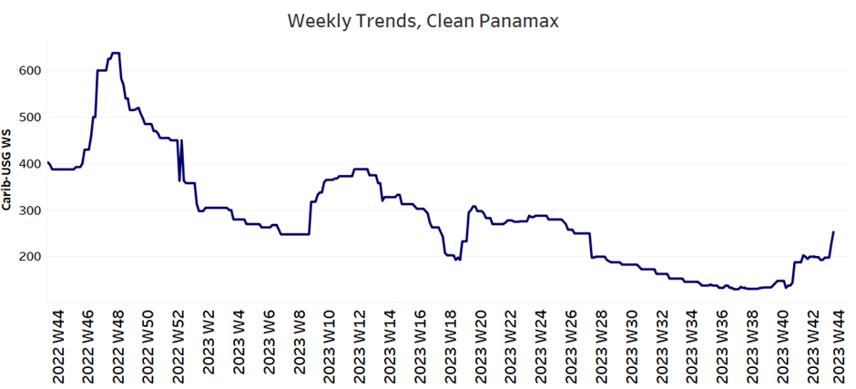
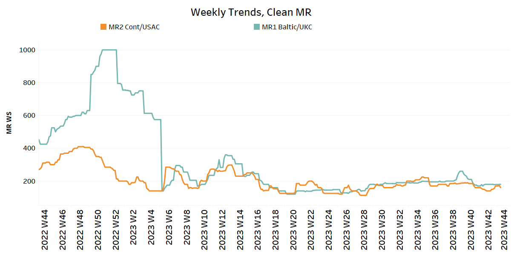
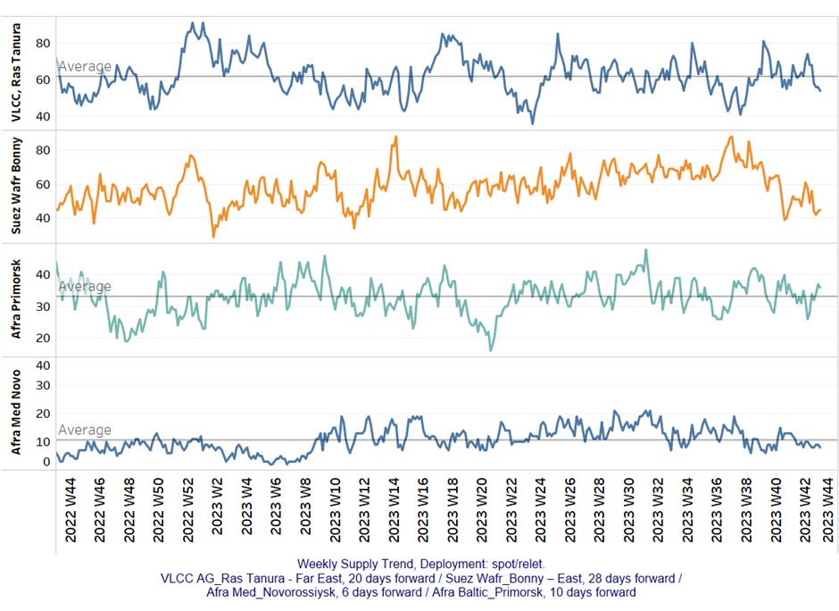
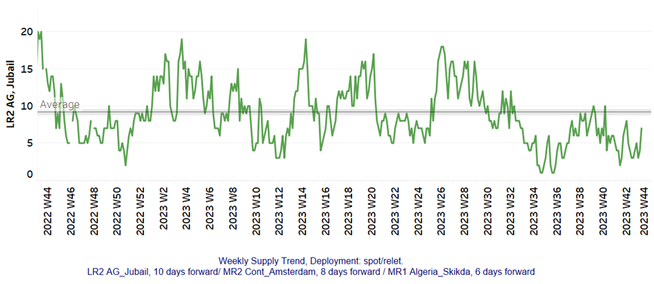
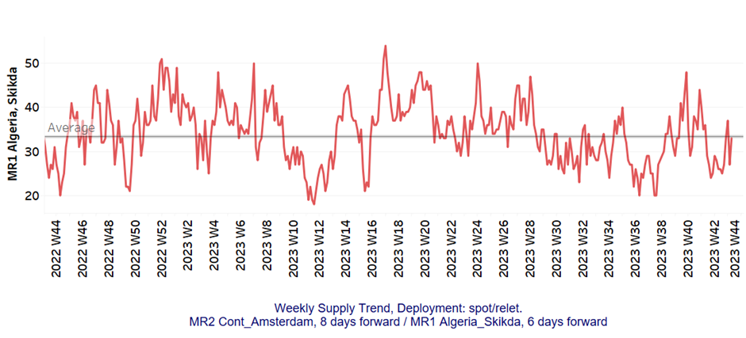
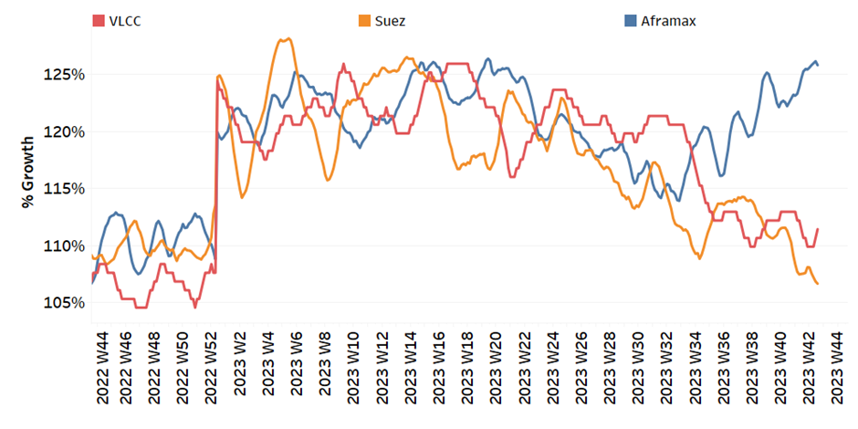
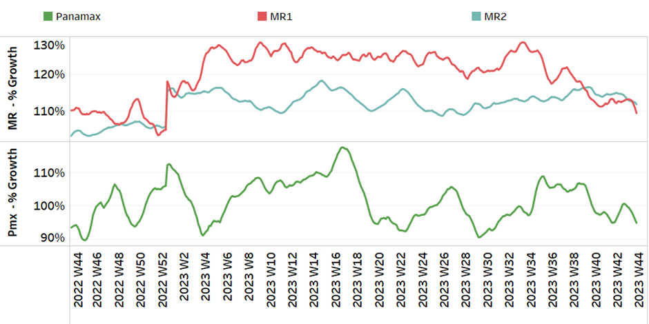

# Signal Tanker Weekly Report

**Date:** November 03, 2023  
**Publisher:** Breakwave Advisors | **Category:** Market Insights  
**Original URL:** [https://www.breakwaveadvisors.com/insights/2023/11/3/siganl-tanker-weekly-report](https://www.breakwaveadvisors.com/insights/2023/11/3/siganl-tanker-weekly-report)  

---

## Chart of the Week: Suezmax West Africa to Uk Continent

**Remarkable rise of rates and tonne days growth with the onset of Middle East geopolitical crisis**

> **Figure 1: Market Chart 1**  
> **Interactive Data & Source:** [Signal Ocean Platform](https://www.thesignalgroup.com/signal-ocean-platform) | [Local Asset](file:///C:/Users/Dell/Github/Shipping/corpus/03-breakwave/insights/2023/assets/2023-11-03_siganl-tanker-weekly-report_img_unnamed-2023-11-03t102700594_27b5b4df4455.png)

The crude freight market gained momentum in early November due to the ongoing crisis in the Middle East. The VLCC segment has seen significant activity, but the Suezmax and Aframax segments have experienced even more growth compared to their levels at the end of September.

The Suezmax segment, where shipments usually run from West Africa to the Continent, has recorded one of the most substantial growth spikes of 2021. Moreover, freight rates have also increased noticeably, leading to speculation about whether this surge will match the magnitude of the previous peak observed before the end of November 2022.
It's worth noting that during the previous period, tonne day growth was slower than the current brisk momentum in the market.

In the meantime, it's worth noting that oil prices have received a boost following the Federal Reserve's decision to maintain its benchmark interest rate at the 5.25%-5.50% range during its recent Wednesday meeting. This development has had a positive impact on the market, with Brent crude futures registering a 1.5% increase, reaching $86 per barrel by 0944 GMT. Similarly, U.S. West Texas Intermediate crude futures have seen a 1.7% rise, reaching $82 per barrel.

​​​​​​

For more information on this week's trends, see the analysis sections below:

Freight Market, Supply and Demand

## Section 1/ Freight

Market Rates (WS)

‘Dirty’ WS​
VLCC - Suezmax - Aframax Firmer

> **Figure 2: ​​​​Firmer Crude Oil Freight Rate Momentum in Early November**  
> *​​​​Firmer crude oil freight rate momentum in early November suggests a sharp rise in rates given geopolitical tensions in the Middle East.*  
> **Interactive Data & Source:** [Signal Ocean Platform](https://www.thesignalgroup.com/signal-ocean-platform) | [Local Asset](file:///C:/Users/Dell/Github/Shipping/corpus/03-breakwave/insights/2023/assets/2023-11-03_siganl-tanker-weekly-report_img_unnamed-2023-11-03t104201839_efd9976d17f4.png)

- VLCC MEG-China freight rates increased to 73 WS, up 38% from the previous week and down 25% from a year ago.
- Suezmax freight rates for shipments from West Africa to continental Europe reached WS 160, up 137% from the previous month. Rates on the Suez-Baltic-Med route are still similarly firm at around 160 WS, up 128% from the previous month.
- Aframax Med freight rates exceeded levels of WS200 and current rates are now 120% higher than a month ago.

> **Figure 3: ‘Product’ Wslr2 Weaker**  
> **Interactive Data & Source:** [Signal Ocean Platform](https://www.thesignalgroup.com/signal-ocean-platform) | [Local Asset](file:///C:/Users/Dell/Github/Shipping/corpus/03-breakwave/insights/2023/assets/2023-11-03_siganl-tanker-weekly-report_img_unnamed-2023-11-03t104341490_b22e6c93264b.png)

- LR2 AG freight rates fell to 160 WS, down 7% from the previous week but up 18% from a month ago.

> **Figure 4: PANAMAX (Sentiment: Firmer)**  
> **Interactive Data & Source:** [Signal Ocean Platform](https://www.thesignalgroup.com/signal-ocean-platform) | [Local Asset](file:///C:/Users/Dell/Github/Shipping/corpus/03-breakwave/insights/2023/assets/2023-11-03_siganl-tanker-weekly-report_img_unnamed-2023-11-03t104504244_d69a3d52b120.png)

- Panamax Carib-to-USG rates recorded a significant firmer momentum of the previous week and recent levels reached WS 250, 90% more than a month ago.

> **Figure 5: ‘Clean’mr Mixed**  
> **Interactive Data & Source:** [Signal Ocean Platform](https://www.thesignalgroup.com/signal-ocean-platform) | [Local Asset](file:///C:/Users/Dell/Github/Shipping/corpus/03-breakwave/insights/2023/assets/2023-11-03_siganl-tanker-weekly-report_img_unnamed-2023-11-03t104656011_136686a09b0e.png)

- MR1 rates for the Baltic continent rose to WS 308, up 30% from a month ago.

- MR2 rates for shipments from the continent to the U.S. held flat momentum for four consecutive weeks at around WS160, 14% lower than a month ago.

## Section 2/ Supply

> **Figure 6: 'Dirty' (#Vessels) - Decreasing**  
> **Interactive Data & Source:** [Signal Ocean Platform](https://www.thesignalgroup.com/signal-ocean-platform) | [Local Asset](file:///C:/Users/Dell/Github/Shipping/corpus/03-breakwave/insights/2023/assets/2023-11-03_siganl-tanker-weekly-report_img_unnamed-2023-11-03t104741744_2d343986366b.png)

With signs of an increase in VLCC for the Ras Tanura, November began with a downward correction in the other ship size segments.

- VLCC Ras Tanura: The number of ships has increased to 54, 8 below the annual average, with a downward trend for early November.
- Suezmax Wafr: The number of ships decreased significantly to 44, almost 50% lower than the peak in week 38.
- Aframax Primorsk: The current number of ships is 37, which is almost 4 above the yearly average. There seems to be a trend for an increase in the first days of November to levels above the annual trend.
- Aframax Med Novo: The number of ships is holding a downward pressure below the average of the year over the last four weeks, with the recent figure floating below 10.

> **Figure 7: 'Clean'lr2 (#Vessels) - Increasing**  
> **Interactive Data & Source:** [Signal Ocean Platform](https://www.thesignalgroup.com/signal-ocean-platform) | [Local Asset](file:///C:/Users/Dell/Github/Shipping/corpus/03-breakwave/insights/2023/assets/2023-11-03_siganl-tanker-weekly-report_img_unnamed-2023-11-03t104848753_2d9c4ff8830b.png)

> **Figure 8: MR1 (#Vessels) - Increasing**  
> **Interactive Data & Source:** [Signal Ocean Platform](https://www.thesignalgroup.com/signal-ocean-platform) | [Local Asset](file:///C:/Users/Dell/Github/Shipping/corpus/03-breakwave/insights/2023/assets/2023-11-03_siganl-tanker-weekly-report_img_unnamed-2023-11-03t104945047_f8085e50d142.png)

- Clean LR2 AG Jubail: The number of recorded ships has remained below the year's average but with signs of an increase. The recent figure reached 7, nearly 4 above the end of October.

- Clean MR1 Algeria Skikda: The number of recorded ships increased to nearly the annual average of 33, but it remains to be seen whether the trend will be persistent given the high volatility of previous days.

## Section 3/ Demand (Tonne Days)

> **Figure 9: ​​‘Dirty’ Mixed**  
> **Interactive Data & Source:** [Signal Ocean Platform](https://www.thesignalgroup.com/signal-ocean-platform) | [Local Asset](file:///C:/Users/Dell/Github/Shipping/corpus/03-breakwave/insights/2023/assets/2023-11-03_siganl-tanker-weekly-report_img_unnamed-2023-11-03t105107479_7edacfafb89e.png)

- Dirty tonne days: The outlook for early November confirmed the previous week's picture for the Aframax segment, where the trend has been clearly upward since the end of week 40. In addition, there also seems to be a slight upward correction in VLCC, which will be confirmed in the coming days.

> **Figure 10: ‘Clean’ Decreasing**  
> **Interactive Data & Source:** [Signal Ocean Platform](https://www.thesignalgroup.com/signal-ocean-platform) | [Local Asset](file:///C:/Users/Dell/Github/Shipping/corpus/03-breakwave/insights/2023/assets/2023-11-03_siganl-tanker-weekly-report_img_unnamed-2023-11-03t105222195_5bb6c9b3c84d.png)

- Panamax tonne days: The growth rate fell again, contrary to expectations, as the last days of October showed signs of improvement.

- Clean MR tonne days: The outlook for demand growth has weakened further, and there are clearer signs of a decline in MR1 size.

Data Source:[Signal Ocean Platform](https://www.thesignalgroup.com/signal-ocean-platform)
