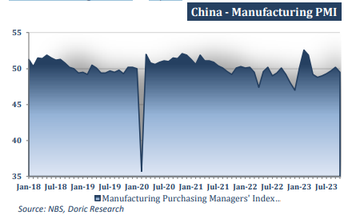
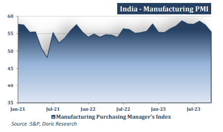
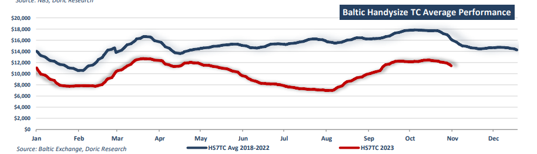

# Asia's Macro Front

**Date:** November 06, 2023  
**Publisher:** Breakwave Advisors | **Category:** Market Insights  
**Original URL:** [https://www.breakwaveadvisors.com/insights/2023/11/6/doric-weekly-market-insight](https://www.breakwaveadvisors.com/insights/2023/11/6/doric-weekly-market-insight)  

---

*By*[*Michalis Voutsinas*](https://www.linkedin.com/in/michalis-voutsinas-587544163/)

In spite of an impressive Capesize reaction in the last trading day, the forty-fourth week was one of those uninspiring periods typically taking place in the seasonal weakest first quarter of every trading year rather than the fourth one. In fact, with all sub-indices being in the red, Baltic Dry Index concluded today at 1462 points. Reporting circa 4 percent weekly losses, the leading Baltic Capesize index was flirting with the mid teens, before bouncing back to $17,690 daily on this week's closing. In a similar vein, Baltic Panamax 82K index moved further south, landing at two-month lows of $13,034 daily. Losing circa 7 percent of its value during the last five trading days, the Baltic Supramax Index balanced at $12,111 daily, being in the red for ten trading days in a row. Trading for 28 consecutive trading days above $12,000, the Baltic Handysize Index finished today down at $11,409 daily, last seen in mid September. Better reflecting the cloudy manufacturing environment, Handies have this unique “privilege” to mirror the course of the global economy on their balancing levels. Indicatively, the smallest bulkers were trading at $15,133 daily this day a year ago, after standing above the $30,000-mark a few months before.

On the macro front, a key gauge of China’s manufacturing activity reported a surprising contraction in October, amidst ongoing jitters over the state of the country’s property market. Dipping back below the 50-point level demarcating contraction from expansion, China's official manufacturing purchasing managers’ index (PMI) fell to 49.5 in October, down from 50.2 in September. Within the official manufacturing PMI, the new-orders subindex dropped to 49.5, from 50.5 a month earlier, while the new-export-orders subindex fell to 46.8 from 47.8 in September. The non-manufacturing PMI also fell to 50.6 last from 51.7 in September, indicating a slowdown in activity. For non-manufacturing PMI, the construction subindex, partly affected by the ongoing property crisis, stood at 53.5, down from 56.2 in September. Additionally, both new export and import orders shrank for the 8th consecutive month, suggesting that manufacturers were struggling for buyers overseas and ordering fewer components used in finished goods for re-export.

> **Figure 1: 1ceb1**  
> **Interactive Data & Source:** [Doric](https://www.doric.gr/) | [Local Asset](file:///C:/Users/Dell/Github/Shipping/corpus/03-breakwave/insights/2023/assets/2023-11-06_doric-weekly-market-insight_img_1ceb1_997189638a2d.png)

On the same wavelength, Japan’s manufacturing PMI for October came in at 48.7, a slight uptick from 48.5 in September. In spite of the improvement, the index languished below the critical 50 threshold for the fifth consecutive month. The S&P Global South Korea Manufacturing PMI fell slightly to 49.8 in October from 49.9 in September, extending the current run of declines for 16 months. Further south, Vietnam's manufacturing PMI remained below the 50- mark during October, decreasing marginally to 49.6 from 49.7 in September, according to S&P Global Market Intelligence's report. As firms continued to scale back production, overall business conditions in the Vietnamese manufacturing sector deteriorated slightly in October. In tandem, the seasonally adjusted S&P Global Malaysia manufacturing PMI was stable at 46.8 in October, pointing to an easing of business conditions for the 14th consecutive month. India was not an exception to the aforementioned trend, with the manufacturing growth slowing for a second straight month in October. In particular, India’s manufacturing PMI dropped to an eight-month low of 55.5 in October from 57.5 in September, missing expectations in a Reuters poll for an uptick. Business sentiment remained in positive territory but slipped to a five-month low amid concerns surrounding the path of demand.

> **Figure 2: 1ceb2**  
> **Interactive Data & Source:** [Doric](https://www.doric.gr/) | [Local Asset](file:///C:/Users/Dell/Github/Shipping/corpus/03-breakwave/insights/2023/assets/2023-11-06_doric-weekly-market-insight_img_1ceb2_175574dffba2.png)

In reference to the other half of the world, the HCOB Germany manufacturing PMI came in at just 40.8 in October, compared to a mere 39.6 in September. In spite of the aforementioned increase, it continued to point to a deep contraction in manufacturing amidst a sustained downturn in new orders. After showing signs of improvement in prior months, US manufacturing contracted sharply in October, with the respective PMI dropping to 46.7 last month from 49.0 in September. The UK manufacturing industry continued its contraction in October, with the seasonally adjusted key gauge of activity balancing at 44.8. With manufacturing indices facing strong headwinds across the globe, how odd would it be for the Handysize to steam heedlessly against them?

> **Figure 3: 1**  
> **Interactive Data & Source:** [Doric](https://www.doric.gr/) | [Local Asset](file:///C:/Users/Dell/Github/Shipping/corpus/03-breakwave/insights/2023/assets/2023-11-06_doric-weekly-market-insight_img_1_225e10d4c8cb.png)

Data source:[Doric](https://www.doric.gr/)
