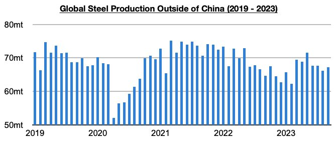
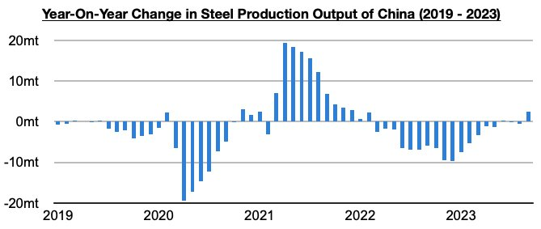

# Growth in Steel Production Outside of China

**Date:** November 06, 2023  
**Publisher:** Breakwave Advisors | **Category:** Market Insights  
**Original URL:** [https://www.breakwaveadvisors.com/insights/2023/11/6/iil67yc61htujjo4ttvxyib7ogxwn2](https://www.breakwaveadvisors.com/insights/2023/11/6/iil67yc61htujjo4ttvxyib7ogxwn2)  

---

*By*[*Jeffrey Landsberg*](https://www.linkedin.com/in/jeffrey-landsberg-70ab957/)

Global steel production totaled approximately 149.3 million tons in September. This is down month-on-month by 3.3 million tons (-2%) and is 2.4 million tons (-2%) less than was reported last year for September 2022’s production. Production outside of China totaled 55.6 million tons. This is up month-on-month by 1 million tons (2%) and is 2.5 million tons (4%) more than was reported last year for September 2022’s production. The growth outside of China occurred largely in India.

> **Figure 1: Chart 1 (89)**  
> [Local Asset](file:///C:/Users/Dell/Github/Shipping/corpus/03-breakwave/insights/2023/assets/2023-11-06_iil67yc61htujjo4ttvxyib7ogxwn2_img_chart1288929_d7d041853366.jpg)

As we have been highlighting in our Weekly Dry Bulk Reports, June saw an inflection point as there was finally growth in steel production outside of China. Prior to June, steel production outside of China fell on a year-on-year basis for fifteen straight months (during those fifteen months, production outside of China contracted year-on-year by 77 million tons).

> **Figure 2: Chart 2 (76)**  
> [Local Asset](file:///C:/Users/Dell/Github/Shipping/corpus/03-breakwave/insights/2023/assets/2023-11-06_iil67yc61htujjo4ttvxyib7ogxwn2_img_chart2287629_4e4055e5cabd.jpg)

In total, June, July, August, and September have now seen steel production outside of China grow year-on-year by 2.1 million tons, with most of the growth occurring last month. Overall, the primary improvement in steel production outside of China remains in India. Russian and US steel production also experienced year-on-year growth.
