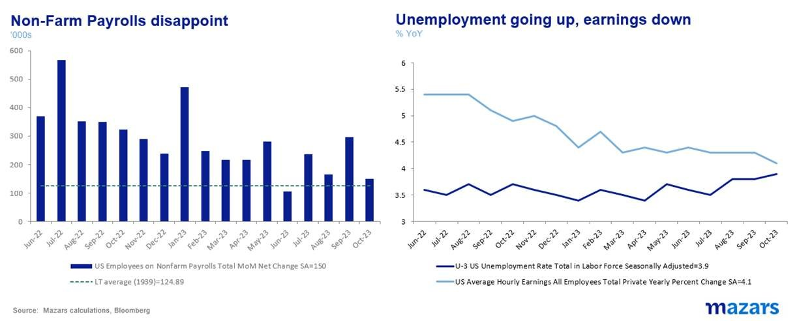
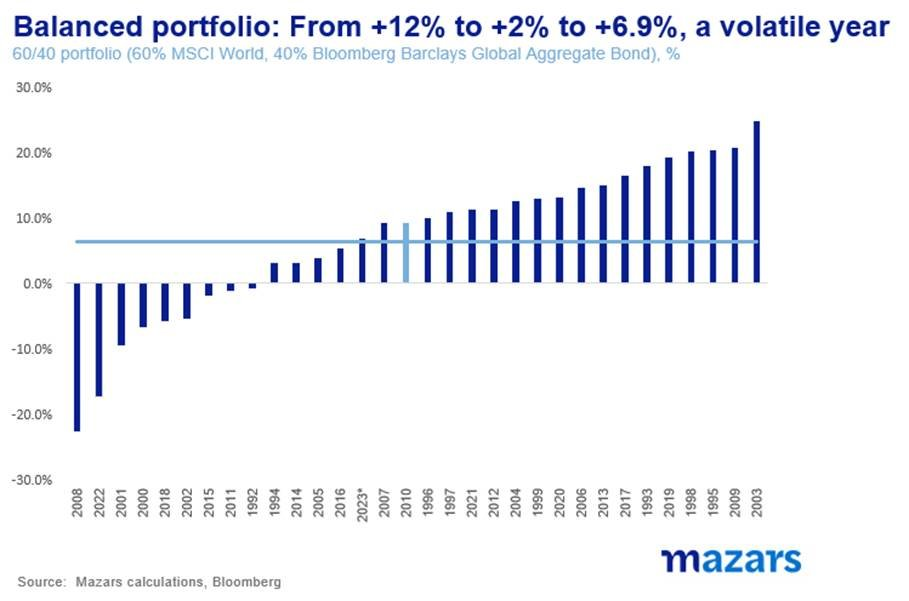
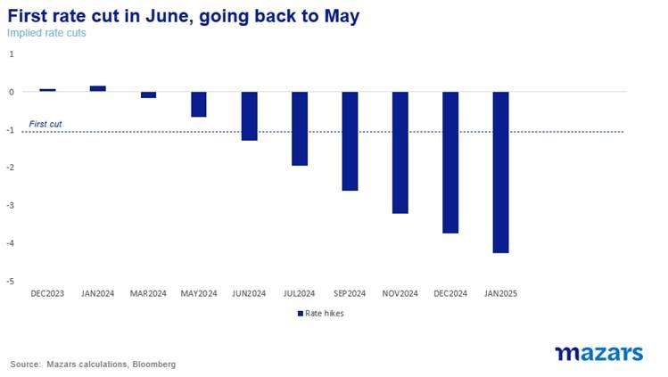

# Ding-a-ling. Financial Santa is in the house, but does he also bring rate cuts?

**Date:** November 07, 2023  
**Publisher:** Breakwave Advisors | **Category:** Market Insights  
**Original URL:** [https://www.breakwaveadvisors.com/insights/2023/11/7/ding-a-ling-financial-santa-is-in-the-house-but-does-he-also-bring-rate-cuts](https://www.breakwaveadvisors.com/insights/2023/11/7/ding-a-ling-financial-santa-is-in-the-house-but-does-he-also-bring-rate-cuts)  

---

*By*[*George Lagarias*](https://www.linkedin.com/in/george-lagarias-mba-3baa769/)

*The three things investors need to know this week*

1. *The combination of a rate pause confirmation along with a fiscal year-end for funds and short positioning catalysed a broad-based asset rally.*
2. *The next big question for investors is now: when are the rate cuts? A market expectation of ten months seems reasonable on paper.*
3. *However,*

- *An independent Fed might try to counterbalance more fiscal spending, either by increasing rates again or at least keeping them higher for even longer – which has a similar effect.*
- *Money can still get more expensive even if the Fed doesn’t cut.*
- *Markets are bad at predicting rates*

Last Monday we said: “Stocks have somewhat corrected, and futures traders have very short positions in bonds. There are now many scenarios in which one (or both) of these asset classes stage a rebound… we should not write off 2023 just yet. September and October are historically the worst months of the year by far. This means that regardless of the view we currently hold, there remains a likelihood that this is the worst this year has to offer. Can the balanced portfolio rise again before the year’s out? The answer is yes, we can still get our customary Santa Rally.”

Last week was one of the best on recent record for both stock and bonds. The S&P 500 gained nearly 6%, erasing more than half of its correction (-11%), while the US 10y Treasury gained 2% and the 30y gained 4%, now trading at 4.6% and 4.7% respectively. The ostensible catalyst was the Fed’s second-in-a-row rate pause, accompanied by a commentary which led markets to believe that the US central bank is done with rate hikes for this cycle –and that we could possibly see rate cuts at some point mid-next year (we’ll get back to that).

A slightly-below-expectations labour market number on Friday helped further fuel those hopes.

> **Figure 1: Market Chart 1**  
> **Interactive Data & Source:** [Reuters](https://www.reuters.com/world/us/us-republicans-want-higher-defense-spending-citing-ukraine-china-2022-03-23/) | [Local Asset](file:///C:/Users/Dell/Github/Shipping/corpus/03-breakwave/insights/2023/assets/2023-11-07_ding-a-ling-financial-santa-is-in-the-house-but-does-he-also-bring-rate-cuts_img_image00528929_a20c68b1ac46.jpg)

Additionally, bond futures had a lot of short positions, which allowed for a short squeeze (traders giving up on their bets against bonds).

However, the last week of October is also the last week of trading in the financial year for Hedge Funds and other investment vehicles. As such, many move to crystallise losses. Following November 1st, managers wipe the slate and are free to trade again.

Unlike the real Santa, who brings his gifts late in the year, the Financial Santa, tends to begin a couple of months earlier.

Historically, this has been very well documented. In the last 52 years, for the S&P 500:

- 75% of returns after Nov 1st and until the end of the year have been positive.
- When returns are positive, the last two months count for more than 30% of annual returns for the index on average.
- 29% of the time, the last two months have had better performance than the previous ten months cumulatively
- Results are less clear in other markets, which may correlate with the S&P but don’t have the same fiscal year

In an age where robots run trading, it stands to reason that past trends would tend to be reinforced.

Thus, the combination of a rate pause confirmation along with a fiscal year-end for funds and short positioning catalysed a broad-based asset rally.

> **Figure 2: Market Chart 2**  
> **Interactive Data & Source:** [Reuters](https://www.reuters.com/world/us/us-republicans-want-higher-defense-spending-citing-ukraine-china-2022-03-23/) | [Local Asset](file:///C:/Users/Dell/Github/Shipping/corpus/03-breakwave/insights/2023/assets/2023-11-07_ding-a-ling-financial-santa-is-in-the-house-but-does-he-also-bring-rate-cuts_img_image006281629_20ac45e25e34.jpg)

The next big question for investors is now: when are the rate cuts? A market expectation of ten months seems reasonable on paper.

> **Figure 3: Market Chart 3**  
> **Interactive Data & Source:** [Reuters](https://www.reuters.com/world/us/us-republicans-want-higher-defense-spending-citing-ukraine-china-2022-03-23/) | [Local Asset](file:///C:/Users/Dell/Github/Shipping/corpus/03-breakwave/insights/2023/assets/2023-11-07_ding-a-ling-financial-santa-is-in-the-house-but-does-he-also-bring-rate-cuts_img_image00728529_adf25e73f161.jpg)

However, in this writer’s humble opinion, investors betting heavily on a half-year rate cut could be rushing things.

For one, while the probability is that the next move will indeed be a rate cut, we do live in a world that is geopolitically fraught. The US is already running a 6.7% budget deficit, and we are entering an election year. Yes, House Republicans are unlikely to do Joe Biden any further fiscal favours, but wars in Israel and Ukraine cost money. The[Republican party](https://www.reuters.com/world/us/us-republicans-want-higher-defense-spending-citing-ukraine-china-2022-03-23/)has generally been more in favour of military spending historically. The added bonus is that military support in the Middle East is[costing](https://www.ft.com/content/01b34010-0569-4b6b-90c4-e2d437c2d035)Democrats votes in key battleground states ahead of the election. So, perversely, both sides of the aisle might agree to further fiscal expansion. An independent Fed might try to counterbalance more fiscal spending, either by increasing rates again or at least keeping them higher for even longer – which has a similar effect.

Second, rate hikes aren’t the be-all-and-end-all. Money can still get more expensive, as the Fed doesn’t control the long end of the curve. With debt levels rising faster, possibly because of even more issuance, the Fed not buying and Emerging Markets trying to ween themselves off the greenback, debt supply and demand dynamics are simply not favourable. And don’t forget inflation. Higher inflation is still very much on the table, and it also lives at the longer end of the curve. The Fed cutting rates might help short yields, but longer-term investors who will see higher prices and the Fed passive about it might decide to disinvest, pushing yields even higher. Despite last week’s action, and barring a big financial accident, long yields could keep rising, or at least staying at high levels, even if the Fed does nothing, or even begins to cut short rates carefully.

Third, markets are just bad at predicting rates. Once, a former boss with a great grasp of private banking and a legendary poor sense of humour told me that “if you are a bear, you should think about changing professions”. Bullishness may be good for stocks, but it might not work for bonds. And it certainly doesn’t work for rate expectations. In the past year and a half, investors have grossly underestimated the Fed’s rate intentions. This time last year, markets were pricing in the first rate cuts as early as September 2023 (when rates in fact peaked). Two years ago, a maximum of two rate cuts was predicted for 2022. Five months later, when the Fed had declared that it aimed to fight inflation and the war in Ukraine had erupted, no more than five hikes were priced in. The Fed ended up hiking 17 times!

> **Figure 4: Market Chart 4**  
> [Local Asset](file:///C:/Users/Dell/Github/Shipping/corpus/03-breakwave/insights/2023/assets/2023-11-07_ding-a-ling-financial-santa-is-in-the-house-but-does-he-also-bring-rate-cuts_img_image00528929_a20c68b1ac46.jpg)

**So, in conclusion, the Santa rally could be already here, as it is most years. A good part of that may have already happened last week, although history suggests there could be more. But that is very much a trading and past trends exercise. Equity and bond investors counting on swift rate cuts would do well to remember that their scenario might not necessarily be one of linear normality. It is more likely that they are betting on a financial accident, or some other sort of issue that would force central banks to perform emergency rate cuts.**
