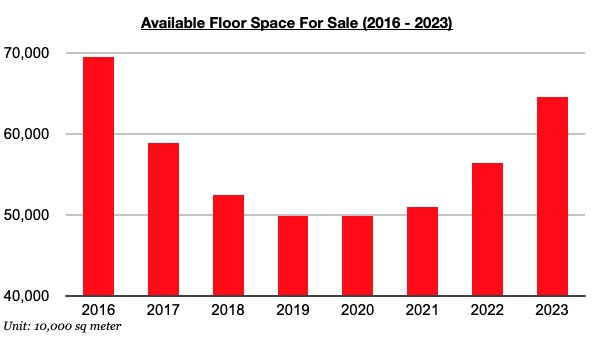
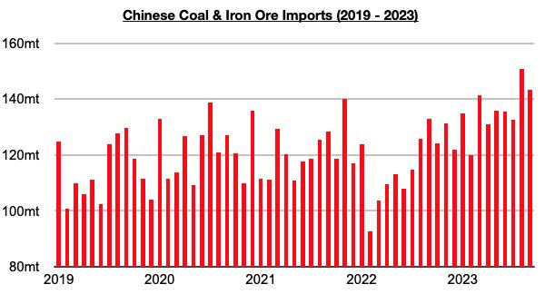

# China's Extreme Housing Oversupply Not Hindering Dry Bulk Market

**Date:** November 08, 2023  
**Publisher:** Breakwave Advisors | **Category:** Market Insights  
**Original URL:** [https://www.breakwaveadvisors.com/insights/2023/11/8/chinas-extreme-housing-oversupply-not-hindering-dry-bulk-market](https://www.breakwaveadvisors.com/insights/2023/11/8/chinas-extreme-housing-oversupply-not-hindering-dry-bulk-market)  

---

*By*[*Jeffrey Landsberg*](https://www.linkedin.com/in/jeffrey-landsberg-70ab957/)

September ended with 645 million square meters of floor space available in China's commercial buildings (which includes residential buildings). This is down slightly from the 648 million square meters of floor space that was available at the end of August, but compared to the end of the last several years, this 645 million square meters of floor space continues to mark the largest amount available since 2016.

> **Figure 1: Chart 1 (90)**  
> [Local Asset](file:///C:/Users/Dell/Github/Shipping/corpus/03-breakwave/insights/2023/assets/2023-11-08_chinas-extreme-housing-oversupply-not-hindering-dry-bulk-market_img_chart1289029_91223e484e3f.jpg)

As we have continued to stress in Commodore's Weekly China Reports, a huge excess of homes remains available in China's housing market. However, we continue to stress that supply and demand of Chinese homes is not what drives China’s dry bulk spot demand. The production of steel, consumption of iron ore, consumption of coal, global mining, etc. are what drives China's commodity imports and spot demand for dry bulk vessels — and this year has continued to see iron ore and coal imports stay strong as we have been stressing. Looking forward, there are still no signs that China's robust appetite for commodity imports is set to suddenly reverse, even as there are also still no signs that China’s extreme housing oversupply problem is set to suddenly be solved.

Through the first nine months of this year, China’s iron ore imports have totaled 877.7 million tons, which is up year-on-year by 54.6 million tons (7%). Coal imports have totaled 347.6 million tons, which is up year-on-year by 146.7 million tons (73%). Collectively, imports have totaled 1.225 billion tons, which is up year-on-year by 201.3 million tons (20%) and is the largest amount ever imported in the first nine months of any year.

> **Figure 2: Chart 2 (77)**  
> [Local Asset](file:///C:/Users/Dell/Github/Shipping/corpus/03-breakwave/insights/2023/assets/2023-11-08_chinas-extreme-housing-oversupply-not-hindering-dry-bulk-market_img_chart2287729_ef73b81873a9.jpg)
