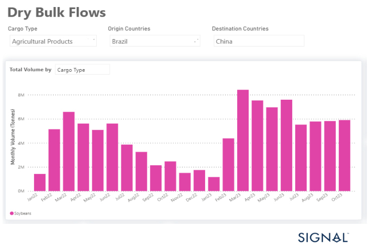
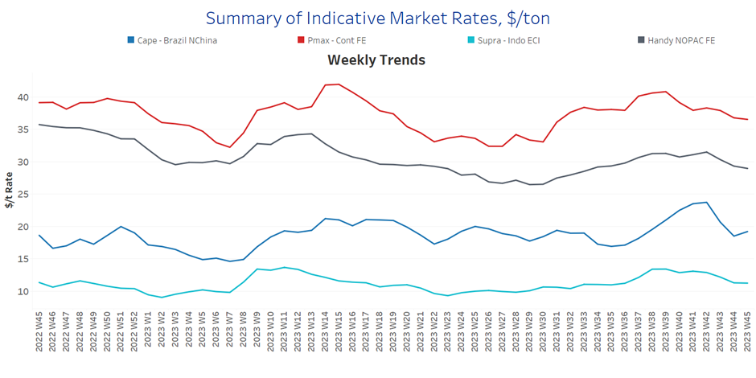
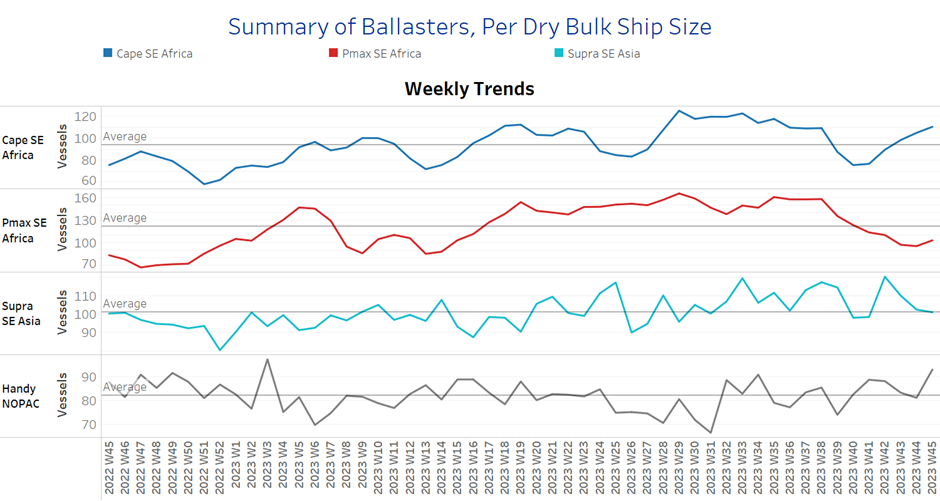
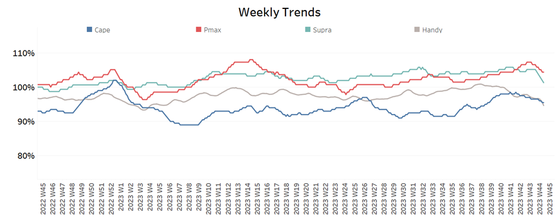
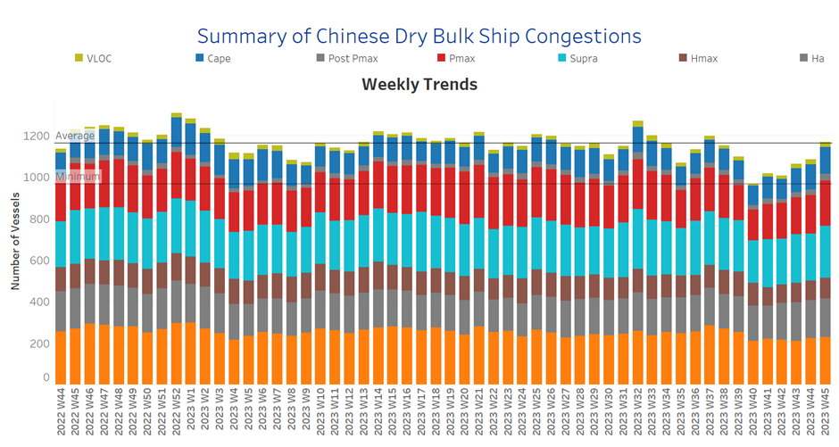

# Signal Dry Bulk Weekly Report

**Date:** November 08, 2023  
**Publisher:** Breakwave Advisors | **Category:** Market Insights  
**Original URL:** [https://www.breakwaveadvisors.com/insights/2023/11/8/signal-dry-bulk-weekly-report](https://www.breakwaveadvisors.com/insights/2023/11/8/signal-dry-bulk-weekly-report)  

---

## Chart of the Week :Dry Bulk Soyabeans Flow From Brazil to China​​​​​

> **Figure 1: Higher Monthly Brazilian Soybean Volumes to China for 2023**  
> **Interactive Data & Source:** [Signal Ocean Platform](https://www.thesignalgroup.com/signal-ocean-platform) | [Local Asset](file:///C:/Users/Dell/Github/Shipping/corpus/03-breakwave/insights/2023/assets/2023-11-08_signal-dry-bulk-weekly-report_img_unnamed-2023-11-08t103643288_e5e04edc65d5.png)

During the second week of November, freight rates showed a weaker outlook due to the lack of adequate support from demand growth rates. Additionally, the number of ballasters for Capesize vessels in Southeast Africa has notably increased over the past three weeks, further fueled by uncertainty surrounding Chinese economic activity. However, there is a glimmer of hope for the market as iron ore prices have recently been boosted by Beijing's efforts to stimulate and stabilise its economy.

In the grain segment, it should be emphasised that Brazilian soybean exports to China have reached monthly volumes (see image above) that exceed those of the previous year. At the same time, China has significantly increased its soybean purchases from Brazil, while the USA has lost its prominent role in supplying the world's second-largest economy with grain feed.

​​​For more information on this week's trends, see the analysis sections below:

Freight Market, Supply, Demand and Port Congestion

## Section 1/ Freight

‘The Big Picture’ - Capesize and Panamax Bulkers and Smaller Ship Sizes

Market Rates ($/t) Weaker

> **Figure 2: Market Chart 2**  
> **Interactive Data & Source:** [Signal Ocean Platform](https://www.thesignalgroup.com/signal-ocean-platform) | [Local Asset](file:///C:/Users/Dell/Github/Shipping/corpus/03-breakwave/insights/2023/assets/2023-11-08_signal-dry-bulk-weekly-report_img_unnamed-2023-11-08t103742111_59b4954bbb37.png)

The second week of November brings downward pressure on freight market sentiment, with the Capesize segment seeing a steep correction from the week 42 peak.

- Capesize vessel freight rates from Brazil to North China decreased by 20% to $18/tonne per month.
- Panamax vessel freight rates from the Continent to the Far East have remained consistently low, at below $40 per tonne, since the end of September. Presently, there is little indication of any significant increase in the near future.
- Supramax vessel freight rates on the Indo-ECI route fell to $11 per tonne, representing an 13% monthly decrease.
- Handysize freight rates for the NOPAC Far East route held under $30/tonne from the beginning of November. Compared to a similar week in October, rates saw a 5% decrease.

## Section 2/ Supply

> **Figure 3: Supply Trend Lines for Key Load Areasballasters (#Vessels) Mixed**  
> **Interactive Data & Source:** [Signal Ocean Platform](https://www.thesignalgroup.com/signal-ocean-platform) | [Local Asset](file:///C:/Users/Dell/Github/Shipping/corpus/03-breakwave/insights/2023/assets/2023-11-08_signal-dry-bulk-weekly-report_img_unnamed-2023-11-08t103941685_60c835662fde.png)

In the second week of November, there was a mixed picture for ballasters. Capesize and Handysize saw significant increases, while the other vessel size segments continued the decreasing trend from October.

- Capesize SE Africa: The number of ballasters rose to 110, 10 higher than the previous week and 35 higher than the low of week 40.
- Panamax SE Africa: The number of ballasters is still below the average of 120 for the last five weeks, but it has shown a slight increase in the past few days.
- Supramax SE Asia: The number of ballast ships has decreased to 100, down 20 from three weeks ago. The recent trend indicates further downward pressure on the annual average.
- Handysize NOPAC: The number of ballast ships increased to over 90, a 10-ship increase from the previous week. Today's count was the highest since the end of week 32.

## Section 3/ Demand

> **Figure 4: Summary of Dry Bulk Demand, per Ship Sizetonne Days Decreasing**  
> **Interactive Data & Source:** [Signal Ocean Platform](https://www.thesignalgroup.com/signal-ocean-platform) | [Local Asset](file:///C:/Users/Dell/Github/Shipping/corpus/03-breakwave/insights/2023/assets/2023-11-08_signal-dry-bulk-weekly-report_img_unnamed-2023-11-08t104059707_89f9e04dbf00.png)

Demand growth declined sharply across all vessel sizes in the past three weeks, with a particularly steep drop in Panamax and Handysize vessels.

- Capesize: The downward trend seems to have bottomed out and there are no signs of improvement.
- Panamax: The downward correction from the high in week 42 is significant, while growth is still higher compared to the lows observed in week 35.
- Supramax: The growth rate remained at its lowest level of the year for two consecutive weeks, while it seems that there will not be a higher pace in the next few days.
- Handysize: Demand growth is still decreasing, and October's sharp downward revision suggests a weak last quarter of the year.​​​​​​

## Section 4/ Port Congestion

> **Figure 5: Dry Bulk Ships Congested at Chinese Portsno of Vessels Increasing**  
> **Interactive Data & Source:** [Signal Ocean Platform](https://www.thesignalgroup.com/signal-ocean-platform) | [Local Asset](file:///C:/Users/Dell/Github/Shipping/corpus/03-breakwave/insights/2023/assets/2023-11-08_signal-dry-bulk-weekly-report_img_unnamed-2023-11-08t104215424_f619ebb2edf6.png)

The level of ship congestion in the Panamax and Supramax segments increased, resulting in one of the highest weekly spikes since week 40.

- Capesize: The number of congested vessels rose to 129, 8 higher than the previous week.
- Panamax: The number of congested ships has increased from 189 in week 37 to 219, marking the first time it has surpassed 200 since then.
- Supramax: The number of ships rose to 250, 25 higher than the previous week, with a tendency of levels to remain above 220. ​​​​​​
- Handysize: The number of congested ships increased to 186, up by 5 from the previous week, and has remained above 180 for three consecutive weeks.

Data Source:[Signal Ocean Platform](https://www.thesignalgroup.com/signal-ocean-platform)
