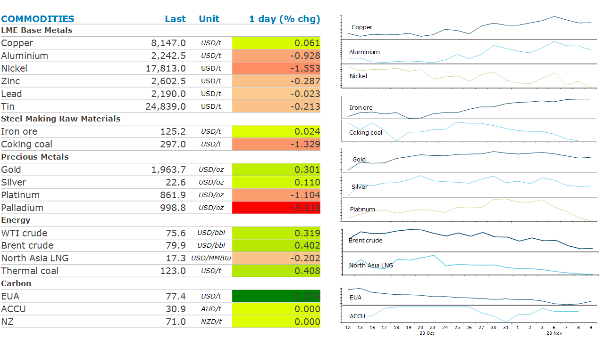

# A lack of compliance demand weighs on Aus carbon credits

**Date:** November 10, 2023  
**Publisher:** Breakwave Advisors | **Category:** Market Insights  
**Original URL:** [https://www.breakwaveadvisors.com/insights/2023/11/9/market-uncertainty-weighs-on-sentiment](https://www.breakwaveadvisors.com/insights/2023/11/9/market-uncertainty-weighs-on-sentiment)  

---

*By*[*Daniel Hynes*](https://www.linkedin.com/in/dahynes/)

Uncertainty over monetary policy saw a mixed performance from commodity markets. Concerns over economic growth in China also weighed on sentiment.

> **Figure 1: 1699562648627**  
> [Local Asset](file:///C:/Users/Dell/Github/Shipping/corpus/03-breakwave/insights/2023/assets/2023-11-10_market-uncertainty-weighs-on-sentiment_img_1699562648627_57ea193f5e53.png)

**Gold**rallied late in the session after dovish comments from the Fed. Governor Raphael Bostic argued there’s probably no need for more rate increases. Even so, two other governors warned that the full effect of past rate hikes have not been fully felt. The comments supported gold’s appeal as an interest rate sensitive haven asset. The market is now pricing in almost no chance of a rate hike in December. The**Platinum Group Metals**remained under pressure amid concerns over demand.**Palladium**fell below USD1,000/oz for the first time in five years as a slowdown in car sales and the rise of electric vehicles weighs on demand. This fall as been magnified by users switching to cheaper**platinum.**

The dovish comments from the Fed helped push copper prices higher. Early in the session, the base metals complex was under pressure after data showed consumer prices fell more than expected in October. The threat of deflation underscores concerns about overall demand in the world’s biggest consumer. However, prices rebounded strongly as concerns over further rate hikes by the Fed eased.

**Crude oil**rebounded amid the broader pick up across risky asset classes late in the session. The market also found support from Saudi Arabia, after energy minister, Prince Abdulaziz bin Salman, said that oil demand is healthy. He went on to blame the recent drop in prices on speculators. A similar warning was issued in May 2023, which was quickly followed by a subsequent cut to production. The threat of disruptions to supplies from the Middle East continues to fall. Israel said it would pause military operations in Gaza for four hours every day. The conflict remains well contained within Gaza, despite concerns it would escalate as neighbouring Arab nations show their displeasure.

**European gas**rallied after EU lawmakers called on the bloc to expand sanctions on Russia. North Asian LNG also gained after Chevron’s Gorgon plant suffered an electrical issue and disrupted exports.

**European carbon**prices rallied as the market speculated that recent selling was overdone. This was aided by a broad rise amid a combination of colder weather and lower renewable generation. Australian carbon credit units remain stuck in a tight range as hopes of rising demand gives way to the realities of a market still in transition. With entities covered by the new Safeguard Mechanism not required to surrender ACCUs until the end of February 2025, the accumulation of ACCUs has been subdued. Investor demand has also plateaued. This comes amid a deluge of supply. The[market should remain in surplus](../pdfs/2023-11-10_market-uncertainty-weighs-on-sentiment_commodity-call-market-awash-with-acc_373779453240.pdf)until demand begins to scale up, which is likely to occur in parallel to a slowdown in issuance to registered projects.

Data source:[Commodities Wrap](https://www.linkedin.com/newsletters/commodities-wrap-6692196755876012032/?fbclid=IwAR3kiXJqZdxmp9ZcRwBNI7FsBySI-XSC0pfPur1qzjt7OZp7PTE59Tsl1QI)
