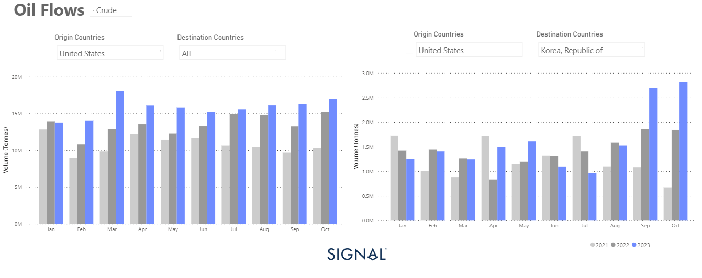
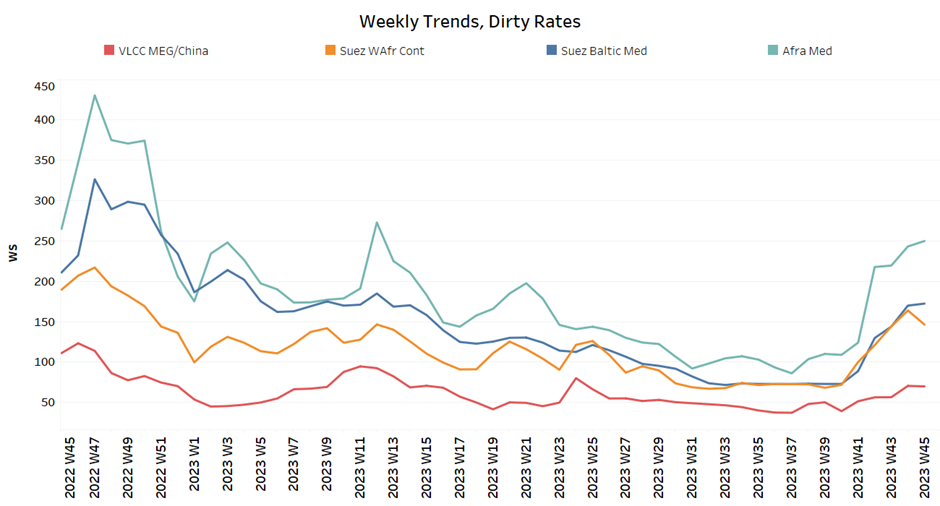
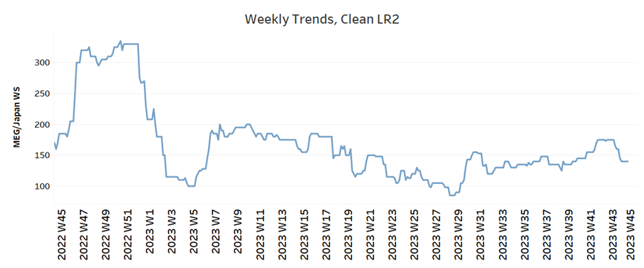
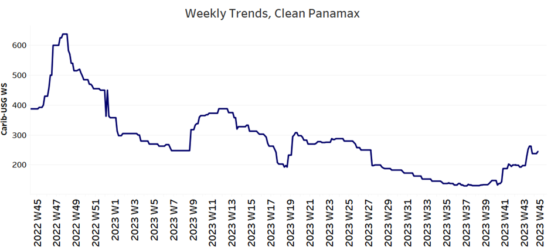
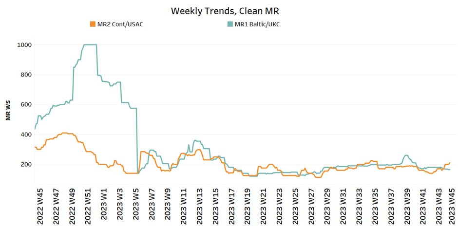
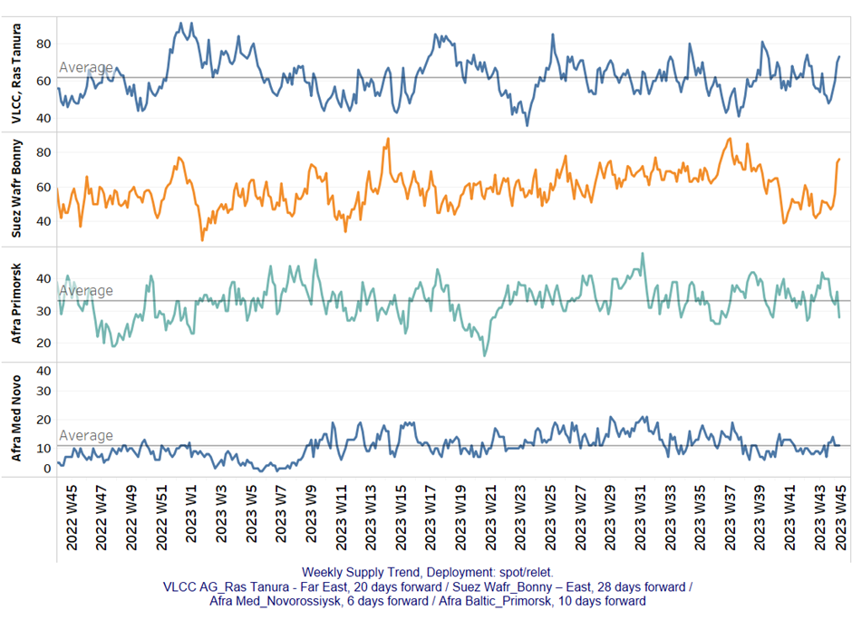
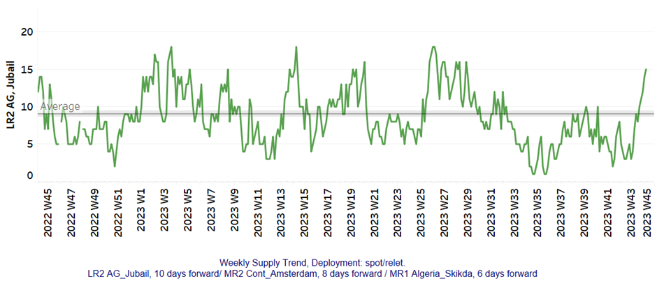
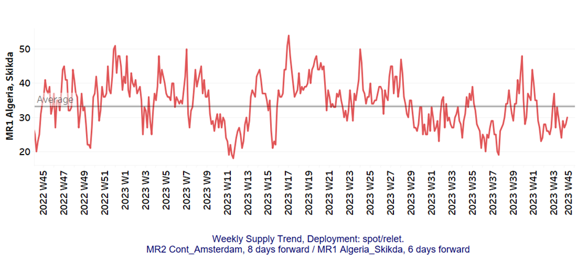
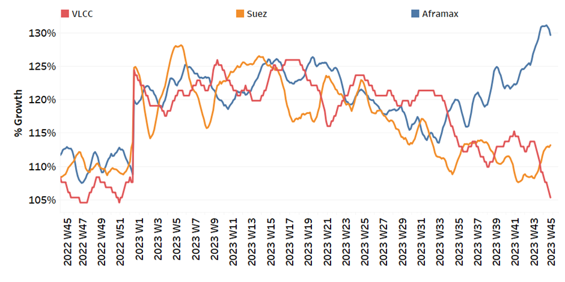
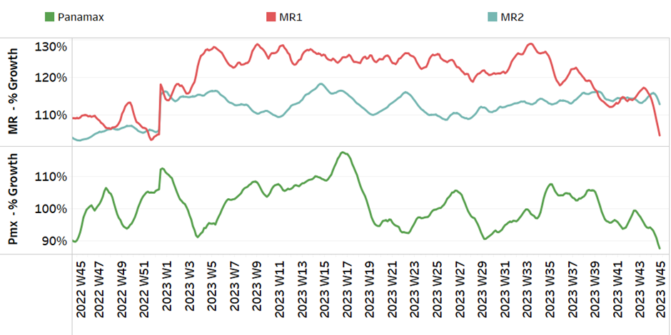

# Signal Tanker Weekly Report

**Date:** November 10, 2023  
**Publisher:** Breakwave Advisors | **Category:** Market Insights  
**Original URL:** [https://www.breakwaveadvisors.com/insights/2023/11/10/signal-tanker-weekly-report](https://www.breakwaveadvisors.com/insights/2023/11/10/signal-tanker-weekly-report)  

---

## Chart of the Week: U.s. Crude Oil Flows to All Destinations

> **Figure 1: U.s. Crude Oil Exports Record Remarkable Rise Destined to Korea**  
> **Interactive Data & Source:** [Signal Ocean Platform](https://www.thesignalgroup.com/signal-ocean-platform) | [Local Asset](file:///C:/Users/Dell/Github/Shipping/corpus/03-breakwave/insights/2023/assets/2023-11-10_signal-tanker-weekly-report_img_unnamed-2023-11-10t112405886_c8fc412b8288.png)

In the second week of November, freight rates for crude oil tankers remained firm with slight signs of a downward correction. The upward momentum of early November in the second half of November remains uncertain as there are signs of an increase in the supply of crude oil tankers, which contrasts with the downward trend observed at the end of October.

Looking at the demand side of the equation, the growth rates (in tonne days) appear to be strengthening. This trend is expected to continue as the winter season approaches, and Chinese crude oil imports have seen a significant increase in October. It's also worth noting that crude oil exports from the US have increased significantly this year.
Korea has even replaced China as the most important destination for American crude oil, which is an interesting development on the global oil market.

Oil prices decreased this week reaching their lowest levels since the end of July. This decline can be attributed to a combination of factors, including mixed economic data from China, increased OPEC exports and the strengthening of the US dollar. According to Reuters, Brent crude futures closed below $80 a barrel on Wednesday for the first time since the Hamas Islamist attack on Israel on October 7. Brent crude futures dropped, settling at $79.54 per barrel, while U.S. crude followed suit, closing at $75.
These numbers marked their lowest points since mid-July. Adding to the downward pressure, U.S. crude oil stocks saw a significant uptick, climbing by nearly 12 million barrels last week, according to information from market sources on Tuesday citing American Petroleum Institute data.

For more information on this week's trends, see the analysis sections below:

Freight Market, Supply and Demand

## Section 1/ Freight

Market Rates (WS)

> **Figure 2: ‘Dirty’ Ws​vlcc - Suezmax - Aframax Mixed**  
> **Interactive Data & Source:** [Signal Ocean Platform](https://www.thesignalgroup.com/signal-ocean-platform) | [Local Asset](file:///C:/Users/Dell/Github/Shipping/corpus/03-breakwave/insights/2023/assets/2023-11-10_signal-tanker-weekly-report_img_unnamed-2023-11-10t112616355_aa6dd5c0ce62.png)

The crude oil freight market rates started to decrease after the spikes at the beginning of November.

- VLCC MEG-China freight rates held around 70 WS, up 90% from a similar week a month earlier.
- Suezmax freight rates for shipments from West Africa to continental Europe reached WS 140, 20 points lower than the previous week, up 90% from the previous month. Rates on the Suez-Baltic-Med route remained firm at around 170 WS, up 130% from the previous month.
- Aframax Med freight rates have exceeded the WS250 level since the beginning of November, and current rates are now 130% higher than a month ago.

> **Figure 3: ‘Product’ Wslr2 Weaker**  
> **Interactive Data & Source:** [Signal Ocean Platform](https://www.thesignalgroup.com/signal-ocean-platform) | [Local Asset](file:///C:/Users/Dell/Github/Shipping/corpus/03-breakwave/insights/2023/assets/2023-11-10_signal-tanker-weekly-report_img_unnamed-2023-11-10t113422815_fd8bb7e7cccc.png)

- LR2 AG freight rates fell to 140 WS, down 12% from the previous week but up 3.5% from a month ago.

> **Figure 4: PANAMAX (Sentiment: Firmer)**  
> **Interactive Data & Source:** [Signal Ocean Platform](https://www.thesignalgroup.com/signal-ocean-platform) | [Local Asset](file:///C:/Users/Dell/Github/Shipping/corpus/03-breakwave/insights/2023/assets/2023-11-10_signal-tanker-weekly-report_img_unnamed-2023-11-10t113521217_8baeb779d9b5.png)

- Panamax Carib-to-USG rates have firmed further and m recently stood at WS 250, 66% higher than a month ago.

> **Figure 5: ‘Clean’mr Mixed**  
> **Interactive Data & Source:** [Signal Ocean Platform](https://www.thesignalgroup.com/signal-ocean-platform) | [Local Asset](file:///C:/Users/Dell/Github/Shipping/corpus/03-breakwave/insights/2023/assets/2023-11-10_signal-tanker-weekly-report_img_unnamed-2023-11-10t113645819_fa5a1df0afc8.png)

- MR1 rates for the Baltic continent fell to WS 165, down 20% from a month ago.

- MR2 rates for shipments from the continent to the U.S. increased for the first time after stagnating for more than five consecutive weeks. Rates were around 210 WS, 30% higher than the previous week.

## Section 2/ Supply

> **Figure 6: 'Dirty' (#Vessels) - Mixed**  
> **Interactive Data & Source:** [Signal Ocean Platform](https://www.thesignalgroup.com/signal-ocean-platform) | [Local Asset](file:///C:/Users/Dell/Github/Shipping/corpus/03-breakwave/insights/2023/assets/2023-11-10_signal-tanker-weekly-report_img_unnamed-2023-11-10t113729624_42f47ed729b2.png)

With still signs of an increase in VLCC for the Ras Tanura and Suezmax Wafr Bonny, November continued with a downward pressure in the Aframax segment.

- VLCC Ras Tanura: The number of ships has increased to 73 13 above the annual average, with an upward trend for the second week of November.
- Suezmax Wafr: The number of ships recorded a significant increase despite the previous week’s signs for a lower number. The recent levels are almost 30 vessels higher than three weeks ago.
- Aframax Primorsk: The current number of ships is 28, which is almost 5 below the yearly average.
- Aframax Med Novo: The number of ships has remained at the same level as the annual average since the end of week 41, with the most recent figure almost exceeding 10.

> **Figure 7: 'Clean'lr2 (#Vessels) - Increasing**  
> **Interactive Data & Source:** [Signal Ocean Platform](https://www.thesignalgroup.com/signal-ocean-platform) | [Local Asset](file:///C:/Users/Dell/Github/Shipping/corpus/03-breakwave/insights/2023/assets/2023-11-10_signal-tanker-weekly-report_img_unnamed-2023-11-10t113845525_1ea07f17a321.png)

> **Figure 8: MR1 (#Vessels) - Increasing**  
> **Interactive Data & Source:** [Signal Ocean Platform](https://www.thesignalgroup.com/signal-ocean-platform) | [Local Asset](file:///C:/Users/Dell/Github/Shipping/corpus/03-breakwave/insights/2023/assets/2023-11-10_signal-tanker-weekly-report_img_unnamed-2023-11-10t113932059_e72bfb4bef0a.png)

- Clean LR2 AG Jubail: The latest figure rose to a new high of 15 after hitting a low of 3 a week ago. This is the first time since the end of week 25 with such a high level.

- Clean MR1 Algeria Skikda: At around 30, the number of ships recorded was below the annual average, although the trend is rising. However, the figures appear to be well below the peak of week 40 (~48 ships).

## Section 3/ Demand (Tonne Days)

> **Figure 9: ​​‘Dirty’ Mixed**  
> **Interactive Data & Source:** [Signal Ocean Platform](https://www.thesignalgroup.com/signal-ocean-platform) | [Local Asset](file:///C:/Users/Dell/Github/Shipping/corpus/03-breakwave/insights/2023/assets/2023-11-10_signal-tanker-weekly-report_img_unnamed-2023-11-10t114018733_80290fe88b32.png)

- Dirty tonne days: Despite the expectation of an upward trend in VLCC demand, the Suezmax and Aframax segments bucked the trend this week, maintaining the momentum of previous weeks. It will be interesting to see how global crude oil demand continues to develop, especially as concerns over oil prices gradually ease amid the crisis in the Middle East, putting a damper on the previous price escalation.

> **Figure 10: ‘Clean’ Decreasing**  
> **Interactive Data & Source:** [Signal Ocean Platform](https://www.thesignalgroup.com/signal-ocean-platform) | [Local Asset](file:///C:/Users/Dell/Github/Shipping/corpus/03-breakwave/insights/2023/assets/2023-11-10_signal-tanker-weekly-report_img_unnamed-2023-11-10t114110918_a9fb75ecd3c6.png)

- Panamax tonne days: The growth rate has continued to fall sharply since the last peak in week 43.

- Clean MR tonne days: The outlook for demand growth has weakened further for MR1, with no sign of a recovery yet for November, while the downward trend for MR2 is less pronounced than the lows of weeks 25 & 27.

Data Source:[Signal Ocean Platform](https://www.thesignalgroup.com/signal-ocean-platform)
