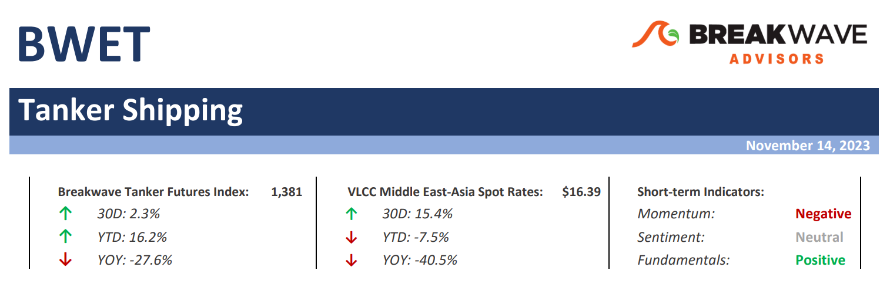
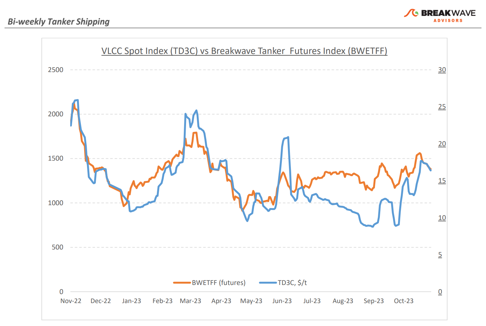
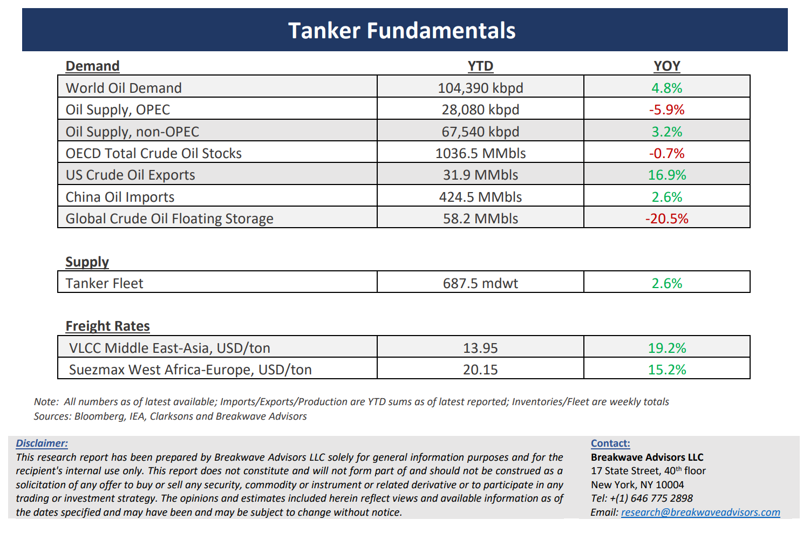

# Breakwave Bi-Weekly Tanker Report - November 14, 2023

**Date:** November 14, 2023  
**Publisher:** Breakwave Advisors | **Category:** Market Insights  
**Original URL:** [https://www.breakwaveadvisors.com/insights/2023/11/14/breakwave-bi-weekly-tanker-report-nov-13-2023-ljgxp](https://www.breakwaveadvisors.com/insights/2023/11/14/breakwave-bi-weekly-tanker-report-nov-13-2023-ljgxp)  

---

> **Figure 1: Tankerreporttop**  
> [Local Asset](file:///C:/Users/Dell/Github/Shipping/corpus/03-breakwave/insights/2023/assets/2023-11-14_breakwave-bi-weekly-tanker-report-nov-13-2023-ljgxp_img_tankerreporttop_d3d991933f6a.png)

**·****Ongoing strength in VLCCs evidence of a tight market –**The positive trend in rates for Very Large Crude Carriers (VLCCs), a trend that emerged in the wake of the unrest in the Middle East, has continued in November while such a favorable outlook is also reflected in other categories of crude oil tankers. Although last week**VLCC rates temporarily peaked**on both the Middle East-to-China and on West Africa-to-China routes and subsequently recorded a ~5% weekly drop, rates in the**Atlantic region**showed**a level of resilience**, something that has been the tendency in the last year, reflecting increasing oil exports from the basin. The ongoing bullish stance stems from the expectation of a robust conclusion to the year in the Atlantic region, while**seasonal factors**also contribute to such an**optimism across the sector**. The buoyant sentiment of the physical market has also been reflected in the period charter market with time charter rates posing a roughly 7% weekly increase during the second week of November. However, the key to the stability of the current positive sentiment in the crude oil freight market depends on factors such as further increase in**demand**during the winter season as well as the development of**oil prices**, both of which face their own**uncertainties**. Yet, the**lead times**associated with booking a tanker vessel and getting delivery of the actual oil seems to**indicate increased confidence**by refiners about the prospects for oil demand next year.

**·****Oil prices remain volatile with both demand and supply expectations once again shifting – Oil prices**have now nearly**erased all the gains**made so far this year mainly due to resurfaced demand worries similar to last summer’s, something that is also evident in shrinking refining margins. In addition, the**risk premium**built due to the Israel-Hamas war has**evaporated**, as there have been no signs of any oil flow disruption. Oil exports out of the US have been exceptionally high, with at least**48 tankers**indicated presently enroute to the United States to load oil for exporting, marking the**highest number in six years**. This is in line with the US's plans to achieve new all-time highs in oil exports during the winter months. In contrast, top oil exporters Saudi Arabia and Russia confirmed they would continue with their voluntary oil output cuts until the end of the year as concerns over demand and economic growth continue to weigh on their respective crude outlooks. It seems that the recent**wide range of $70-$90 per barrel**for WTI prices**will remain**in place for now, which should be satisfactory for both sides of the isle when it comes to price direction. For the tanker market, any increase in oil flows next year should correspond to another leg higher in spot tanker rates given the positive fleet supply outlook for the sector.

**·****Tanker cycle driven by tight supply, recovering demand –**The tanker market is recovering from a long period of staggered rates as the growth in new vessel supply shrinks while oil demand is recovering in line with the global economy. A historically low orderbook combined with favorable demand fundamentals should continue to support increased spot rate volatility, which combined with the ongoing geopolitical turmoil, should support freight rates in the medium term.

> **Figure 2: Tankerreportchart**  
> [Local Asset](file:///C:/Users/Dell/Github/Shipping/corpus/03-breakwave/insights/2023/assets/2023-11-14_breakwave-bi-weekly-tanker-report-nov-13-2023-ljgxp_img_tankerreportchart_1b5304536fac.png)

> **Figure 3: Tankerreportbottom**  
> [Local Asset](file:///C:/Users/Dell/Github/Shipping/corpus/03-breakwave/insights/2023/assets/2023-11-14_breakwave-bi-weekly-tanker-report-nov-13-2023-ljgxp_img_tankerreportbottom_102cb2ee80ba.png)

### Subscribe:
